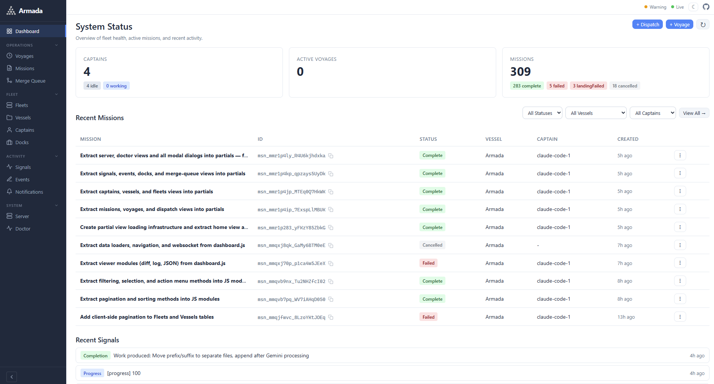
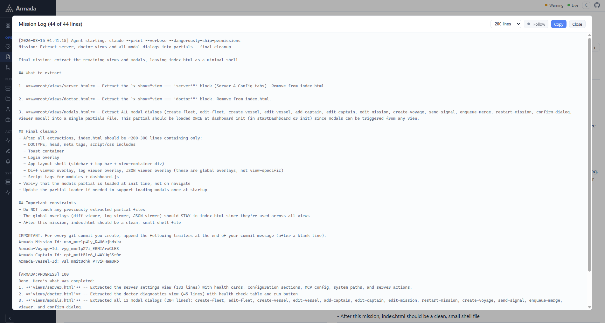
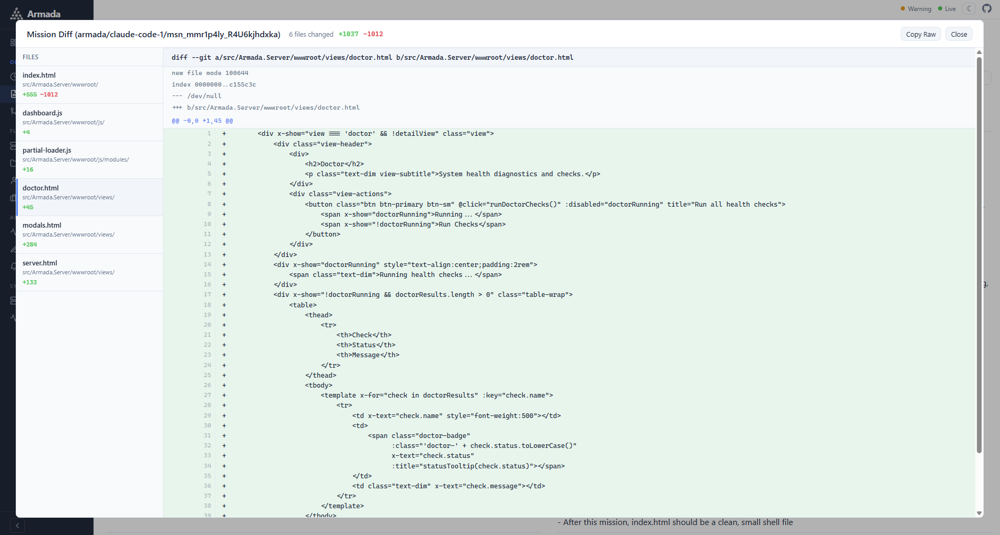
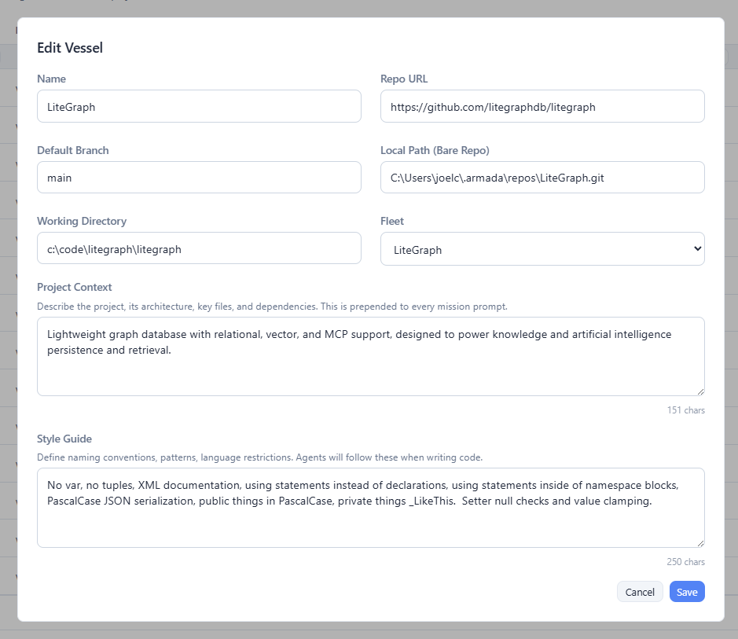
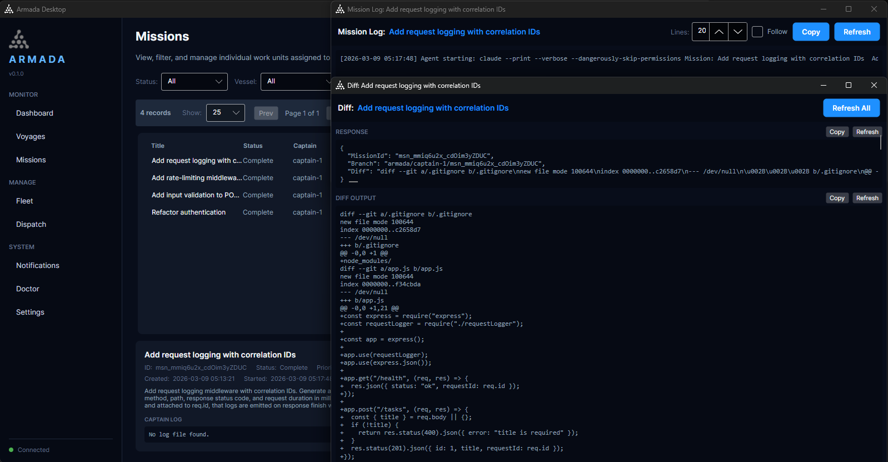

<p align="center">
  
</p>

<h1 align="center">Armada</h1>

<p align="center">
  <strong>Multi-agent orchestration for scaling human developers with AI</strong>
  <br />
  v0.2.0 | C#/.NET | MIT License
  <br />
  <strong>⚠️ ALPHA — APIs, schemas, and behavior may change without notice.</strong>
</p>

<p align="center">
  <a href="#quick-start">Quick Start</a> |
  <a href="#how-it-works">How It Works</a> |
  <a href="#architecture">Architecture</a> |
  <a href="#cli-reference">CLI Reference</a> |
  <a href="#rest-api">REST API</a> |
  <a href="#mcp-integration">MCP Integration</a> |
  <a href="#contributing">Contributing</a>
</p>

---

Armada coordinates multiple AI coding agents working in parallel on your codebase. Each agent operates in an isolated git worktree, producing clean branches and pull requests. One command gets you from zero to dispatching work -- no configuration required.

```bash
cd your-project
armada go "Add input validation to the signup form"
```

That's it. Armada auto-initializes, detects your installed agent runtime (Claude Code, Codex, Gemini, Cursor), infers the repo from your current directory, provisions a worker agent, and dispatches your task.

> **⚠️ Security Note:** Armada runs AI agents with auto-approve flags enabled by default — Claude Code uses `--dangerously-skip-permissions`, Codex uses `--approval-mode full-auto`, and Gemini uses `--sandbox none`. This means agents can read, write, and execute code in their worktrees without user confirmation. Review the [configuration](#configuration) options and understand the implications before running Armada in sensitive environments.

## Features

- **Zero-config startup** -- sensible defaults, auto-detection of runtimes and repositories
- **Parallel agents** -- dispatch multiple tasks across multiple AI agents simultaneously
- **Git worktree isolation** -- each agent works on its own branch, no interference between agents
- **Multi-runtime support** -- Claude Code, Codex, Gemini, Cursor, and extensible to other agent runtimes via `IAgentRuntime`
- **Auto-recovery** -- crashed agents are automatically detected, repaired, and relaunched
- **Broad-scope detection** -- prevents concurrent mutations to the same files across agents
- **REST API + WebSocket** -- programmatic access and real-time status updates
- **MCP server** -- 18 tools let Claude Code, Codex, or any MCP client orchestrate Armada (see [AI-powered orchestration](#ai-powered-orchestration))
- **Cross-platform** -- Windows, macOS, Linux (C#/.NET)

## Benefits

- **Single pane of glass** -- Monitor and manage all AI agent work across every project from one unified dashboard, eliminating the need to juggle multiple terminals and windows.
- **Reduced context-switching** -- Full mission history, logs, diffs, and signals are preserved, so you can pick up exactly where you left off without losing your train of thought.
- **Scale across more projects** -- Dispatch parallel missions across multiple repositories simultaneously, letting you take on more work than a single developer normally could.
- **Project management meets conversational AI** -- Integrate task tracking, prioritization, and workflow orchestration directly into AI coding agents like Claude Code, bridging the gap between planning and execution.
- **Safe isolated worktrees** -- Every agent operates in its own git worktree, so parallel work never collides and your main branch stays clean until you're ready to merge.
- **Automated merge queues** -- Completed missions are queued for merge automatically, reducing manual branch management and keeping your integration pipeline flowing.
- **Auditable event trails** -- Every mission dispatch, status transition, completion, and failure is recorded in a structured event log you can query at any time.
- **Reproducible workflows** -- Voyages capture a batch of missions as a reusable unit; retry a failed voyage or re-dispatch it against a new branch with a single command.
- **Team visibility** -- Real-time WebSocket updates and a REST API keep everyone informed of agent progress without polling or asking around.

## Screenshots

<details>
<summary>Click to expand screenshots</summary>

<br />











</details>

## Quick Start

### Prerequisites

- [.NET 8.0+ SDK](https://dot.net/download)
- At least one AI agent runtime on your PATH:
  - [Claude Code](https://docs.anthropic.com/en/docs/claude-code) (`claude`)
  - [Codex](https://github.com/openai/codex) (`codex`)
  - [Gemini CLI](https://github.com/google-gemini/gemini-cli) (`gemini`)
  - [Cursor](https://docs.cursor.com/cli) (`cursor`)

### Install

```bash
# Prerequisites: .NET 8.0+ SDK (https://dot.net/download)
git clone https://github.com/jchristn/armada.git
cd armada/src
dotnet build Armada.sln

# Install as a global dotnet tool
dotnet pack Armada.Helm -o ./nupkg
dotnet tool install --global --add-source ./nupkg Armada.Helm

# If you later need to remove (perhaps to update)
dotnet tool uninstall --global Armada.Helm
```

Helper scripts are in the project root directory: `install-tool.bat/.sh`, `remove-tool.bat/.sh`, and `reinstall-tool.bat/.sh`.

### First Mission

```bash
cd your-project
armada go "Add input validation to the signup form"
armada watch   # monitor progress
```

For a deeper walkthrough, see the [Getting Started Guide](GETTING_STARTED.md).

## How It Works

```
You (Human)
    |
    v
 armada CLI ---embedded---> Admiral (in-process, auto-starts)
                  or
               ----HTTP----> Admiral Server (if started separately)
                               |
                               +-- SQLite Database (state)
                               |
                               +-- Captain 1 (Claude Code) --> git worktree 1
                               +-- Captain 2 (Claude Code) --> git worktree 2
                               +-- Captain 3 (Codex)       --> git worktree 3
                               +-- Captain 4 (Gemini)      --> git worktree 4
                               +-- Captain 5 (Cursor)      --> git worktree 5
```

When you run `armada go`, the **Admiral** (coordinator process) receives your prompt, creates one or more **Missions**, and assigns each to a **Captain** (AI agent). Each captain works in its own **git worktree** branched from the default branch. This gives you:

- **Full isolation** -- agents cannot interfere with each other
- **Clean diffs** -- each branch contains only one agent's changes
- **Easy review** -- one PR per mission

### Parallel Tasks

Semicolons or numbered lists split a prompt into separate missions, each assigned to a different agent:

```bash
armada go "Add rate limiting; Add request logging; Add input validation"

armada go "1. Add auth middleware 2. Add login endpoint 3. Add token validation"
```

### Named Voyages (Batches)

```bash
armada voyage create "API Hardening" --vessel my-project \
  --mission "Add rate limiting middleware" \
  --mission "Add input validation to all POST endpoints" \
  --mission "Add request logging with correlation IDs"
```

### Auto-Recovery

If a captain crashes, the Admiral automatically detects it, repairs the worktree, and relaunches the agent (up to `MaxRecoveryAttempts` times, default: 3).

## Architecture

Armada is a C#/.NET solution with four projects:

| Project | Description |
|---------|-------------|
| **Armada.Core** | Domain models, database interfaces, service interfaces, settings |
| **Armada.Runtimes** | Agent runtime adapters (Claude Code, Codex, Gemini, Cursor, extensible via `IAgentRuntime`) |
| **Armada.Server** | Admiral process: REST API ([SwiftStack](https://github.com/jchristn/swiftstack)), MCP server ([Voltaic](https://github.com/jchristn/voltaic)), WebSocket hub |
| **Armada.Helm** | CLI ([Spectre.Console](https://spectreconsole.net/)), thin HTTP client to Admiral |

### Key Concepts

| Term | Plain Language | Description |
|------|---------------|-------------|
| **Admiral** | Coordinator | The server process that orchestrates everything. Auto-starts when needed. |
| **Captain** | Agent/worker | An AI agent instance (Claude Code, Codex, etc.). Auto-created on demand. |
| **Fleet** | Group of repos | Collection of repositories. A default fleet is auto-created. |
| **Vessel** | Repository | A git repository registered with Armada. Auto-registered from your current directory. |
| **Mission** | Task | An atomic work unit assigned to a captain. |
| **Voyage** | Batch | A group of related missions dispatched together. |
| **Dock** | Worktree | A git worktree provisioned for a captain's isolated work. |
| **Signal** | Message | Communication between the Admiral and captains. |

### Data Model

```
┌─────────────────────────────────────────────────────────────────┐
│                            ADMIRAL                              │
│                     (coordinator process)                       │
└────────┬──────────────┬──────────────┬──────────────┬───────────┘
         │              │              │              │
         ▼              ▼              ▼              ▼
    ┌─────────┐   ┌──────────┐  ┌──────────┐   ┌──────────┐
    │  Fleet  │   │ Captain  │  │  Voyage  │   │  Signal  │
    │ (flt_)  │   │  (cpt_)  │  │  (vyg_)  │   │  (sig_)  │
    │         │   │          │  │          │   │          │
    │ group   │   │ AI agent │  │ batch of │   │ message  │
    │ of repos│   │ worker   │  │ missions │   │ between  │
    └────┬────┘   └────┬─────┘  └────┬─────┘   │ admiral  │
         │             │             │         │ & agents │
         ▼             │             ▼         └──────────┘
    ┌──────────┐       │       ┌──────────┐
    │ Vessel   │◄──────┼───────│ Mission  │
    │ (vsl_)   │       │       │  (msn_)  │
    │          │       │       │          │
    │ git repo │       └──────►│ one task │
    └────┬─────┘       assigns │ for one  │
         │             captain │ agent    │
         ▼                     └──────────┘
    ┌──────────┐
    │   Dock   │
    │  (dck_)  │
    │          │
    │   git    │
    │ worktree │
    └──────────┘

    Relationships:
    Fleet  1──*  Vessel       A fleet contains many vessels (repos)
    Vessel 1──*  Dock         A vessel has many docks (worktrees)
    Voyage 1──*  Mission      A voyage groups many missions
    Mission *──1 Vessel       Each mission targets one vessel
    Mission *──1 Captain      Each mission is assigned to one captain
    Captain 1──1 Dock         A captain works in one dock at a time
```

### Data Flow

```
User Command (CLI / API / MCP)
    |
    v
Admiral receives command
    |
    +--> Creates/updates Mission in SQLite
    +--> Resolves target Vessel (repository)
    +--> Allocates Captain (find idle or spawn new)
    +--> Provisions worktree (git worktree add)
    +--> Starts agent process with mission context
    +--> Monitors via stdout/stderr + heartbeat
    |
Captain works autonomously
    |
    +--> Reports progress via signals
    +--> Admiral updates Mission status
    +--> On completion: push branch, create PR (optional)
    +--> Captain returns to idle pool
```

### Technology Stack

| Component | Technology | Notes |
|-----------|-----------|-------|
| Language | C# / .NET 8+ | Cross-platform |
| Database | SQLite (Microsoft.Data.Sqlite) | Zero-install, embedded |
| REST API | [SwiftStack](https://github.com/jchristn/swiftstack) | OpenAPI built-in |
| MCP/JSON-RPC | [Voltaic](https://github.com/jchristn/voltaic) | Standards-compliant MCP server |
| CLI | [Spectre.Console](https://spectreconsole.net/) | Rich terminal UI |
| Logging | [SyslogLogging](https://github.com/jchristn/sysloglogging) | Structured logging |
| ID Generation | [PrettyId](https://github.com/jchristn/prettyid) | Prefixed IDs (flt_, vsl_, cpt_, msn_, etc.) |

## CLI Reference

### Common Commands

```
armada go <prompt>           Quick dispatch (infers repo from current directory)
armada status                Dashboard (scoped to current repo)
armada status --all          Global view across all repos
armada watch                 Live dashboard with notifications
armada log <captain>         Tail a specific agent's output
armada log <captain> -f      Follow mode (like tail -f)
armada doctor                System health check
```

### Missions and Voyages

```
armada mission list|create|show|cancel|retry
armada voyage list|create|show|cancel|retry
```

### Entity Management

All commands accept names or IDs:

```
armada vessel list|add|remove
armada captain list|add|stop|stop-all
armada fleet list|add|remove
```

### Infrastructure

```
armada server start|status|stop
armada config show|set|init
armada mcp install|stdio
```

### Examples

```bash
# Dispatch a single task in your current repo
armada go "Fix the null reference in UserService.cs"

# Dispatch three tasks in parallel
armada go "Add rate limiting; Add request logging; Add input validation"

# Work with a specific repo
armada go "Fix the login bug" --vessel my-api

# Register additional repos
armada vessel add my-api https://github.com/you/my-api
armada vessel add my-frontend https://github.com/you/my-frontend

# Add more agents (supports claude, codex, gemini, cursor)
armada captain add claude-2 --runtime claude
armada captain add codex-1 --runtime codex
armada captain add gemini-1 --runtime gemini

# Emergency stop all agents
armada captain stop-all

# Retry a failed mission
armada mission retry msn_abc123

# Retry all failed missions in a voyage
armada voyage retry "API Hardening"
```

## Configuration

Settings live in `~/.armada/settings.json` and are auto-created with sensible defaults on first use.

```bash
armada config show              # View current settings
armada config set MaxCaptains 8 # Change a setting
armada config init              # Interactive setup (optional)
```

| Setting | Default | Description |
|---------|---------|-------------|
| `AdmiralPort` | 7890 | REST API port |
| `MaxCaptains` | 0 (auto, defaults to 5) | Maximum total captains |
| `StallThresholdMinutes` | 10 | Minutes before a captain is considered stalled |
| `MaxRecoveryAttempts` | 3 | Auto-recovery attempts before giving up |
| `AutoPush` | true | Push branches to remote on mission completion |
| `AutoCreatePullRequests` | false | Create PRs on mission completion |
| `AutoMergePullRequests` | false | Auto-merge PRs after creation |
| `TerminalBell` | true | Ring terminal bell during `armada watch` |
| `DefaultRuntime` | null (auto-detect) | Default agent runtime |

## REST API

The Admiral exposes a REST API on port 7890. All endpoints are under `/api/v1/`.

```bash
API="http://localhost:7890/api/v1"

curl $API/status                  # System status
curl $API/fleets                  # List fleets
curl $API/vessels                 # List vessels
curl $API/missions                # List missions
curl $API/captains                # List captains
curl $API/status/health           # Health check
```

Full CRUD endpoints are available for fleets, vessels, missions, voyages, captains, signals, and events.

Start the Admiral as a standalone server:

```bash
armada server start
```

## MCP Integration

Armada runs an MCP (Model Context Protocol) server with 18 tools, allowing Claude Code and other MCP-compatible clients to use Armada tools directly.

```bash
armada mcp install    # Configure Armada as an MCP server
```

Once installed, your MCP client can call tools like `armada_status`, `armada_dispatch`, `armada_list_missions`, `armada_cancel_voyage`, `armada_list_events`, and more.

### AI-Powered Orchestration

Connect Claude Code, Codex, or any MCP-capable AI to Armada's MCP server and it becomes an AI-powered orchestrator -- the AI reasons about objectives, decomposes work into missions, dispatches voyages, monitors progress, and adapts dynamically, while Armada handles the infrastructure (worktrees, state machines, merge queues, health checks).

```
Claude Code (orchestrator) --MCP--> Armada Server --spawns--> Captain agents (workers)
```

This gives you the equivalent of an AI "Mayor" pattern without coupling AI reasoning into the infrastructure:

```
> "Refactor the authentication system. Decompose it into parallel missions
   and dispatch them via Armada. Monitor progress and redispatch failures."
```

Claude Code will research the codebase, identify components, design non-overlapping missions, call `armada_dispatch`, poll `armada_voyage_status`, and handle failures -- all autonomously.

For detailed setup and examples, see:
- [Claude Code as Orchestrator](docs/CLAUDE_CODE_AS_ORCHESTRATOR.md)
- [Codex as Orchestrator](docs/CODEX_AS_ORCHESTRATOR.md)

## Use Cases

### Solo Developer Multiplier

You're working on a feature and realize three preparatory refactors are needed. Instead of doing them sequentially:

```bash
armada go "1. Extract UserRepository from UserService 2. Add ILogger to all controllers 3. Migrate config to Options pattern"
```

Three agents work in parallel while you continue on your feature branch.

### Code Review Prep

Batch mechanical changes across a codebase before a review:

```bash
armada voyage create "Pre-review cleanup" --vessel my-api \
  --mission "Add XML documentation to all public methods in Controllers/" \
  --mission "Replace magic strings with constants in Services/" \
  --mission "Add input validation to all POST endpoints"
```

### Multi-Repo Coordination

Dispatch related work across multiple repositories:

```bash
armada go "Update the shared DTOs to include CreatedAt field" --vessel shared-models
armada go "Add CreatedAt to the API response serialization" --vessel backend-api
armada go "Display CreatedAt in the user profile component" --vessel frontend-app
```

### Prototyping and Exploration

Explore multiple approaches to a problem simultaneously:

```bash
armada voyage create "Auth approach comparison" --vessel my-api \
  --mission "Implement JWT-based authentication with refresh tokens" \
  --mission "Implement session-based authentication with Redis store" \
  --mission "Implement OAuth2 with Google and GitHub providers"
```

Review each branch, pick the winner, discard the rest.

### Bug Triage

Fan out investigation and fixes across reported issues:

```bash
armada go "Fix: login fails when email contains a plus sign" --vessel auth-service
armada go "Fix: pagination returns duplicate results on page 2" --vessel search-api
armada go "Fix: file upload silently fails for files over 10MB" --vessel upload-service
```

## Building from Source

```bash
# Clone
git clone https://github.com/jchristn/armada.git
cd armada

# Build
dotnet build Armada.sln

# Test
dotnet test Armada.sln

# Run the CLI directly (without installing as a global tool)
dotnet run --project src/Armada.Helm -- go "your task here"

# Run the standalone server
dotnet run --project src/Armada.Server
```

## Issues and Discussions

- **Bug reports and feature requests**: [Open an issue](https://github.com/jchristn/armada/issues) on GitHub. Please include your OS, .NET version, agent runtime, and steps to reproduce.
- **Questions and discussions**: [Start a discussion](https://github.com/jchristn/armada/discussions) on GitHub for general questions, ideas, or feedback.

When filing an issue, include:

1. What you expected to happen
2. What actually happened
3. Output of `armada doctor`
4. Relevant log output (`armada log <captain>`)

## License

Armada is released under the [MIT License](LICENSE.md). See the LICENSE.md file for details.
