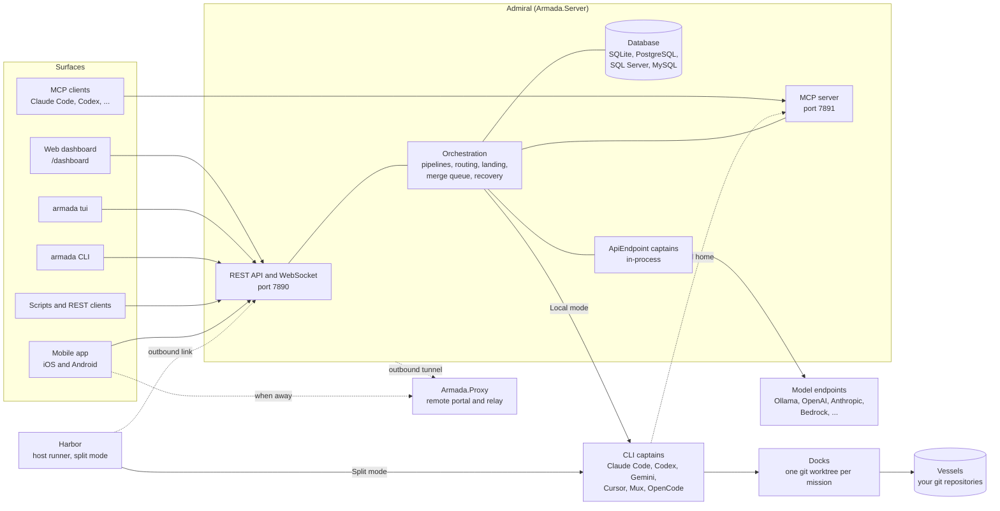
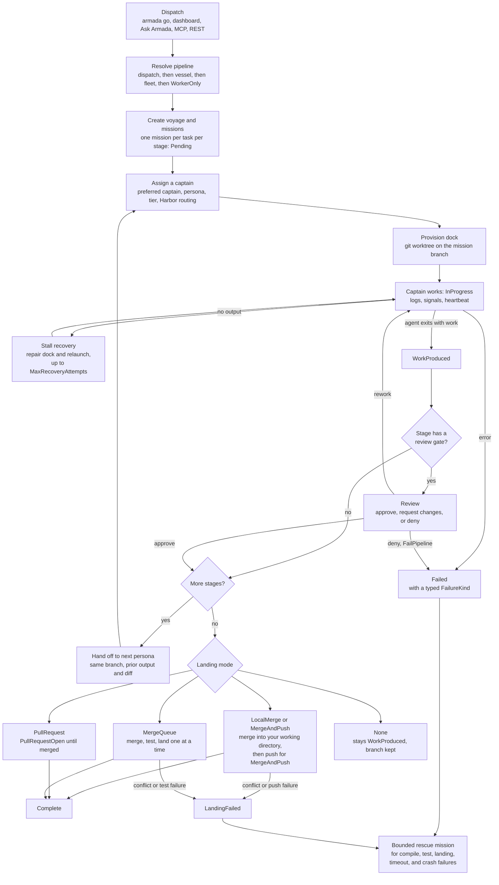
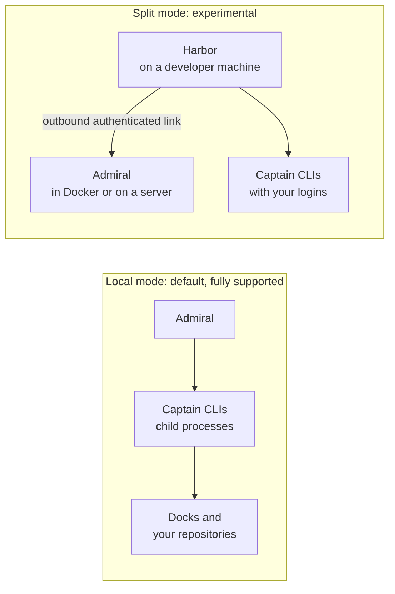
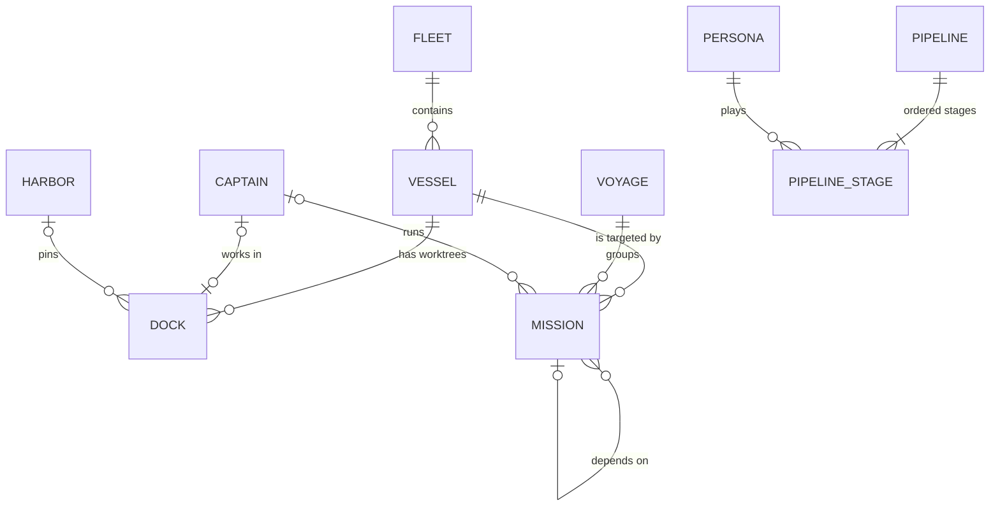

<p align="center">
  
</p>

<h1 align="center">Armada</h1>

<p align="center">
  <strong>Run a fleet of AI coding agents across all of your repositories: in parallel, isolated, reviewed, and on the record.</strong>
  <br />
  <em>v1.0.0</em>
</p>

<p align="center">
  <a href="#why-armada">Why Armada</a> |
  <a href="#use-cases">Use Cases</a> |
  <a href="#how-it-compares">How It Compares</a> |
  <a href="#quick-start">Quick Start</a> |
  <a href="#how-it-works">How It Works</a> |
  <a href="#ask-armada">Ask Armada</a> |
  <a href="#pipelines">Pipelines</a> |
  <a href="#terminal-ui">TUI</a> |
  <a href="#mobile-app">Mobile</a> |
  <a href="#harbor-run-agents-on-your-machine">Harbor</a> |
  <a href="#cli-reference">CLI</a> |
  <a href="#rest-api">API</a> |
  <a href="#mcp-integration">MCP</a> |
  <a href="#documentation">Docs</a> |
  <a href="#community">Community</a>
</p>

---

Armada is a self-hosted coordinator for the coding agents you already use: Claude Code, Codex, Gemini CLI, Cursor, Mux, OpenCode, and any model behind an API endpoint. You describe the work. Armada hands it to agents, gives each one its own git worktree and branch, runs it through the stages you choose (plan, implement, test, review), lands the result the way you choose (merge, pull request, or merge queue), and records every log, diff, and decision in a database you can query later.

- **The problem.** One agent in one terminal is easy. Five agents across twelve repositories is not: you juggle branches and worktrees, babysit sessions, lose track of what landed and what failed, and rebuild context every time you switch projects.
- **What Armada does.** It turns agent work into durable, tracked units (missions) that run in parallel, in isolation, through review gates, with automatic recovery when an agent stalls or fails.
- **Why not just run the CLIs.** Armada runs those same CLIs, and adds the parts you otherwise do by hand: worktree isolation, queueing and routing, quality gates, landing, retries, history, and approvals from a browser, terminal, or phone.
- **Who it's for.** Developers who work across several repositories, tech leads who want parallel agent work with a record of what changed, and AI engineers comparing runtimes and models on real tasks.

```bash
cd your-repo
armada go "Add rate limiting" --task "Add rate limiting middleware" --task "Add request logging" --task "Add input validation"
armada watch
```

Three missions, three captains, three worktrees, three branches. Watch them in the terminal, the [dashboard](#quick-start), the [TUI](#terminal-ui), or the [mobile app](#mobile-app).

---

## Why Armada

Agent CLIs are good at a single task in a single checkout. The work around them is where the time goes:

1. **Context switching across projects.** Coming back to a repository means reconstructing what was in flight, what landed, what failed, and what the agent was about to do next.
2. **No durable memory.** Agent sessions disappear into terminal scrollback and branch diffs. A week later, neither you nor the next agent can ask "what happened here?"
3. **Parallelism is manual.** Running agents side by side means creating worktrees, naming branches, keeping them from colliding, and merging the results yourself.
4. **Quality is ad hoc.** Whether a change gets tests or a review depends on what you remembered to ask for.

Armada addresses each one:

- **State lives outside your head.** Missions, voyages, logs, diffs, status changes, and landing results are stored by the Admiral and shown on every surface. Dispatch, walk away, and come back to a current picture.
- **Memory that agents can use too.** Each repository (vessel) carries project context, a style guide, and model-maintained notes that Armada includes in mission prompts. The Recorder persona distills durable memories that later agents recall through the `search_memory` MCP tool.
- **Parallel by default, isolated by construction.** Every mission gets its own dock (a git worktree on its own branch). Agents cannot step on each other or on your checkout until work lands.
- **Pipelines make quality repeatable.** Built-in and custom pipelines chain personas (Architect, Worker, TestEngineer, Linter, Judge, and your own) with optional human review gates between stages.

---

## Use Cases

Each scenario names who it is for, what they do, and what they get.

### Solo developer: multiply output without losing track

You have three independent refactors that would take an afternoon serially.

```bash
armada go "Refactors" --task "Extract UserRepository from UserService" --task "Add ILogger to all controllers" --task "Migrate config to the Options pattern"
```

Armada creates one mission per `--task`, auto-creates captains for parallel work (up to `MaxCaptains`, 5 when unset), and runs each in its own worktree. You get three branches and three diffs to review instead of a queue. Finished work lands by the vessel's landing mode (by default merged into your checkout and pushed; `--landing-mode PullRequest` opens pull requests instead).

### Team lead: parallel work across many repositories, with a record

You own forty repositories under `~/Code` and want dependency updates, cleanup, and fixes moving at once.

1. **Import** every repository in one pass: `armada vessel import --root ~/Code --dry-run`, then import the ones you keep.
2. **Grade** them with Vessel Health (`armada health`): commits behind, stale branches, outdated and vulnerable packages, test and CI setup, recent mission failures.
3. **Act** with a Fleet Action: select the failing rows and run "Update outdated dependencies". Each vessel gets its own voyage, paced so a large run does not starve other work.
4. **Review** in Needs You and the Approvals center, and reconstruct any change later from the Activity timeline.

Multi-tenant authentication gives each teammate an account and bearer token on a shared Admiral. See [docs/FLEET_ACTIONS.md](docs/FLEET_ACTIONS.md), [docs/VESSEL_HEALTH.md](docs/VESSEL_HEALTH.md), and [docs/REMOTE_SERVER.md](docs/REMOTE_SERVER.md).

### AI engineer: compare runtimes and models on the same task

You want evidence, not anecdotes, about which agent and model handle your codebase best.

- Register one captain per runtime or model: `armada captain add claude-1 --runtime claude`, `armada captain add codex-1 --runtime codex`, `armada captain add gemini-1 --runtime gemini`, or an `api` captain backed by a [model endpoint](docs/REST_API.md#model-endpoints) (Ollama, OpenAI-compatible, Anthropic, Bedrock, and others).
- Dispatch the same task as several missions, each pinned to a different captain with a per-mission `requestedCaptainId` (MCP `dispatch` or `POST /api/v1/voyages`), and use landing mode `None` so every result stays on its own branch.
- Compare the diffs (`armada diff <mission>`), Judge verdicts, mission runtimes, and token use (`token_usage_summary`), then keep the winner.
- Route by cost in production: give each persona a default captain and a capability tier (Economy, Standard, Premium) so cheap captains take Worker and TestEngineer stages and strong ones take Architect and Judge. See [docs/CAPTAIN_ROUTING.md](docs/CAPTAIN_ROUTING.md).

### Quality-minded developer: ship with gates you define

Set `Tested` as a vessel's default pipeline and every dispatch becomes Worker, then TestEngineer, then Judge, with a review gate after each stage. Add a `SecurityAuditor` persona with your own prompt and insert it before the Judge. Attach playbooks (for example `CSHARP_BACKEND_ARCHITECTURE.md`) so the rules travel with the work. See [Pipelines](#pipelines).

### On the go: review and approve from your phone

The [mobile app](#mobile-app) for iOS and Android pushes the things that need a person: Ask proposals, CLI tool permission requests, mission reviews, deployment approvals, failed missions and landings, and stalled captains. Deny straight from the notification; Approve opens the full request in the app so you see exactly what you are approving. Connect over your LAN, a public URL, or through [Armada.Proxy](#remote-access-through-armadaproxy) when you are away.

### Conversational operations: run Armada by asking

Open [Ask Armada](#ask-armada) and type "What failed overnight on my-api? Restart it and add rate limiting." The captain answers from live fleet state and turns each state-changing step into a confirm card with the exact arguments. Approve, and the conversation tracks the work through to landing.

### Agents on your machine, Admiral elsewhere (experimental)

Run the Admiral in Docker or on a server and install the [Harbor](#harbor-run-agents-on-your-machine) tray app on your machine. The Harbor dials out to the Admiral, so it works from behind NAT. Today, Ask Armada turns, captain chat, and planning sessions run on the Harbor with your CLI logins; mission launches go to a Harbor only when it can see the Admiral's dock directory at the same path (in practice, a Harbor on the Admiral's own machine). Running missions in a checkout on a remote Harbor is in development.

### Let AI manage AI

Connect Claude Code, Codex, Gemini, Cursor, Mux, or OpenCode to Armada's MCP server and let it act as the orchestrator: decompose a goal into missions, dispatch them, monitor progress, and redispatch failures. See [AI-Powered Orchestration](#ai-powered-orchestration).

---

## How It Compares

Armada does not replace your agent. It runs it. The comparison is with the work you would otherwise do around the agent.

| You want to... | Agent CLIs by hand (optionally in tmux or terminal tabs) | With Armada |
|---|---|---|
| Run several tasks at once | Create worktrees and branches yourself, one terminal each | One command or form; each mission gets its own dock and branch |
| Use several runtimes | Separate tools, flags, and logins per CLI | One dispatch model across Claude Code, Codex, Gemini, Cursor, Mux, OpenCode, and API endpoints |
| Get tests and review every time | Remember to ask for them | Pipelines with persona stages and optional human review gates |
| Land the work | Merge, push, or open PRs by hand | Landing modes: local merge, merge and push, pull request, merge queue, or none |
| Recover from a stalled or failed agent | Notice it, then restart it | Stall detection, dock repair, relaunch, and bounded rescue missions |
| Know what happened last week | Scroll back, read branch diffs | Searchable missions, logs, diffs, events, and an activity timeline |
| Approve risky actions | Watch the terminal | Confirm cards and CLI tool permission requests, decided from Needs You on the web or the Approvals center in the TUI and mobile app |
| Hand context to the next agent | Paste it again | Vessel context, playbooks, and agent memory injected automatically |

**Compared with single-agent tools** (an agent CLI or IDE assistant on its own): those are the right tool for one interactive change in one checkout. Armada is for when the work outgrows one session: many tasks, many repositories, more than one runtime, or a need for gates and a record. The captains Armada runs are those same tools.

**Compared with a terminal multiplexer:** tmux or terminal tabs give you parallel sessions. Armada adds what sits behind the sessions: a database of missions and outcomes, isolation, routing, landing, recovery, and access from other machines.

**When you do not need Armada:** a quick one-off edit in a single repository. Run the agent directly.

---

## What You Get

**Orchestration**
- Parallel dispatch of missions and voyages (batches) to many captains across many repositories.
- [Pipelines](#pipelines) of personas, with human review gates you can turn on per stage.
- Per-step captain selection with capability-tier fallback ([docs/CAPTAIN_ROUTING.md](docs/CAPTAIN_ROUTING.md)).
- [Playbooks](#playbooks): reusable markdown guidance attached at dispatch time.
- Planning sessions: chat with a captain, then dispatch the agreed plan without copy and paste.
- Backlog of scoped objectives with acceptance criteria, optionally imported from GitHub issues or PRs.

**Safety and control**
- Git isolation: one worktree and branch per mission; your checkout is untouched until landing.
- Landing modes and a built-in merge queue that merges, tests, and lands branches one at a time per target ([docs/MERGING.md](docs/MERGING.md)).
- Approvals: Ask Armada confirm cards, CLI tool permission requests with remembered allow and deny rules, mission reviews, and deployment approvals, gathered in Needs You (dashboard) and the Approvals center (TUI and mobile app).
- Auto-recovery: stall detection with dock repair and relaunch, plus bounded rescue missions for mechanical failures ([Auto-Recovery](#auto-recovery)).
- Multi-tenant authentication with global admins, tenant admins, and users; bearer tokens shown once; audit events for commands run.

**Memory and context**
- Every mission's log, diff, status history, and landing result, queryable from every surface.
- Vessel context: project context, style guide, and model-maintained notes; **Build Context** launches a captain to write them.
- Agent memory (episodic, semantic, procedural) written by the Recorder persona and recalled through MCP.
- Activity timeline across missions, voyages, checks, deployments, merges, events, and request history.
- Papercuts: captains report friction (stale docs, flaky tests, contradictory briefs) as structured, groupable events.

**Surfaces**
- Web dashboard (React) served by the Admiral at `/dashboard`, with a repository Workspace (file tree, editing, search, git status) and an API Explorer.
- [Ask Armada](#ask-armada): private conversations that read fleet state and propose actions for approval.
- [Terminal UI](#terminal-ui) (`armada tui`) covering every dashboard screen, for SSH sessions and terminals.
- [Mobile app](#mobile-app) for iOS and Android with push approvals and biometric unlock.
- [CLI](#cli-reference), [REST API](#rest-api) with OpenAPI, WebSocket events, and an [MCP server](#mcp-integration).

**Models and runtimes**
- CLI runtimes: Claude Code, Codex, Gemini, Cursor, Mux, and OpenCode, plus a `Custom` runtime, behind one pluggable `IAgentRuntime` interface.
- `ApiEndpoint` captains: an in-process tool-calling loop against a registered inference endpoint, also usable for Ask Armada.
- Managed model endpoints for inference and embeddings (Ollama, OpenAI, OpenAI-compatible, Azure OpenAI, Anthropic, Gemini, Vertex AI, Bedrock, VoyageAI) with health checks and write-only API keys.

**Many repositories**
- [Vessel import](#working-across-many-repositories) from a directory tree, with optional captain-suggested fleet grouping.
- Vessel Health grades, Fleet Actions across many vessels, and a commit-history heatmap per vessel.

**Delivery**
- Workflow profiles: per-vessel or per-fleet commands for lint, build, test, package, deploy, rollback, and verify.
- Checks, environments, deployments, releases, incidents, and runbooks as first-class records ([docs/DELIVERY_OPERATIONS.md](docs/DELIVERY_OPERATIONS.md)).
- Pull-based GitHub context: issue and PR import, GitHub Actions runs as checks, and PR review evidence.

**Deploy and operate**
- Local install, Docker Compose, prebuilt installers for Windows, macOS, and Linux, and the CLI as a .NET tool.
- SQLite (default), PostgreSQL, SQL Server, or MySQL, with automatic migrations and pre-migration backups.
- Remote use: an Admiral on another machine ([docs/REMOTE_SERVER.md](docs/REMOTE_SERVER.md)), Armada.Proxy for remote browsers and phones, and Harbors for split mode (experimental).
- OpenTelemetry export with a Prometheus, Loki, and Grafana stack ([docs/TELEMETRY.md](docs/TELEMETRY.md)).
- [Internationalized](#internationalization) dashboard, TUI, and mobile app (English plus eight beta locales).
- [Self-rebuild](#rebuilding-armada-from-the-dashboard) from the dashboard when Armada's own source is a vessel.

---

## Quick Start

### Prerequisites

- [.NET 8.0+ SDK](https://dot.net/download)
- At least one agent runtime on your PATH, signed in:
  - [Claude Code](https://docs.anthropic.com/en/docs/claude-code) (`claude`)
  - [Codex](https://github.com/openai/codex) (`codex`)
  - [Gemini CLI](https://github.com/google-gemini/gemini-cli) (`gemini`)
  - [Cursor](https://docs.cursor.com/cli) (`cursor-agent`)
  - Mux (`mux`)
  - [OpenCode](https://opencode.ai) (`opencode`)
- Optional: Node.js to rebuild the dashboard (without it, the install uses the prebuilt bundle committed in the repository).

### Install

```bash
git clone https://github.com/jchristn/armada.git
cd armada
./scripts/macos/install.sh      # Linux: ./scripts/linux/install.sh   Windows: scripts\windows\install.bat
```

The install script builds the solution, deploys the dashboard, and installs the `armada` CLI as a global .NET tool. On Windows, pass a target framework first when only one SDK is installed (`scripts\windows\install.bat net8.0`; the default is `net10.0`). Prebuilt installers and Docker images are listed under [Deployment](#deployment).

#### Behind an enterprise proxy or firewall

TLS-inspecting proxies make the dashboard's npm build fail with `SELF_SIGNED_CERT_IN_CHAIN`. Add `--insecure` (alias `-k` or `--no-strict-ssl`) to any install, update, reinstall, publish, mcp, or task script, for example `./scripts/linux/install.sh --insecure` or `scripts\windows\install.bat net8.0 --insecure` (framework first). The flag sets `NODE_TLS_REJECT_UNAUTHORIZED=0` and `npm_config_strict_ssl=false` for that run and propagates to every sub-script. It affects only npm and Node: `dotnet` and NuGet use the OS certificate store, so if `dotnet restore` also fails on certificates, an administrator must install the proxy's root CA. To avoid passing the flag each time, set `NODE_TLS_REJECT_UNAUTHORIZED=0` in your shell or run `npm config set strict-ssl false` once.

### Your First Dispatch

```bash
cd your-project
armada go "Add input validation to the signup form"
armada watch   # live progress
```

`armada go` starts the Admiral if it is not running, detects your runtime, registers the current repository as a vessel, creates a captain, provisions a worktree, and dispatches. With the default landing mode (`MergeAndPush`), finished work is merged into your checkout's default branch and pushed. Pass `--landing-mode PullRequest` to open a pull request instead, or `--landing-mode None` to leave the branch for you to review.

Prefer to talk it through? Open Ask Armada at `http://localhost:7890/dashboard/ask` or run `armada tui`, describe the change, and approve the dispatch card the captain proposes. See [Ask Armada](#ask-armada).

To let Claude Code (or Codex, Gemini, Cursor, Mux, OpenCode) drive Armada, run `armada mcp install`. See [MCP Integration](#mcp-integration). For a longer walkthrough, see the [Getting Started Guide](GETTING_STARTED.md); to onboard many repositories through an agent, see [FAST_TRACK_SETUP.md](FAST_TRACK_SETUP.md).

### Planning Before Dispatch

To negotiate a plan with a captain first, open **Planning** in the dashboard, choose a captain, vessel, optional pipeline, and playbooks, and chat until the plan is ready. Select a reply and summarize it into a dispatch draft, open it on the Dispatch page, or dispatch directly.

- Planning supports the `ClaudeCode`, `Codex`, `Gemini`, `Cursor`, `Mux`, and `OpenCode` runtimes (not `ApiEndpoint` or `Custom`).
- A session reserves its captain and a dock on the vessel. The captain can read and modify the repository while planning; treat it as tool-capable, not read-only.
- Each turn relaunches the runtime against the saved transcript and repository context. The chat shows Markdown replies, live tool calls, per-turn metrics, and a Stop button.
- Planning-session persistence is implemented for SQLite; other database backends answer `501 Not Supported`.
- Idle sessions stop after `PlanningSessionInactivityTimeoutMinutes` (60); `PlanningSessionRetentionDays` deletes old transcripts.

### Default Credentials

On first boot, Armada seeds a default tenant, user, and credential:

| Item | Value |
|------|-------|
| Email | `admin@armada` |
| Password | `password` |
| Bearer Token | `default` |

Dashboard at `http://localhost:7890/dashboard`. API access with `Authorization: Bearer default`.

The default password is flagged, not blocked: the API keeps working, the TUI signs in with a header warning, and the dashboard prompts for a new password at first sign-in (Skip for now is allowed after a confirmation). Changing it disables the `default` bearer token, so move scripts to a new credential (Server > Credentials; the token is shown once) or to the local API key the CLI uses. The one hard rule: while default credentials are in use, the Admiral refuses to listen on any address other than localhost. For Docker and other headless installs set `ARMADA_INITIAL_ADMIN_PASSWORD` before the first start, or set `AllowDefaultCredentialsOnNetwork` to accept the risk explicitly.

### Running Agents Safely

Captains run as CLI agents with your account's permissions, and by default with their auto-approve flags (Claude Code `--dangerously-skip-permissions`, Codex `--sandbox workspace-write`, or `--dangerously-bypass-approvals-and-sandbox` on Windows, Gemini `--approval-mode yolo`, Cursor `--force`, Mux `--yolo`, OpenCode `--auto`), so they can read, write, and execute without confirmation. To run a captain without them, untick **Auto-approve agent tool use** when editing the captain (or pass `autoApprove: false` to the `create_captain` / `update_captain` MCP tools); the runtime then uses its safer mode (for example Claude Code `--permission-mode acceptEdits`, Codex `--sandbox workspace-write`).

Which of a captain's own tools may run is set by its CLI tool permission policy: `Refuse`, `ApproveInArmada` (permission prompts become approval cards in Ask, the Approvals center, Needs You, and the mobile app, with remembered allow and deny rules; available for Claude Code and `ApiEndpoint` captains), or `Bypass`. See [CLI tool permissions](docs/ASK_ARMADA_HOME_BASE.md#cli-tool-permissions) and the `Permissions` settings.

Run Armada under a dedicated account, keep it on localhost unless you need remote access (then follow [docs/REMOTE_SERVER.md](docs/REMOTE_SERVER.md): a non-default admin password, TLS in front, and one bearer token per user or machine), and review `audit.command` events for commands run through workspace exec, fleet actions, and check runs. See [Running agents safely](docs/SECURITY_REVIEW.md#running-agents-safely) and [SECURITY.md](SECURITY.md).

---

## How It Works

### Architecture

The Admiral is the one long-running server. Every surface talks to it; it launches captains (directly in Local mode, or through a Harbor) and owns the database.


```mermaid
flowchart LR
    subgraph surfaces["Surfaces"]
        dash["Web dashboard<br/>/dashboard"]
        tui["armada tui"]
        cli["armada CLI"]
        mobile["Mobile app<br/>iOS and Android"]
        mcpc["MCP clients<br/>Claude Code, Codex, ..."]
        rest["Scripts and REST clients"]
    end

    proxy["Armada.Proxy<br/>remote portal and relay"]

    subgraph admiral["Admiral (Armada.Server)"]
        api["REST API and WebSocket<br/>port 7890"]
        mcp["MCP server<br/>port 7891"]
        orch["Orchestration<br/>pipelines, routing, landing,<br/>merge queue, recovery"]
        db[("Database<br/>SQLite, PostgreSQL,<br/>SQL Server, MySQL")]
        apicap["ApiEndpoint captains<br/>in-process"]
    end

    endpoints["Model endpoints<br/>Ollama, OpenAI, Anthropic,<br/>Bedrock, ..."]
    harbor["Harbor<br/>host runner, split mode"]
    captains["CLI captains<br/>Claude Code, Codex, Gemini,<br/>Cursor, Mux, OpenCode"]
    docks["Docks<br/>one git worktree per mission"]
    repos[("Vessels<br/>your git repositories")]

    dash --> api
    tui --> api
    cli --> api
    rest --> api
    mobile --> api
    mcpc --> mcp
    mobile -. "when away" .-> proxy
    admiral -. "outbound tunnel" .-> proxy
    api --- orch
    mcp --- orch
    orch --- db
    orch -- "Local mode" --> captains
    harbor -. "outbound link" .-> api
    harbor -- "Split mode" --> captains
    orch --- apicap
    apicap --> endpoints
    captains --> docks
    docks --> repos
    captains -. "call home" .-> mcp
```

- **Local mode (default):** the Admiral launches captain processes as children on its own machine.
- **Split mode (experimental):** a Harbor opens an outbound link to the Admiral and runs host work there. See [Harbor](#harbor-run-agents-on-your-machine) for what runs on a Harbor today.
- **Remote access:** each Admiral opens an outbound tunnel to Armada.Proxy, so remote browsers and the mobile app can reach it without exposing the Admiral. Alternatively, expose the Admiral directly ([docs/REMOTE_SERVER.md](docs/REMOTE_SERVER.md)).
- **Captains call home:** every mission captain gets a mission-scoped MCP token, and every Ask Armada turn a thread-scoped one, so agents can read and update Armada as the right user.

### Mission lifecycle


```mermaid
flowchart TD
    dispatch["Dispatch<br/>armada go, dashboard, Ask Armada, MCP, REST"]
    resolve["Resolve pipeline<br/>dispatch, then vessel, then fleet, then WorkerOnly"]
    create["Create voyage and missions<br/>one mission per task per stage: Pending"]
    assign["Assign a captain<br/>preferred captain, persona, tier, Harbor routing"]
    dock["Provision dock<br/>git worktree on the mission branch"]
    work["Captain works: InProgress<br/>logs, signals, heartbeat"]
    stall["Stall recovery<br/>repair dock and relaunch,<br/>up to MaxRecoveryAttempts"]
    produced["WorkProduced"]
    gate{"Stage has a<br/>review gate?"}
    review["Review<br/>approve, request changes, or deny"]
    more{"More stages?"}
    handoff["Hand off to next persona<br/>same branch, prior output and diff"]
    landing{"Landing mode"}
    merge["LocalMerge or MergeAndPush<br/>merge into your working directory,<br/>then push for MergeAndPush"]
    pr["PullRequest<br/>PullRequestOpen until merged"]
    queue["MergeQueue<br/>merge, test, land one at a time"]
    none["None<br/>stays WorkProduced, branch kept"]
    complete["Complete"]
    landfail["LandingFailed"]
    failed["Failed<br/>with a typed FailureKind"]
    rescue["Bounded rescue mission<br/>for compile, test, landing,<br/>timeout, and crash failures"]

    dispatch --> resolve --> create --> assign --> dock --> work
    work -- "no output" --> stall --> work
    work -- "agent exits with work" --> produced
    work -- "error" --> failed
    produced --> gate
    gate -- "yes" --> review
    gate -- "no" --> more
    review -- "approve" --> more
    review -- "rework" --> work
    review -- "deny, FailPipeline" --> failed
    more -- "yes" --> handoff --> assign
    more -- "no" --> landing
    landing --> merge
    landing --> pr
    landing --> queue
    landing --> none
    merge --> complete
    pr --> complete
    queue --> complete
    merge -- "conflict or push failure" --> landfail
    queue -- "conflict or test failure" --> landfail
    failed --> rescue
    landfail --> rescue
```

1. **You choose the entry point.** `armada go`, the Dispatch page, an Ask Armada conversation, a planning session, MCP, or REST.
2. **The Admiral resolves the pipeline** (dispatch parameter, then vessel default, then fleet default, then `WorkerOnly`) and creates one mission per task per stage, chained so each stage waits for the previous one.
3. **Missions are assigned** to an idle captain: the preferred captain when one was chosen, otherwise any captain allowed to serve the persona at or above the fallback tier. A Pending mission shows why it is waiting.
4. **Each mission gets a dock**, a git worktree on its own branch, and the captain runs with the mission prompt, vessel context, playbooks, and (for later stages) the prior stage's output and diff.
5. **Review gates** pause a stage in `Review` until someone approves, asks for more work, or denies. Approving the last stage continues to landing.
6. **Landing** follows the landing mode resolved from the voyage, then the vessel, then the global default (`MergeAndPush`). See [docs/MERGING.md](docs/MERGING.md#landing-mode).
7. **An Architect stage** can fan out into several Worker missions, each on a fresh branch.

### Parallel Tasks

Each `--task` becomes its own mission, and Armada can assign them to different agents. The prompt becomes the voyage title. Without `--task` the whole prompt is one mission; Armada does not split prompts on semicolons or list numbering.

```bash
armada go "API hardening" --task "Add rate limiting" --task "Add request logging" --task "Add input validation"
armada go "Auth" -t "Add auth middleware" -t "Add login endpoint" -t "Add token validation"
```

### Auto-Recovery

Armada recovers from two kinds of trouble without you:

- **Stalled captains.** When a captain produces no output for `StallThresholdMinutes` (10), the Admiral repairs the dock and relaunches the agent in it, up to `MaxRecoveryAttempts` times (default 3). A mission that runs past `MaxMissionRuntimeMinutes` (240) is failed as a runaway.
- **Mechanical failures.** A mission that failed with a compile error, failing tests, a landing conflict, a timeout, or a crash opens an incident, and Armada dispatches a bounded rescue mission for it, up to `MaxMissionRecoveryAttempts` (default 2, maximum 5, 0 disables). Failures that need judgment (scope, Judge verdicts, environment problems) are left for a person.

---

## Components and Concepts

| Term | Plain language | What it is |
|------|---------------|-------------|
| **Admiral** | Coordinator | The server process (`Armada.Server`): REST API and WebSocket (built on [Watson](https://github.com/jchristn/watson)), the MCP server (built on [Voltaic](https://github.com/jchristn/voltaic)), the embedded dashboard, and the orchestration logic. It owns the database. The CLI starts it when needed. |
| **Captain** | Agent | A worker agent backed by a runtime (`Armada.Runtimes`): a CLI runtime (Claude Code, Codex, Gemini, Cursor, Mux, OpenCode, Custom) or an in-process `ApiEndpoint` runtime. Has a model, an optional capability tier, and allowed personas. |
| **Fleet** | Group of repos | A named group of vessels. A default fleet is created automatically. |
| **Vessel** | Repository | A git repository registered with Armada, with its own default pipeline, landing mode, project context, style guide, and model-maintained notes. |
| **Mission** | Task | One atomic unit of work, assigned to one captain, targeting one vessel. |
| **Voyage** | Batch | A group of related missions dispatched together. |
| **Dock** | Worktree | The git worktree provisioned for a mission so its work stays isolated on its own branch. A dock lives on one host's filesystem. |
| **Signal** | Message | A message between the Admiral and captains for progress and coordination. |
| **Persona** | Role | A named role (Worker, Architect, TestEngineer, Judge, and others) with its own prompt template. |
| **Pipeline** | Workflow | An ordered sequence of persona stages, set per fleet or vessel and overridable per dispatch. |
| **Prompt Template** | Instructions | A user-editable template; every prompt Armada sends is template-driven with `{Placeholder}` parameters. |
| **Playbook** | Reusable guidance | A markdown document attached to missions at dispatch time. |
| **Planning Session** | Interactive draft | A dashboard chat with a captain on a reserved dock that can turn into a dispatch. |
| **Workflow Profile** | Delivery recipe | Vessel- or fleet-scoped commands for build, test, package, deploy, rollback, and verify. |
| **Check Run** | Structured validation | A durable record of a build, test, deploy, or verification run, with logs and artifacts. |
| **Harbor** | Host runner | A tray app (`Armada.Harbor`) that runs captains, git, and worktrees on a developer machine and dials out to the Admiral (split mode). |

`armada` (`Armada.Helm`) is the CLI, a thin HTTP client to the Admiral. `armada tui` (`Armada.Tui`) is the terminal UI and uses `Armada.Client`, the typed .NET client. For mission scheduling and assignment details, see [docs/SCHEDULING.md](docs/SCHEDULING.md).

---

## Ask Armada

Ask Armada is the place you run Armada from. It is the **Ask** page of the dashboard (`http://localhost:7890/dashboard/ask`), the screen the TUI opens into (`armada tui`), and the Ask tab of the mobile app. All three work on the same server-side conversations, so you can start in the browser and continue in a terminal or on your phone.

**Conversations.** Create one by typing (it is named after your first message), or press `n` in the TUI list. Search, rename, pin, summarize, archive, and delete; unread counts and a "working" marker show activity. A conversation is private to the user who created it (another user, even an admin, gets 404), but the work it starts is ordinary tenant work visible on the normal pages. Idle conversations are archived after 90 days (pinned ones never); see [data retention](docs/UPGRADING.md#data-retention).

**The captain.** Each conversation has a captain that answers in plain language and calls Armada's MCP tools for you through a thread-scoped token. Pick it in the conversation header (in the TUI, press `Esc` to leave the message box, then `c`). Choose **No captain (quick actions only)** to use the conversation only for quick actions. Every runtime's state-changing calls go through approval, except a `Custom` runtime, which the conversation flags. See [docs/CAPTAINS.md](docs/CAPTAINS.md) for per-runtime details.

**What you can do**

- **Ask about fleet state.** "What is running?", "Any failures since yesterday?", "Which vessels fail health?" Read-only tools run without asking.
- **Propose work.** Dispatch a voyage, restart a mission, run a fleet action, evaluate health, import repositories. Anything that changes state becomes a **confirm card** with the tool, a summary, the exact arguments, and an expiry (`Ask.ProposalExpiryMinutes`, default 60).
- **Approve or reject.** Approve runs the stored call as you, through the same handler and permission checks as a direct call. In the TUI, `a` approves and `r` rejects; `Ctrl+A` opens the **Approvals center** (Ask proposals, CLI permission requests, mission reviews, deployment approvals, failed landings, stalled captains).
- **Quick actions.** Type `/`: `/dispatch`, `/fleet-action`, `/status`, `/health`, and `/import`. Submitting the form is the confirmation. They work without a captain.
- **Auto-approve.** A per-conversation toggle (`Ctrl+Y` in the TUI) that skips confirm cards, with a warning banner while on. Use it only in conversations you trust.
- **Track work to landing.** Whatever a conversation starts appears as a live **work card** through captain assignment, pipeline stage, checks, merge queue, pull request, and landing, with progress updates at each milestone.

```
You:      What failed overnight on my-api?
claude-1: One mission failed: "Add request logging" (msn_...) on my-api. The Judge
          returned FAIL: the new middleware is not registered in Program.cs.
You:      Restart it, and also dispatch a voyage to add rate limiting to the
          public endpoints.
          [Confirm] restart_mission  { "missionId": "msn_..." }        Approve | Reject
          [Confirm] dispatch  "Rate limiting" on my-api, 1 mission     Approve | Reject
You:      (approves both)
Armada:   Started: "Rate limiting" (vyg_...) - mission assigned to claude-2.
          [Work card] Rate limiting  InProgress  Worker -> Judge  ....
Armada:   Mission "Add request logging" landed on main.
Armada:   "Rate limiting" finished: 1 of 1 missions landed.
```

The design, REST routes (`/api/v1/ask/threads/...`), events, and settings are in [docs/ASK_ARMADA_HOME_BASE.md](docs/ASK_ARMADA_HOME_BASE.md); TUI keys are in [docs/TUI.md](docs/TUI.md#ask-armada).

---

## Pipelines

Pipelines run work through explicit stages instead of treating every task as one agent session. Each stage is a **persona** with its own prompt template.

### Built-in Personas

| Persona | Role | What it does |
|---------|------|-------------|
| **ProductManager** | Shape | Clarifies the user outcome and turns the request into durable requirements before design starts |
| **Architect** | Plan | Reads the codebase and decomposes a goal into concrete missions with file lists and dependency ordering |
| **Worker** | Implement | Writes code. The default; this is what you get without a pipeline |
| **UsabilityEngineer** | Usability | Improves usability, edge-case experience, and consistency with the surrounding product |
| **TestEngineer** | Test | Receives the Worker's diff, finds gaps in coverage, and writes tests |
| **Linter** | Lint | Checks changed code and docs for style and correctness, fixes clear in-scope violations, and flags the rest |
| **Judge** | Review | Checks the diff against the original mission for completeness, correctness, scope, and style, and returns a verdict |
| **Recorder** | Record | Distills durable memories from the voyage into the vessel context and the memory store. Runs as a non-gating final stage |

Every working persona is also told to recall the vessel's existing memory (the `search_memory` MCP tool and the vessel context) before it starts.

### Built-in Pipelines

| Pipeline | Stages | When to use |
|----------|--------|------------|
| **WorkerOnly** | Worker | Quick fixes; the system fallback |
| **Reviewed** | Worker [review] -> Judge [review] | Normal development |
| **Tested** | Worker [review] -> TestEngineer [review] -> Judge [review] | When you need coverage |
| **Recorded** | Worker [review] -> Recorder | Capture durable memories from the work |
| **FullPipeline** | ProductManager -> Architect -> Worker -> UsabilityEngineer -> TestEngineer -> Linter -> Judge (each [review]) -> Recorder | Big features, unfamiliar codebases |

`[review]` marks a human review gate: the stage's mission waits in `Review` until someone resolves it from the mission page, Needs You, the Approvals center, or the mobile app. Approve continues; More Work Required sends the stage back with your feedback; Deny retries the stage, or fails the pipeline for a Judge stage. Built-in pipelines are seeded with these gates; edit a pipeline (or create your own) to remove gates for unattended runs. See [Review Gates](docs/PIPELINES.md#review-gates).

### Pipeline Resolution

| Priority | Source | How to set |
|----------|--------|-----------|
| 1 (highest) | Dispatch parameter | The Pipeline field on the Dispatch page or `/dispatch` form, or `pipeline` / `pipelineId` in REST and MCP dispatch calls |
| 2 | Vessel default | Set on the repository in the dashboard or via API |
| 3 | Fleet default | Applies to all repositories in the fleet unless overridden |
| 4 (lowest) | System fallback | WorkerOnly |

### Custom Personas and Pipelines

The built-ins are starting points. Create your own personas and compose them into pipelines (MCP tool calls shown):

```bash
# Create a security auditor persona with custom instructions
update_prompt_template name=persona.security_auditor content="Review for OWASP vulnerabilities..."
create_persona name=SecurityAuditor promptTemplateName=persona.security_auditor

# Build a pipeline that includes security review
create_pipeline name=SecureRelease stages='[{"personaName":"Worker"},{"personaName":"SecurityAuditor"},{"personaName":"Judge"}]'
```

Every prompt Armada sends is backed by an editable template, and the dashboard has a template editor with a parameter reference. Use the same approach for a PerformanceAnalyst, MigrationPlanner, DocsWriter, ReleaseManager, or any internal role. For the full reference, see [docs/PIPELINES.md](docs/PIPELINES.md) and [docs/PERSONAS_GUIDE.md](docs/PERSONAS_GUIDE.md).

### Agent memory

The Recorder persona writes durable **memory** that survives across sessions: episodic (what happened), semantic (standalone facts), and procedural (how-to) records with provenance, tags, and a salience used to order recall. Manage it over MCP (`search_memory`, `create_memory`, `update_memory`, `delete_memory`), REST (`/api/v1/memories`), or the dashboard under `Configuration > Memory`.

## Playbooks

Playbooks are tenant-scoped markdown instruction documents that you manage in the dashboard (`Configuration > Playbooks`) or CLI (`armada playbook ...`) and attach to work at dispatch time.

- Select any number of playbooks for a voyage or mission, each with a delivery mode: `InlineFullContent`, `InstructionWithReference`, or `AttachIntoWorktree`.
- Armada snapshots the exact content, filename, order, and delivery mode used for each mission, so later edits do not change historical context.
- File-based delivery gives the agent readable files without polluting repository history.

Use them for architecture rules, coding standards, migration checklists, release procedures, or security requirements that should travel with the work.

---

## Terminal UI

`armada tui` is the dashboard in a terminal: the same Admiral, REST API, and WebSocket, for people who live in a shell, work over SSH, or have no browser. It ships inside the `armada` CLI.

```
armada tui                                 # last profile, or the local Admiral
armada tui --server http://127.0.0.1:7890  # a specific server (saved as a profile)
armada tui --profile work --route /missions
```

Every dashboard screen opens a real TUI screen (Ask Armada, Home, Needs You, Planning, Dispatch, Backlog, Fleet Actions, Missions, Voyages, Merge Queue, Jobs, Vessels, Captains and Docks, Delivery, Configuration, Activity, API Explorer, Settings), plus an Approvals center. Profiles live in `~/.armada/tui.json` with tokens in the OS keychain, and are shared with `armada profile`.

| Key | Does |
|-----|------|
| `Ctrl+K` | Command palette: every screen, tab, and command; type an id (`msn_...`, `vsl_...`) to open it |
| `g` then a letter | Go to: `g a` Ask, `g h` Home, `g i` Needs You, `g m` Missions, `g v` Vessels, `g c` Captains, `g d` Delivery, `g s` Settings, `g k` CLI Tool Permissions |
| `Ctrl+A` | Approvals center |
| `Ctrl+J` | Ask dock on any screen |
| `Alt+A` | Ask about this: a new conversation about the current screen's subject |
| `F10`, `?`, `Ctrl+N` | Menu bar, help for the current screen, notification center |

Dark, Light, High contrast, and Auto themes; Unicode or ASCII icons; works from 80x24 up; no state is shown by color alone. See [docs/TUI.md](docs/TUI.md) for every screen and the full key map.

<details>
<summary>Text capture: Ask Armada (120x40)</summary>

```
 Armada  [Default Tenant] admin@armada  [Global Admin]                                             o Offline  [bell 0]
 File  Go  View  Actions  Ask  Help                                                                            F10 Menu
+----------------------++----------------------------------------------------------------------------------------------+
|  Dashboard           || Release checklist [e]          Captain: claude-1 (ClaudeCode) [c]   Auto-approve: off [Ctr...|
|> Ask Armada          ||----------------------------------------------------------------------------------------------|
|- OPERATIONS          ||  You                                                                                   1m ago|
|   Needs You          ||    What is left before we cut the 1.0 release?                                               |
|   Planning           ||                                                                                              |
|   Dispatch           ||  claude-1  3.8s                                                                        1m ago|
|   Fleet Actions      ||  Two things are open:                                                                        |
|   Missions           ||                                                                                              |
|- DELIVERY            ||  1. Fix column widths is in progress on DemoRepo.                                            |
|   Delivery           ||  2. Broken failed its tests; I can restart it.                                               |
|- BUILD               ||                                                                                              |
|   Vessels            ||  Want me to dispatch a voyage for the remaining docs work?                                   |
|   Captains           ||                                                                                              |
|- CONFIGURATION       ||  You                                                                                   1m ago|
|   Configuration      ||    Yes, one mission for the README.                                                          |
|- ACTIVITY            ||                                                                                              |
|   Activity           ||                                                                                              |
|   Jobs               ||                                                                                              |
|- SYSTEM              ||                                                                                              |
|   API Explorer       ||                                                                                              |
|   Settings           ||                                                                                              |
|                      ||                                                                                              |
|                      ||                                                                                              |
|                      ||                                                                                              |
|                      ||                                                                                              |
|                      ||                                                                                              |
|                      ||                                                                                              |
|                      ||                                                                                              |
|                      ||                                                                                              |
|                      ||                                                                                              |
|                      ||                                                                                              |
|                      ||                                                                                              |
|                      ||----------------------------------------------------------------------------------------------|
|                      ||>  Message the captain, or type / for quick actions                                           |
|                      ||[typing]  [ ] Show thinking (Alt+T)   / Quick actions   Ctrl+E Editor   AI can m... Enter Send|
+----------------------++----------------------------------------------------------------------------------------------+
 Esc Leave the message box  Enter Send  Ctrl+J Newline  / Quick actions  F1 Help  Ctrl+K Palette  F10 Menu       manual
```

More captures: [login](docs/tui-screens/login-120x40.txt), [Home](docs/tui-screens/home-120x40.txt), [Missions](docs/tui-screens/missions-120x40.txt), [Approvals](docs/tui-screens/approvals-120x40.txt). They are rendered from stub data by the `Tui.ReadmeFrames` test suite (`ARMADA_TUI_README_DIR=docs/tui-screens`), so the header shows Offline.

</details>

## Mobile App

Armada for iPhone, iPad, and Android phones and tablets (`src/Armada.Mobile`, Expo / React Native) is a client of the Admiral like the web dashboard: the same REST API and WebSocket, the same data, and every dashboard screen, laid out for touch.

- **Ask, Approvals, Work, and More tabs** on phones; a sidebar with list and detail side by side on tablets.
- **Push notifications** for Ask proposals, CLI permission requests, mission reviews, deployment approvals, failed missions and landings, stalled captains, and finished voyages. Deny from the notification; Approve opens the full request in the app.
- **Face ID, Touch ID, or fingerprint** unlock, and an optional saved password in the device keychain.
- **Connect** directly (LAN or public URL) or through Armada.Proxy, with several server profiles.
- `src/Armada.Mobile/parity.json` maps every dashboard surface to its mobile screen, and CI fails when the dashboard gains one the app does not cover.

The app is not yet in the App Store or Google Play; install a build from whoever builds it for your organization, or build it yourself. See [docs/MOBILE.md](docs/MOBILE.md) for installing, connecting, push setup, security, and store builds.

## Screenshots

<details>
<summary>Dashboard screenshots (from an earlier dashboard build)</summary>

<br />


</details>

---

## Working Across Many Repositories

### Onboarding Many Repositories, Fleet Actions, and Vessel Health

- **Import.** **Import repositories** on the Vessels page (or `armada vessel import --root ~/Code --dry-run`) scans directories on the Admiral host, shows every git repository it found with a status (new, already onboarded, worktree, and so on), and creates vessels only for the ones you keep. Imported vessels point at your existing checkout and never set `LocalPath`, so removing a vessel never touches your clone. Scanning is limited to `Import.AllowedRoots`. A captain can also recommend fleet groupings.
- **Vessel Health** (the Health tab, or `armada health`) grades each vessel: commits ahead of or behind the default branch, uncommitted changes, stale `armada/*` branches, outdated and vulnerable NuGet and npm packages, tests and the latest check run, CI configuration, and recent mission failures. Evaluations run every 6 hours (`RepositoryHealth.IntervalMinutes`) or on demand; a check that cannot run shows as Unknown, not healthy.
- **Fleet Actions** apply one action across many vessels: a Command action runs a shell command in each working directory and records the output; a Mission action dispatches one voyage per vessel, paced.
- **View History** (`H` in the TUI, or `armada vessel history <vessel>`) shows a commit heatmap and the commits behind it, with authors, line counts, and files changed.

See [docs/FLEET_ACTIONS.md](docs/FLEET_ACTIONS.md), [docs/VESSEL_HEALTH.md](docs/VESSEL_HEALTH.md), and the Vessel Import section of [docs/REST_API.md](docs/REST_API.md).

### Rebuilding Armada from the Dashboard

When Armada's own source is one of its vessels, set **Self Vessel ID** on the Server page and use **Rebuild Armada**: pick a branch, tag, or commit, and Armada builds it from a throwaway worktree into a fresh versioned slot while the current server keeps running, backs up the database, and cuts over only after a successful build. **Roll Back** reverts to the previous slot. Self-rebuild is experimental in 1.0. See [docs/SERVER_REBUILD.md](docs/SERVER_REBUILD.md).

## Internationalization

The dashboard, TUI, and mobile app support live language selection and locale-aware date, time, and number formatting.

- Locales: English, Spanish, Mandarin (Simplified), Mandarin (Traditional), Cantonese, Japanese, German, French, and Italian.
- English is the reviewed locale. The other eight are labeled beta in the language pickers until a native speaker has reviewed them; untranslated text falls back to English.
- Language selection is available from login, setup, and the authenticated shell, and persists between sessions.

---

## Deployment

Armada runs as a local developer install, in Docker, or as a split Admiral and Harbor topology. To run the Admiral on another machine and use it from the dashboard, TUI, CLI, MCP clients, and Harbors, see [docs/REMOTE_SERVER.md](docs/REMOTE_SERVER.md). Operating an install (ports, TLS, backups, retention, troubleshooting) is covered in [docs/OPERATIONS.md](docs/OPERATIONS.md).

### Deployment modes


```mermaid
flowchart LR
    subgraph local["Local mode: default, fully supported"]
        a1["Admiral"] --> c1["Captain CLIs<br/>child processes"] --> d1["Docks and<br/>your repositories"]
    end
    subgraph split["Split mode: experimental"]
        a2["Admiral<br/>in Docker or on a server"]
        h2["Harbor<br/>on a developer machine"]
        c2["Captain CLIs<br/>with your logins"]
        h2 -- "outbound authenticated link" --> a2
        h2 --> c2
    end
```

- **Local mode (default).** The Admiral and the agent processes share one machine; there is no Harbor and no link. This is the right mode for a developer running Armada where they code, and it is what every install path gives you.
- **Split mode (experimental in 1.0).** The Admiral runs detached and Harbors connect to it from other hosts. Whenever a Harbor is connected, captain launches are routed to an eligible one; `requireHarborForLaunch` keeps them off the Admiral host. The `deploymentMode` setting is informational in 1.0. See [Harbor](#harbor-run-agents-on-your-machine) for what runs on a Harbor today.

### Prebuilt installers and Docker images

Installing from source (above) is the path the project uses day to day. Release builds also produce these packages:

| Platform | What you get |
|----------|--------------|
| Any OS with .NET | The CLI as a global tool: `dotnet tool install --global Armada.Helm` |
| Windows | Harbor `.exe` (Inno Setup) and the Admiral server `.msi` (WiX) |
| macOS | `Armada Harbor.app` in a `.dmg`, and the Admiral server `.pkg` |
| Linux | `.deb` and `.rpm` packages for the CLI, Harbor, and the server |
| Docker | Admiral, dashboard, and proxy images on Docker Hub (`jchristn77/armada-server`, `jchristn77/armada-dashboard`, `jchristn77/armada-proxy`; tags `v1.0.0` and `latest`). `docker/update.sh` or `docker/update.bat` pulls them and recreates the stack without touching its data |

Each release carries a `SHA256SUMS` file. Installers are code-signed only when the release was built with signing credentials; an unsigned Windows installer shows a SmartScreen prompt ("More info", then "Run anyway"), and an unsigned macOS app or package must be allowed once in **System Settings > Privacy & Security** ("Open Anyway"). See [BUILDING_INSTALLERS.md](BUILDING_INSTALLERS.md).

### Deploy locally

The Admiral serves its REST API and dashboard on port **7890** (`http://localhost:7890/dashboard`, WebSocket at `/ws`) and MCP on port **7891** (`AdmiralPort` and `McpPort` in `~/.armada/settings.json`). On first run Armada creates the SQLite database, applies migrations, and seeds default data.

To run the server as a user-scoped background service from your checkout, use the startup scripts under `scripts/<os>/`:

| Task | Linux | macOS | Windows |
|------|-------|-------|---------|
| Publish server and dashboard only | `./scripts/linux/publish-server.sh` | `./scripts/macos/publish-server.sh` | `scripts\windows\publish-server.bat` |
| Install and register at startup | `./scripts/linux/install-systemd-user.sh` | `./scripts/macos/install-launchd-agent.sh` | `scripts\windows\install-windows-task.bat` |
| Update from the current checkout | `./scripts/linux/update-systemd-user.sh` | `./scripts/macos/update-launchd-agent.sh` | `scripts\windows\update-windows-task.bat` |
| Verify the running deployment | `./scripts/linux/healthcheck-server.sh` | `./scripts/macos/healthcheck-server.sh` | `scripts\windows\healthcheck-server.bat` |
| Remove the startup registration | `./scripts/linux/remove-systemd-user.sh` | `./scripts/macos/remove-launchd-agent.sh` | `scripts\windows\remove-windows-task.bat` |

These publish `Armada.Server` into `~/.armada/bin` (`%USERPROFILE%\.armada\bin` on Windows) and the dashboard into `~/.armada/dashboard`. The remove scripts unregister the startup entry but keep the published files. `scripts/<os>/run-local.sh` (or `.bat`) builds and starts the server, then runs a Harbor in the foreground for exercising the Harbor link. See [docs/RUN_ON_STARTUP.md](docs/RUN_ON_STARTUP.md).

### Deploy with Docker

```bash
cd docker/armada
export ARMADA_INITIAL_ADMIN_PASSWORD='choose-a-strong-password'   # 8+ characters, or put it in docker/armada/.env
docker compose up -d
```

The compose file refuses to start without `ARMADA_INITIAL_ADMIN_PASSWORD`, because the Admiral listens on all interfaces inside the container. Sign in as `admin@armada` with the password you set. This starts `armada-server` (7890, 7891 MCP, 9464 Prometheus scrape), an optional standalone `armada-dashboard` (3000), and a Prometheus, Loki, and Grafana stack. Configuration lives in `docker/armada/armada.json` and data under `docker/armada/`. See [Running Locally (with Docker)](#running-locally-with-docker) and [docs/DOCKER.md](docs/DOCKER.md).

### Harbor: run agents on your machine

A Harbor (`Armada.Harbor`, a small tray app) is the host runner for split mode. You do not need it in Local mode. It runs on the machine that has your repositories, git credentials, and agent CLI logins, dials out to the Admiral (so it works from behind NAT and against a container's published port), and executes the work the Admiral routes to it. The app also has a **Manage** window for the Admiral's status, settings, logs, and backups.

**What runs on a Harbor today**

- **Interactive turns:** Ask Armada turns and narrations, captain chat, planning and refinement turns, and vessel context builds run on an eligible connected Harbor, using your CLI logins. Chat turns use a scratch directory the Harbor creates.
- **Missions:** in 1.0 the Admiral creates every mission dock under its own `docksDirectory`. A mission launches on a Harbor only when that Harbor sees the dock at the same path, which in practice means a Harbor on the Admiral's own machine; otherwise the captain runs on the Admiral host (or, with `requireHarborForLaunch` on, the mission fails with a reason naming the Harbor and dock path). Harbor-side docks in your own checkout are in development.
- `ApiEndpoint` captains always run in-process on the Admiral.

Split mode is **experimental** in 1.0 (decision D3 in [V1_READINESS.md](V1_READINESS.md)): the link, the Harbor REST routes and MCP tools, and the `harbor.*`, `deploymentMode`, and `requireHarborForLaunch` settings are outside the [compatibility promise](docs/COMPATIBILITY.md) and may change in a minor release.

**Install and start the Harbor**

| Platform | Install | Start at login |
|----------|---------|----------------|
| Windows | Harbor `.exe` installer (Inno Setup) | The installer registers it (`--install-startup`) |
| macOS | `Armada Harbor.app` from the `.dmg` | Run `"/Applications/Armada Harbor.app/Contents/MacOS/Armada.Harbor" --install-startup` once |
| Linux | `.deb` / `.rpm` Harbor package (`armada-harbor`) | Run `armada-harbor --install-startup` as yourself |
| From source | `scripts/<os>/run-harbor.sh` (or `scripts\windows\run-harbor.bat`); or `dotnet run --project src/Armada.Harbor` | -- |

**Configure it.** On first run Harbor writes `~/.armada-harbor/settings.json` (`%USERPROFILE%\.armada-harbor\settings.json` on Windows); change it in the app (**Harbor > Harbor Settings...**), which validates, backs up, and reconnects. Keys are PascalCase and case-sensitive:

| Field | Description |
|---|---|
| `ServerLinkUrl` | The Admiral's Harbor link: `ws://<admiral-host>:7890/v1.0/harbor/connect` (the Admiral port, not the MCP port). Use `wss://` behind a TLS proxy. |
| `DashboardUrl` | Opened by the app's Dashboard button. Default `http://127.0.0.1:7890/dashboard`. |
| `AccessKey` | An Armada credential (a bearer token from Server > Credentials, or the local API key). The Harbor registers under that credential's tenant and user. Required unless the Harbor and a localhost-bound Admiral share a machine. |
| `Capabilities` | Runtimes and tools this host offers (for example `git`, `claude`, `codex`); used for routing. Default `["git"]`. |
| `MaxConcurrentJobs` | Jobs this Harbor accepts at once. Default 4. |
| `Name`, `HarborId`, `HeartbeatIntervalMs`, `Appearance` | Display name, id (`hbr_`), heartbeat (default 15000 ms), and window color scheme. |

**Run split mode with Docker.** `docker/armada/compose.split.yaml` runs the Admiral with `docker/armada/armada.split.json` (`deploymentMode: "Split"`, `requireHarborForLaunch: true`):

```bash
cd docker/armada
ARMADA_INITIAL_ADMIN_PASSWORD='choose-a-password' docker compose -f compose.split.yaml up -d
```

Sign in, create a credential under Server > Credentials, put it in the Harbor's `AccessKey`, start Harbor on the host, and check that it shows Connected on `Configuration > Harbors`. The Harbor self-registers on its first handshake. Captains launched by the Harbor call Armada's MCP server at `harbor.advertisedMcpBaseUrl`, which must be reachable from the Harbor host.

Harbors are managed over REST at `/api/v1/harbors` and over MCP (`get_harbor`, `create_harbor`, `update_harbor`, `delete_harbor`, `set_harbor_enabled`, and `enumerate` with entityType `harbors`). Routing (dock affinity, preferred Harbor, capabilities, least load) is in [docs/HARBOR.md](docs/HARBOR.md), the wire contract in [docs/HARBOR_PROTOCOL.md](docs/HARBOR_PROTOCOL.md), and troubleshooting in [docs/OPERATIONS.md](docs/OPERATIONS.md).

### Remote Access Through Armada.Proxy

`Armada.Proxy` is a portal and relay for the real Armada dashboard: each Armada instance opens an outbound tunnel to the proxy (`RemoteControl` settings), and remote browsers and the mobile app reach that instance through the proxy. Run it with `docker/proxy/compose.yaml` (port 7893) or the `jchristn77/armada-proxy` image; it refuses to start with a blank or default password, so set `ARMADA_PROXY_PASSWORD` (the same value as `RemoteControl.Password` on each instance).

In a browser: open the proxy URL, sign in with the proxy password, pick a connected deployment, and use the same React dashboard at `/dashboard` on the proxy origin (signing in to Armada if required). The proxy keeps its own routes under `/proxy-api/v1/*`, relays Armada REST at `/api/v1/*` and the WebSocket at `/ws`, and blocks some local-only administrative actions. See [docs/REMOTE_MGMT.md](docs/REMOTE_MGMT.md) and [docs/PROXY_API.md](docs/PROXY_API.md). To expose the Admiral itself instead (for the CLI, TUI, MCP clients, and Harbors on other machines), see [docs/REMOTE_SERVER.md](docs/REMOTE_SERVER.md).

---

## Architecture

| Project | Description |
|---------|-------------|
| **Armada.Core** | Domain models (including tenants, users, credentials), database interfaces and providers, service interfaces, settings |
| **Armada.Runtimes** | Agent runtime adapters (Claude Code, Codex, Gemini, Cursor, Mux, OpenCode, ApiEndpoint; extensible via `IAgentRuntime`) |
| **Armada.Server** | Admiral process: REST API and WebSocket ([Watson](https://github.com/jchristn/watson)), MCP server ([Voltaic](https://github.com/jchristn/voltaic)), Harbor link, embedded dashboard |
| **Armada.Dashboard** | React dashboard (Vite), served by the Admiral at `/dashboard` and also available as a standalone container |
| **Armada.Helm** | CLI ([Spectre.Console](https://spectreconsole.net/)), thin HTTP client to the Admiral; hosts `armada tui` |
| **Armada.Tui** | Terminal UI (built on the TUIKit NuGet package) covering every dashboard screen ([docs/TUI.md](docs/TUI.md)) |
| **Armada.Mobile** | iOS and Android app (Expo / React Native) sharing the dashboard's API client, types, and translations ([docs/MOBILE.md](docs/MOBILE.md)) |
| **Armada.Client** | Typed .NET client for the REST API and WebSocket, used by the TUI |
| **Armada.Harbor** | Avalonia tray app that links to the Admiral and runs agent processes, git, and worktrees on the developer's machine ([docs/HARBOR.md](docs/HARBOR.md)) |
| **Armada.Proxy** | Optional remote-access portal and tunnel relay ([docs/REMOTE_MGMT.md](docs/REMOTE_MGMT.md)) |

### Data Model


```mermaid
erDiagram
    FLEET ||--o{ VESSEL : contains
    VESSEL ||--o{ DOCK : "has worktrees"
    VESSEL ||--o{ MISSION : "is targeted by"
    VOYAGE ||--o{ MISSION : groups
    CAPTAIN |o--o{ MISSION : runs
    CAPTAIN |o--o| DOCK : "works in"
    HARBOR |o--o{ DOCK : pins
    PIPELINE ||--|{ PIPELINE_STAGE : "ordered stages"
    PERSONA ||--o{ PIPELINE_STAGE : "plays"
    MISSION }o--o| MISSION : "depends on"
```

ID prefixes include `flt_` (fleet), `vsl_` (vessel), `cpt_` (captain), `msn_` (mission), `vyg_` (voyage), `dck_` (dock), `sig_` (signal), `mrg_` (merge entry), `evt_` (event), `hbr_` (Harbor), `ath_` (Ask thread), `usr_`, `ten_`, and `crd_`. Each mission carries the persona of its stage and depends on the previous stage's mission.

### Technology Stack

| Component | Technology | Notes |
|-----------|-----------|-------|
| Language | C# / .NET 8+ | Cross-platform |
| Database | SQLite, PostgreSQL, SQL Server, MySQL | SQLite default; zero-install, embedded |
| REST API + WebSocket | [Watson](https://github.com/jchristn/watson) | OpenAPI built-in |
| MCP/JSON-RPC | [Voltaic](https://github.com/jchristn/voltaic) | Standards-compliant MCP server |
| CLI | [Spectre.Console](https://spectreconsole.net/) | Rich terminal output |
| Dashboard | React (Vite) | Shared API client with the mobile app |
| Mobile | Expo / React Native | iOS and Android |
| Logging | [SyslogLogging](https://github.com/jchristn/sysloglogging) | Structured logging |
| ID Generation | [PrettyId](https://github.com/jchristn/prettyid) | Prefixed IDs (flt_, vsl_, cpt_, msn_, etc.) |

---

## CLI Reference

The `armada` CLI is a thin HTTP client to the Admiral. Run `armada` (or `armada help`) for the grouped command menu, and `armada <command> --help` for per-command help. All commands accept names or IDs.

```
armada go <prompt>           Quick dispatch (infers repo from current directory; --task, --vessel, --landing-mode)
armada status [--all]        Status for the current repo, or across all repos
armada watch                 Live status with notifications
armada log <captain> [-f]    Tail (or follow) an agent's output
armada diff [mission]        Show a mission's diff
armada inbox                 Items waiting on you (Needs You)
armada health                Vessel health [--status Fail] [--fleet <id>] [--evaluate]
armada doctor                System health check
armada tui                   Terminal UI (the dashboard in a terminal)

armada mission  list|create|show|cancel|restart|retry
armada voyage   list|create|show|cancel|retry
armada backlog  list|show|create|update|delete|reorder
armada playbook list|add|show|remove
armada vessel   list|add|remove|import|history
armada captain  list|add|update|stop|remove|stop-all
armada fleet    list|add|remove
armada action   list|run|status|cancel           Fleet actions

armada server   start|status|stop|restart
armada config   show|set|init
armada mcp      install|remove|stdio
armada profile  list|add|use|remove              Saved remote Admirals, shared with armada tui
armada reset                                     Danger zone: reset all Armada data
```

Commands that talk to the Admiral accept `--server <url>`, `--token <bearer>`, and `--profile <name>` (or `ARMADA_SERVER_URL` and `ARMADA_TOKEN`, or the active profile) to act on an Admiral on another machine; `server start`, `reset`, `config set`, `config init`, and `mcp stdio` refuse a remote target. See [docs/REMOTE_SERVER.md](docs/REMOTE_SERVER.md#9-cli-command-reference-for-remote-targets). Locally, the CLI talks to `http://127.0.0.1:<AdmiralPort>` and can auto-start an embedded server.

### Examples

```bash
# Dispatch a single task in your current repo
armada go "Fix the null reference in UserService.cs"

# Work with a specific repo, and open a pull request instead of merging
armada go "Fix the login bug" --vessel my-api --landing-mode PullRequest

# A voyage with several missions on one vessel
armada voyage create "Pre-review cleanup" --vessel my-api \
  --mission "Add XML documentation to all public methods in Controllers/" \
  --mission "Replace magic strings with constants in Services/"

# Register additional repos, or import a whole directory tree
armada vessel add my-api https://github.com/you/my-api
armada vessel import --root ~/Code --dry-run

# Add more agents (--runtime accepts: claude, codex, gemini, cursor, mux, opencode, api, custom)
armada captain add claude-2 --runtime claude
armada captain add codex-1 --runtime codex
armada captain add gemini-1 --runtime gemini
armada captain add cursor-1 --runtime cursor
armada captain add opencode-1 --runtime opencode
armada captain add mux-1 --runtime mux --mux-endpoint local-openai

# Emergency stop all agents
armada captain stop-all

# Retry a failed mission, or every failed mission in a voyage
armada mission retry msn_abc123
armada voyage retry "API Hardening"
```

`--runtime` (on `captain add`, `captain update`, and `config set DefaultRuntime`) also accepts the enum names such as `ClaudeCode`; an unknown value is an error. An `api` captain needs an inference endpoint, chosen in the dashboard, the TUI, or the REST and MCP captain APIs. Mux captains require a named endpoint, validated through `mux probe --require-tools`, and can target a non-default Mux config directory with `--mux-config-dir`. See [docs/CAPTAINS.md](docs/CAPTAINS.md) for what each runtime supports.

## Configuration

Settings live in `~/.armada/settings.json` (or `docker/armada/armada.json` in Docker) and are created on first use. The Admiral rewrites the file at startup so every current setting appears with its default.

```bash
armada config show              # View current settings
armada config set MaxCaptains 8 # Change a setting
armada config init              # Interactive setup (optional)
```

| Setting | Default | Description |
|---------|---------|-------------|
| `AdmiralPort` | 7890 | REST API port |
| `MaxCaptains` | 0 (no limit; `armada go` auto-creates at most 5) | Maximum total captains |
| `StallThresholdMinutes` | 10 | Minutes before a captain is considered stalled |
| `MaxRecoveryAttempts` | 3 | Stall recovery attempts before the mission fails |
| `MaxMissionRecoveryAttempts` | 2 | Rescue missions per incident for recoverable failures (0 disables, maximum 5) |
| `LandingMode` | `MergeAndPush` | Default landing policy (vessels and voyages can override it): `MergeAndPush`, `LocalMerge` (merge, no push), `PullRequest`, `MergeQueue`, or `None`. See [docs/MERGING.md](docs/MERGING.md#landing-mode); upgrading from 1.0.0, read [the landing mode notes](docs/MERGING.md#upgrading-from-100-landing-modes-fixed-in-101) |
| `AutoMergePullRequests` | false | Enable auto-merge on pull requests opened by the `PullRequest` landing mode |
| `BranchCleanupPolicy` | `LocalOnly` | Branch cleanup after landing: `LocalOnly`, `LocalAndRemote`, or `None` |
| `GitHubToken` | null | Optional global GitHub token for issue and PR import, Actions sync, and PR evidence; vessels can override it. Never returned on reads |
| `RequireAuthForShutdown` | false | Deprecated and ignored: server stop, restart, rebuild, and rollback always require an admin |
| `Mcp.ToolCallsPerSecond` | 100 | Per-client MCP tool call limit; 0 disables it |
| `Ask.CaptainAutoApprove` | false | Let a captain's `Bypass` CLI tool permission policy (or its legacy `autoApprove`) apply to Ask Armada turns |
| `Permissions.AskDefaultPolicy` | `ApproveInArmada` | CLI tool permission policy for Ask turns when neither the conversation nor the captain sets one: `Refuse`, `ApproveInArmada`, or `Bypass` |
| `Permissions.MissionDefaultPolicy` | `Bypass` | CLI tool permission policy for missions when neither the vessel nor the captain sets one |
| `Permissions.AllowOwnerApproval` | false | Let the owner of a mission or Ask conversation decide its CLI permission requests (admins always can) |
| `Permissions.PromptTimeoutSeconds` | 600 | Seconds a CLI permission request waits before it expires and is denied (10-3600) |
| `TerminalBell` | true | Ring terminal bell during `armada watch` |
| `DefaultRuntime` | null (auto-detect) | Default agent runtime |
| `PlanningSessionInactivityTimeoutMinutes` | 60 | Stop idle planning sessions after this many minutes; 0 disables |
| `PlanningSessionAbandonmentTimeoutMinutes` | 240 | Clean up abandoned planning sessions with no running process; 0 disables |
| `PlanningSessionRetentionDays` | 0 | Delete stopped or failed planning transcripts after this many days; 0 disables |

The file uses camelCase keys (for example `mcp.toolCallsPerSecond`). The full list is in [docs/API_SURFACE_1.0.md](docs/API_SURFACE_1.0.md#settings), and the operational settings (ports, TLS, backups, retention) are explained in [docs/OPERATIONS.md](docs/OPERATIONS.md).

## Authentication

Armada supports multi-tenant authentication with three methods:

| Method | Header | Description |
|--------|--------|-------------|
| **Bearer Token** (recommended) | `Authorization: Bearer <token>` | 64-character tokens linked to a tenant and user. Default token: `default` |
| **Session Token** | `X-Token: <token>` | AES-256-CBC encrypted, 24-hour lifetime. Returned by `POST /api/v1/authenticate` |
| **Local API Key** | `X-Api-Key: <key>` | Generated on first start (`apiKey` in `settings.json`) for trusted local clients such as the `armada` CLI, the TUI, and a same-machine Harbor. Maps to a synthetic admin identity; use bearer tokens for other clients |

The default installation works with `Authorization: Bearer default` until the default admin password is changed, which disables that token. All operational data is tenant-scoped:

- `IsAdmin = true`: global system admin with access to every tenant and object.
- `IsAdmin = false`, `IsTenantAdmin = true`: tenant admin with management access inside that tenant, including users and credentials.
- `IsAdmin = false`, `IsTenantAdmin = false`: regular user with tenant-scoped visibility plus self-service on their own account and credentials.

For full details, see [docs/REST_API.md](docs/REST_API.md#authentication).

## REST API

The Admiral exposes a REST API on port 7890. Endpoints are under `/api/v1/` and require authentication unless noted otherwise. Errors use a standard format with `Error`, `Description`, `Message`, and `Data` fields, where `Error` matches the HTTP status; see [REST_API.md](docs/REST_API.md#error-responses). The 1.0 REST, MCP, WebSocket, CLI, and settings surface is frozen and additive-only within 1.x; see [docs/COMPATIBILITY.md](docs/COMPATIBILITY.md).

```bash
API="http://localhost:7890/api/v1"
AUTH="Authorization: Bearer default"

curl -H "$AUTH" $API/status              # System status
curl -H "$AUTH" $API/fleets              # List fleets
curl -H "$AUTH" $API/vessels             # List vessels
curl -H "$AUTH" $API/missions            # List missions
curl -H "$AUTH" $API/captains            # List captains
curl $API/status/health                  # Health check (no auth required)
```

Full CRUD is available for fleets, vessels, missions, voyages, captains, signals, events, playbooks, prompt templates, personas, pipelines, model endpoints, Harbors, tenants, users, and credentials. Beyond those, the API covers Ask Armada threads, the vessel Workspace, workflow profiles, check runs, objectives and backlog, releases, environments, deployments, incidents, runbooks, the cross-entity history timeline, planning sessions, request history, push devices, and Mux endpoint discovery. Live OpenAPI is at `/openapi.json` and `/swagger`, and the dashboard's API Explorer can run any route.

See [docs/REST_API.md](docs/REST_API.md), [docs/WEBSOCKET_API.md](docs/WEBSOCKET_API.md), [docs/DELIVERY_OPERATIONS.md](docs/DELIVERY_OPERATIONS.md) for the delivery workflow, and [docs/TELEMETRY.md](docs/TELEMETRY.md) for metrics and dashboards.

## MCP Integration

Armada exposes an MCP (Model Context Protocol) server so Claude Code and other MCP clients can call Armada tools directly.

```bash
armada mcp install    # Configure Claude Code, Codex, Gemini, Cursor (and Mux, OpenCode when installed) for Armada MCP
armada mcp remove     # Remove those Armada MCP entries again
```

From a source checkout, the same installer is `scripts/macos/install-mcp.sh` (or the `linux` / `windows` equivalent); it runs `armada mcp install --yes`.

To add Armada to Claude Code manually, register its HTTP MCP endpoint (`http://localhost:7891/mcp`; no token is needed while the Admiral listens on localhost, which is the default, and a token that is sent must be valid), or run it over stdio:

```bash
claude mcp add --transport http --scope user armada http://localhost:7891/mcp
claude mcp add --scope user armada -- armada mcp stdio
```

When the Admiral listens on another address (for example in Docker), MCP requires a credential: add `--header "Authorization: Bearer <token>"`. Check the connection with `claude mcp list`; inside Claude Code, `/mcp` lists Armada's tools. On **enterprise-managed** Claude Code this may fail with `not allowed by enterprise policy`; an administrator must allow `http://localhost:7891/mcp` in `allowedMcpServers` (see [docs/MCP_API.md](docs/MCP_API.md#http-transport)). For orchestrator instructions to paste into a `CLAUDE.md`, see [docs/INSTRUCTIONS_FOR_CLAUDE_CODE.md](docs/INSTRUCTIONS_FOR_CLAUDE_CODE.md).

You do not need any of this for Ask Armada or missions: Ask captains get a thread-scoped token for every turn, and every mission captain gets a mission-scoped MCP token (`mcp.missionScopedTokens`, default true) bound to the mission's tenant, owner, and captain, valid only while the mission is assigned or in progress (Gemini and Cursor captains get it only with `isolateCaptainLaunch`). See [docs/MCP_API.md](docs/MCP_API.md#mission-scoped-captain-calls).

MCP clients can call `status`, `dispatch`, `enumerate`, `voyage_status`, `cancel_voyage`, and tools for checks, releases, objectives, deployments, runbooks, playbooks, personas, pipelines, prompt templates, memory, model endpoints, Harbors, vessel import (`discover_vessels`, `import_vessels`), fleet actions (`run_fleet_action`, `fleet_action_run_status`), and vessel health (`vessel_health`, `evaluate_vessel_health`). A failed call returns `isError` with a machine-readable `ErrorCode` (`NotFound`, `InvalidArgument`, `Conflict`, `Forbidden`, `Unavailable`, `Failed`); branch on the code, not the text. Tool calls are rate limited per client (`mcp.toolCallsPerSecond`, default 100). See [docs/MCP_API.md](docs/MCP_API.md).

### Papercuts

Captains report friction they meet on an `[ARMADA:PAPERCUT]` line: a stale document, a dead link, a brief that contradicts itself, a missing sibling repository, a test that fails under load. Armada stores each report as a `papercut` event with its mission, captain, vessel, and voyage, and the `papercut_summary` MCP tool reads them back grouped by vessel, category, and problem. Read them after a voyage closes and in a weekly sweep; how to triage and route each category is in [Reading captain papercuts](docs/OPERATIONS.md#reading-captain-papercuts).

### AI-Powered Orchestration

Connect an MCP-capable agent to Armada and it can act as the orchestrator. Armada handles the worktrees, state, and process management underneath.

```
Claude Code (orchestrator) --MCP--> Armada Admiral --launches--> Captain agents (workers)
```

```
> "Refactor the authentication system. Decompose it into parallel missions
   and dispatch them via Armada. Monitor progress and redispatch failures."
```

Setup guides: [Claude Code](docs/CLAUDE_CODE_AS_ORCHESTRATOR.md), [Codex](docs/CODEX_AS_ORCHESTRATOR.md), [Gemini](docs/GEMINI_AS_ORCHESTRATOR.md), [Cursor](docs/CURSOR_AS_ORCHESTRATOR.md), [Mux](docs/MUX_AS_ORCHESTRATOR.md), and [OpenCode](docs/OPENCODE_AS_ORCHESTRATOR.md).

---

## Running Locally (without Docker)

Prerequisites: the [.NET 8.0+ SDK](https://dot.net/download) and at least one agent runtime on your PATH, or a registered inference endpoint for an `ApiEndpoint` captain.

```bash
git clone https://github.com/jchristn/armada.git
cd armada
dotnet build src/Armada.sln
dotnet run --project src/Armada.Server     # foreground dev session
```

Open `http://localhost:7890/dashboard` (REST, dashboard, and WebSocket on 7890; MCP on 7891). Configuration is in `~/.armada/settings.json`. To install the CLI from the checkout without the install script:

```bash
dotnet pack src/Armada.Helm -o ./nupkg
dotnet tool install --global --add-source ./nupkg Armada.Helm
armada doctor
```

Run the tests:

```bash
dotnet run --project src/Test.Automated --framework net10.0
```

For a background service registered at login, see [Deploy locally](#deploy-locally) and [docs/RUN_ON_STARTUP.md](docs/RUN_ON_STARTUP.md).

## Running Locally (with Docker)

Docker Compose runs the server (and an optional standalone dashboard) in containers, so the host does not need the .NET SDK. You need [Docker](https://docs.docker.com/get-docker/) with Compose v2.

```bash
cd docker/armada
export ARMADA_INITIAL_ADMIN_PASSWORD='choose-a-strong-password'   # required; 8+ characters
docker compose up -d       # start
docker compose down        # stop (data is kept)
```

| Service | Port | URL | Description |
|---------|------|-----|-------------|
| `armada-server` | 7890 | `http://localhost:7890/dashboard` | REST API, WebSocket (`/ws`), dashboard |
| `armada-server` | 7891 | `http://localhost:7891/mcp` | MCP server (send a credential; the container is not loopback-bound) |
| `armada-server` | 9464 | `http://localhost:9464/metrics` | Prometheus scrape endpoint |
| `armada-dashboard` | 3000 | `http://localhost:3000/dashboard/` | Standalone React dashboard (nginx, proxies the API to `armada-server`) |
| `prometheus` / `loki` / `grafana` | 9090 / 3100 / 3001 | `http://localhost:3001` | Observability stack (Grafana login `admin` / `admin`) |

Data persists under `docker/armada/` (`db/`, `logs/`), and configuration is `docker/armada/armada.json` (restart `armada-server` after editing). `docker/armada/factory/reset.sh` (or `reset.bat`) deletes the local database and logs while keeping configuration. The compose files run the published `v1.0.0` images; to build images from source (`src/Armada.Server/Dockerfile`, `src/Armada.Dashboard/Dockerfile`, `src/Armada.Proxy/Dockerfile`) and for the volume layout, split mode, and the proxy stack, see [docs/DOCKER.md](docs/DOCKER.md).

## Upgrading / Migration

Schema migrations run automatically at startup, and SQLite is backed up first. Upgrade any 0.9.x release directly to 1.0; downgrades are not supported. Backups, restores, supported paths, and the upgrade test are in [docs/UPGRADING.md](docs/UPGRADING.md), and the release-by-release notes (v0.1.0 through v1.0.1) are in [Version-by-version upgrade notes](docs/UPGRADING.md#version-by-version-upgrade-notes). Every change is in [CHANGELOG.md](CHANGELOG.md).

**From 1.0.0 to 1.0.1: check your landing modes.** `LocalMerge` no longer pushes; the new `MergeAndPush` mode merges and then pushes (what `LocalMerge` did in 1.0.0) and is the global default. Nothing is migrated, so switch any vessel, voyage, or global `landingMode` that should keep pushing from `LocalMerge` to `MergeAndPush`. See [docs/MERGING.md](docs/MERGING.md#upgrading-from-100-landing-modes-fixed-in-101).

---

## Documentation

| Topic | Read |
|-------|------|
| First steps | [GETTING_STARTED.md](GETTING_STARTED.md), [FAST_TRACK_SETUP.md](FAST_TRACK_SETUP.md) |
| Ask Armada and approvals | [docs/ASK_ARMADA_HOME_BASE.md](docs/ASK_ARMADA_HOME_BASE.md) |
| Runtimes and captains | [docs/CAPTAINS.md](docs/CAPTAINS.md), [docs/CAPTAIN_ROUTING.md](docs/CAPTAIN_ROUTING.md), [docs/SCHEDULING.md](docs/SCHEDULING.md) |
| Pipelines and personas | [docs/PIPELINES.md](docs/PIPELINES.md), [docs/PERSONAS_GUIDE.md](docs/PERSONAS_GUIDE.md), [docs/PERSONAS.md](docs/PERSONAS.md) |
| Landing and the merge queue | [docs/MERGING.md](docs/MERGING.md) |
| Many repositories | [docs/FLEET_ACTIONS.md](docs/FLEET_ACTIONS.md), [docs/VESSEL_HEALTH.md](docs/VESSEL_HEALTH.md) |
| Delivery workflows | [docs/DELIVERY_OPERATIONS.md](docs/DELIVERY_OPERATIONS.md) |
| Terminal UI and mobile | [docs/TUI.md](docs/TUI.md), [docs/MOBILE.md](docs/MOBILE.md) |
| Harbors and split mode | [docs/HARBOR.md](docs/HARBOR.md), [docs/HARBOR_PROTOCOL.md](docs/HARBOR_PROTOCOL.md) |
| Remote access | [docs/REMOTE_SERVER.md](docs/REMOTE_SERVER.md), [docs/REMOTE_MGMT.md](docs/REMOTE_MGMT.md), [docs/PROXY_API.md](docs/PROXY_API.md), [docs/TUNNEL_OPERATIONS.md](docs/TUNNEL_OPERATIONS.md) |
| APIs | [docs/REST_API.md](docs/REST_API.md), [docs/MCP_API.md](docs/MCP_API.md), [docs/WEBSOCKET_API.md](docs/WEBSOCKET_API.md), [docs/API_SURFACE_1.0.md](docs/API_SURFACE_1.0.md), [docs/COMPATIBILITY.md](docs/COMPATIBILITY.md) |
| Operating an install | [docs/OPERATIONS.md](docs/OPERATIONS.md), [docs/DOCKER.md](docs/DOCKER.md), [docs/RUN_ON_STARTUP.md](docs/RUN_ON_STARTUP.md), [docs/UPGRADING.md](docs/UPGRADING.md), [docs/TELEMETRY.md](docs/TELEMETRY.md) |
| Security | [SECURITY.md](SECURITY.md), [docs/SECURITY_REVIEW.md](docs/SECURITY_REVIEW.md) |
| Contributing and testing | [docs/TESTING.md](docs/TESTING.md), [BUILDING_INSTALLERS.md](BUILDING_INSTALLERS.md), [docs/RELEASING.md](docs/RELEASING.md) |

## Community

Armada has a growing community building on and around it.

- **Community fork:** [@developervariety/Armada](https://github.com/developervariety/Armada)

## Contributors

Special thanks to the community that helps build and improve Armada.

- [@kevin-v96](https://github.com/kevin-v96)
- [@developervariety](https://github.com/developervariety)

## Issues and Discussions

- **Bug reports and feature requests**: [Open an issue](https://github.com/jchristn/armada/issues) on GitHub. Please include your OS, .NET version, agent runtime, and steps to reproduce.
- **Questions and discussions**: [Start a discussion](https://github.com/jchristn/armada/discussions) on GitHub for general questions, ideas, or feedback.

When filing an issue, include:

1. What you expected to happen
2. What actually happened
3. Output of `armada doctor`
4. Relevant log output (`armada log <captain>`)

## License

Armada is released under the [MIT License](LICENSE.md). See the LICENSE.md file for details.
