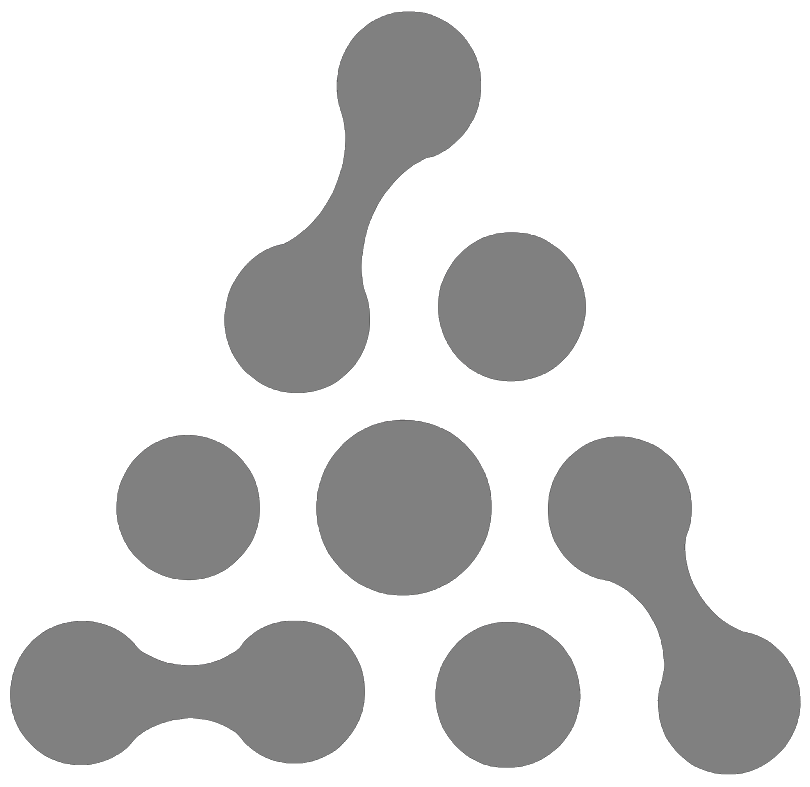
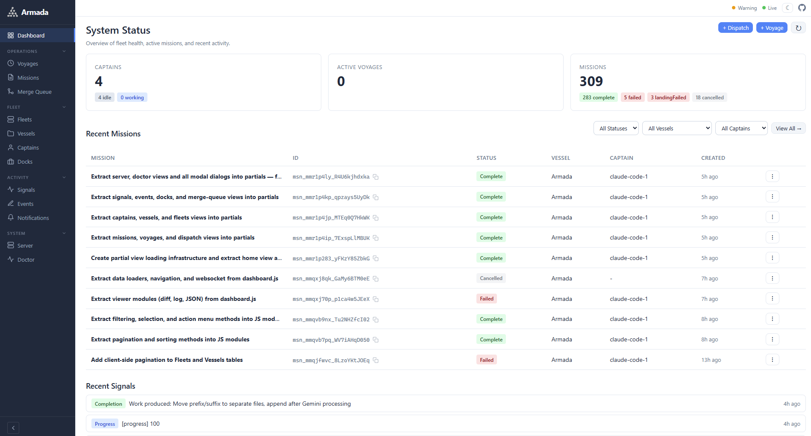
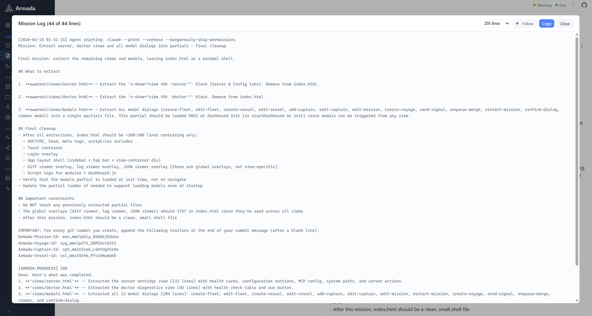
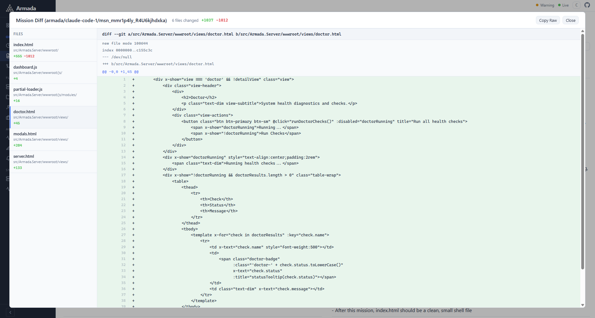
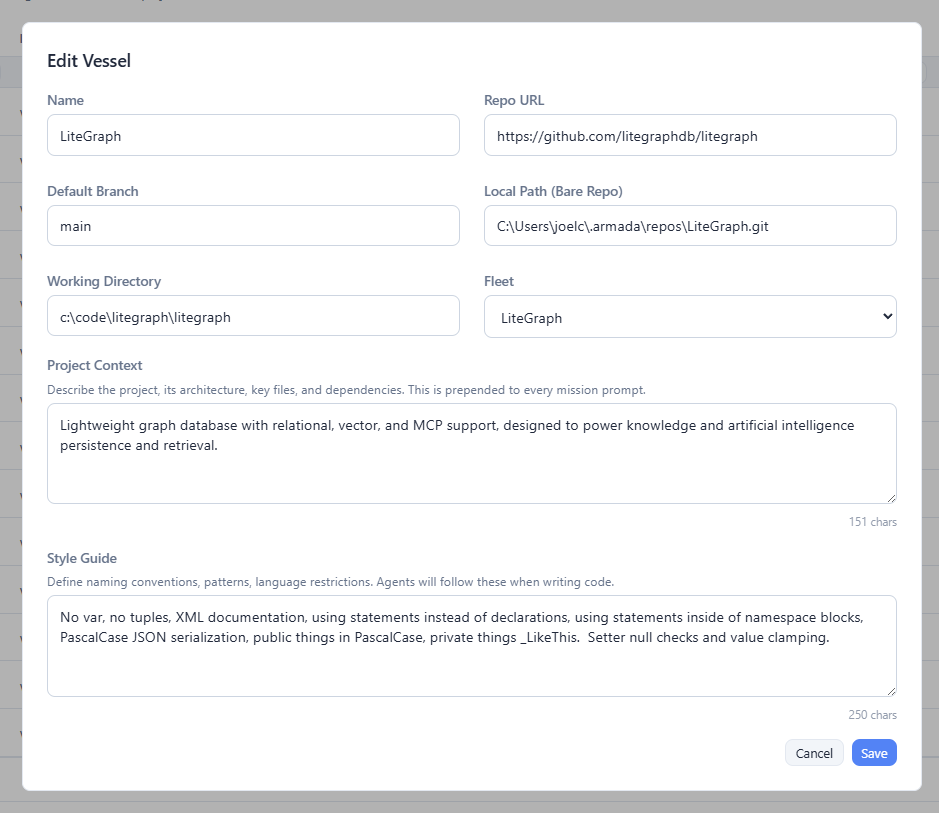

<p align="center">
  
</p>

<h1 align="center">Armada</h1>

<p align="center">
  <strong>Reduce context switching across projects. Keep agent work in queryable memory.</strong>
  <br />
  <em>v1.0.0</em>
</p>

<p align="center">
  <a href="#why-armada">Why Armada</a> |
  <a href="#how-it-works">How It Works</a> |
  <a href="#community">Community</a> |
  <a href="#quick-start">Quick Start</a> |
  <a href="#ask-armada">Ask Armada</a> |
  <a href="#terminal-ui">Terminal UI</a> |
  <a href="#harbor-run-agents-on-your-machine">Harbor</a> |
  <a href="#pipelines">Pipelines</a> |
  <a href="#use-cases">Use Cases</a> |
  <a href="#architecture">Architecture</a> |
  <a href="#rest-api">API</a> |
  <a href="#mcp-integration">MCP</a>
</p>

---

## Why Armada

Armada is for people working across multiple repositories who are tired of paying the context-switching tax every time they come back to a project.

The first problem is operational: switching between projects means rebuilding context over and over. What was in flight, what already landed, what failed, what the agent was about to do next. That overhead adds up fast.

The second problem is memory. Most agent sessions disappear into terminal history and branch diffs. A week later, neither you nor the next agent has a clean way to ask "what happened here?" without manually piecing it back together.

Armada is built around those two problems:

1. **Reduce context switching across projects.** Armada keeps the state of work outside your head. You can dispatch, leave, come back later, and see where things stand without reconstructing everything from scratch.

2. **Provide extended, queryable memory for both users and agents.** Missions, logs, diffs, status changes, and related work are preserved behind a searchable interface. You no longer have to remember what you were working on; you can ask. Agents can do the same.

Armada gives models a place to maintain working context on a vessel over time. Agents can update vessel context with notes, hints, and project-specific guidance so the next dispatch does not have to rediscover the same facts from scratch. That reduces context load time for both humans and models.

Everything else in Armada exists to support that: isolated worktrees, parallel dispatch, pipelines, retries, dashboards, API access, and MCP tools.

### What You Get

- **Less project-switch overhead.** Leave one repo, work somewhere else, then come back to a current view of what happened.
- **A queryable memory layer.** Logs, diffs, status history, and agent output stay available through the dashboard, API, and MCP instead of vanishing into scrollback.
- **Integrated API tooling.** `Activity` preserves request history (filter by the Requests source), while `API Explorer` lets you execute live OpenAPI-backed requests and replay captured traffic without leaving the dashboard.
- **A first-class repository workspace.** The `Vessels > Workspace` tab gives you a vessel-aware file tree, in-browser editing, search, git-aware status, and direct handoff into planning, dispatch, and context curation.
- **Project-specific delivery profiles.** `Configuration > Workflow Profiles` lets each vessel or fleet declare how it lints, builds, tests, packages, versions, deploys, rolls back, and verifies itself.
- **Managed model endpoints.** Register external embedding or inference providers (Ollama, OpenAI, OpenAI-compatible, Anthropic, Gemini, VoyageAI), health-check them deduplicated by base URL, and validate one with a real request. Stored API keys are write-only and never returned on reads. A registered inference endpoint can also back an `Ask Armada` captain, so the assistant can run against a hosted model instead of a local CLI runtime. See [docs/REST_API.md](docs/REST_API.md#model-endpoints) and [docs/MCP_API.md](docs/MCP_API.md).
- **Structured check execution.** `Delivery > Checks` turns build, test, deploy, and verification runs into queryable records with logs, artifacts, retry, branch/commit metadata, and links back to missions and voyages.
- **Scoped objectives and delivery memory.** `Dispatch > Backlog` captures acceptance criteria, non-goals, linked vessels, and evidence so work can be scoped before dispatch without falling back to external notes.
- **Pull-based GitHub delivery context.** Objectives can import GitHub issue or PR scope, deployments can sync GitHub Actions into `Delivery > Checks`, and mission or release detail can show GitHub PR review/check evidence without exposing raw tokens on reads.
- **First-class delivery records and timeline history.** `Delivery > Environments`, `Deployments`, and `Releases` group rollout targets, approvals, verification evidence, linked voyages, missions, checks, versions, notes, and artifacts, while `Activity` (All Activity) lets you reconstruct the current cross-entity delivery story from one place.
- **Operational incident and runbook support.** `Delivery > Incidents` and `Delivery > Runbooks` carry rollback context, hotfix handoff, step-by-step execution, and deployment-linked operational guidance inside Armada itself.
- **Persistent vessel context.** Models can maintain repository-specific context, hints, and working notes on each vessel to speed up future dispatches. The `Build Context` / `Refine Context` action on a vessel launches a captain to write or refine that context from an editable prompt template plus your notes.
- **Ask Armada, the home base.** Run Armada from saved, private conversations in the dashboard or the terminal: ask about fleet state, have the captain propose work, approve it on a confirm card, and watch it through to landing in the same thread. See [Ask Armada](#ask-armada).
- **A full terminal UI.** `armada tui` is the dashboard in a terminal (every dashboard screen, Ask Armada, an Approvals center, keyboard-first), for SSH sessions and machines without a browser. See [Terminal UI](#terminal-ui).
- **Interactive planning before dispatch.** Chat with a captain in the dashboard, keep the transcript, then open the result in Dispatch or launch the work directly from the planning screen.
- **Parallel execution across repos.** Dispatch work to multiple agents across multiple repositories at once.
- **Quality gates that run automatically.** Every piece of work can flow through a pipeline: plan it, implement it, test it, review it. No manual intervention between steps.
- **Git isolation by default.** Every agent works in its own worktree on its own branch. Agents can't step on each other. Your main branch stays clean until you merge.
- **Configurable and extensible workflows.** Prompt templates, personas, and pipelines are user-controlled, so you can adapt the system to your project instead of fitting your project to the built-ins.
- **Reusable playbooks at dispatch time.** Store markdown guidance such as `CSHARP_BACKEND_ARCHITECTURE.md`, manage it in the dashboard, and select it per voyage or mission with inline or file-based delivery modes.
- **Works with the agents you already have.** Claude Code, Codex, Gemini, Cursor, Mux, and OpenCode -- pluggable runtime system.
- **Harbors (host runners).** Run the Admiral standalone on your machine (Local mode, the default) or detached in Docker or on another host (Split mode) while agent CLIs, git, and worktrees execute where your repositories and tool logins live, over an authenticated client-to-server link. Split mode is experimental in 1.0. See [Harbor: run agents on your machine](#harbor-run-agents-on-your-machine).
- **Per-step captain selection.** Give each persona a default captain and dictate which captain runs each pipeline step at dispatch, with a capability-tier fallback when that captain is busy. See [docs/CAPTAIN_ROUTING.md](docs/CAPTAIN_ROUTING.md).
- **Guided setup in the dashboard.** First-run configuration can stay inside the setup wizard instead of bouncing between unrelated pages.
- **Internationalized dashboard UX.** Login, shared shell UI, list/detail/admin routes, setup flows, notifications, pagination, server management, and legacy embedded dashboard surfaces support live language selection and locale-aware formatting.

### Who It's For

- **Solo developers** working across multiple repos.
- **Tech leads** who want a record of what agents changed.
- **Teams** that need shared visibility into agent-driven work.
- **Anyone** who wants more structure than a single-agent terminal loop.

---

## How It Works

<table align="center">
<tr><td>
<pre>
+-----------------------------------------------------------+     +-----------------------------------------------------------+
| Direct Dispatch                                           |     | Planning In The Dashboard                                 |
| CLI / API / MCP sends work immediately                    |     | Chat with a captain inside the UI on a reserved dock      |
+-----------------------------------------------------------+     +-----------------------------------------------------------+
                              |                                               |
                              |                                               v
                              |                          +-----------------------------------------------------------+
                              |                          | Select a planning reply                                   |
                              |                          | Summarize it, open it in Dispatch, or dispatch directly   |
                              |                          +-----------------------------------------------------------+
                              |                                               |
                              +-------------------------------+---------------+
                                                              |
                                                              v
                         +-----------------------------------------------------------+
                         | Admiral                                                   |
                         | Coordinates work, resolves pipeline, assigns captains,    |
                         | provisions worktrees, and tracks mission state            |
                         +-----------------------------------------------------------+
                                                              |
                                                              v
                         +-----------------------------------------------------------+
                         | Architect                                                 |
                         | Reads the codebase, breaks work into missions, and        |
                         | identifies file boundaries                                |
                         +-----------------------------------------------------------+
                                                              |
                                                              v
                         +-----------------------------------------------------------+
                         | Worker                                                    |
                         | Implements the mission in an isolated git worktree        |
                         | and produces a diff                                       |
                         +-----------------------------------------------------------+
                                                              |
                                                              v
                         +-----------------------------------------------------------+
                         | TestEngineer                                              |
                         | Reviews the worker diff and adds or updates tests         |
                         +-----------------------------------------------------------+
                                                              |
                                                              v
                         +-----------------------------------------------------------+
                         | Linter                                                    |
                         | Checks changed code and docs for style and correctness    |
                         +-----------------------------------------------------------+
                                                              |
                                                              v
                         +-----------------------------------------------------------+
                         | Judge                                                     |
                         | Reviews correctness, completeness, scope, and style       |
                         | Produces PASS or FAIL                                     |
                         +-----------------------------------------------------------+
</pre>
</td></tr>
</table>

1. **You choose the entry point.** Dispatch directly from the CLI/API/MCP, ask for the work in an [Ask Armada](#ask-armada) conversation and approve the captain's proposal, or start a planning session in the dashboard and chat with a captain first.
2. **Planning can hand off directly to execution.** From the planning UI, select an assistant reply and either summarize it into a dispatch draft, open it in the main Dispatch page, or dispatch it directly without copy/paste.
3. **The Admiral coordinates execution.** It resolves the pipeline, assigns captains, provisions worktrees, and tracks mission state.
4. **The Architect plans.** It reads the codebase, breaks the work into missions, and identifies likely file boundaries.
5. **Workers implement.** Each worker runs in its own git worktree on its own branch.
6. **TestEngineers add tests.** They get the worker diff as input.
7. **Linters check style and correctness.** They review the changed code and documentation, fix clear in-scope violations, and flag the rest.
8. **Judges review.** They check the result against the original task and return a pass/fail verdict.

Each step is a **persona** with its own prompt template. A sequence of personas is a **pipeline**. The built-ins are just defaults; pipelines are user-configurable and can be extended with whatever personas your project needs:

| Pipeline | Stages | When to use |
|----------|--------|------------|
| **WorkerOnly** | Implement | Quick fixes, one-liners |
| **Reviewed** | Implement -> Review | Normal development |
| **Tested** | Implement -> Test -> Review | When you need coverage |
| **Recorded** | Implement -> Record | Capture durable memories from the work |
| **FullPipeline** | Plan -> Implement -> Test -> Lint -> Review -> Record | Big features, unfamiliar codebases |

You can set a default pipeline per repository and override it on a single dispatch when needed. If the built-in roles are not enough, define your own personas and compose them into custom pipelines for security review, documentation, migration planning, release checks, architecture review, or any other project-specific step.

Armada also lets each project define its own delivery commands. `Configuration > Workflow Profiles` stores the repo-specific commands for build, test, package, publish, deploy, rollback, smoke-test, and health-check flows, and `Delivery > Checks` executes those commands as durable records you can inspect and retry later.

### Parallel Tasks

Each `--task` becomes its own mission, and Armada can assign them to different agents. The prompt becomes the voyage
title. Without `--task` the whole prompt is one mission; Armada does not split prompts on semicolons or list numbering.

```bash
armada go "API hardening" --task "Add rate limiting" --task "Add request logging" --task "Add input validation"

armada go "Auth" -t "Add auth middleware" -t "Add login endpoint" -t "Add token validation"
```

### Auto-Recovery

If a captain crashes, the Admiral can repair the worktree and relaunch the agent up to `MaxRecoveryAttempts` times (default: 3).

## Components and Concepts

Armada is a single C#/.NET solution split into a handful of projects. The table below explains each moving part and which project implements it. The [Architecture](#architecture) section further down has the full data model, relationships, and ID prefixes.

- **Admiral** (`Armada.Server`) -- the coordinator process. It is the one long-running server: the REST API and WebSocket (built on [Watson](https://github.com/jchristn/watson)), the MCP server (built on [Voltaic](https://github.com/jchristn/voltaic)), and the embedded web dashboard all live here, alongside the orchestration logic that resolves pipelines, assigns captains, provisions worktrees, and tracks mission state. It owns the database.
- **Captain** (`Armada.Runtimes`) -- a worker agent the Admiral dispatches to do the actual coding. A captain is backed by one of two kinds of runtime, both behind the `IAgentRuntime` seam: a **CLI runtime** that drives an installed agent binary (Claude Code, Codex, Gemini, Cursor, Mux, OpenCode), or an in-process **`ApiEndpoint`** runtime that runs a tool-calling loop directly against a registered inference endpoint. The runtime layer is pluggable, so new agents can be added without touching the orchestrator.
- **Fleet** -- a named group of vessels (repositories). A default fleet is created automatically. See `Armada.Core` domain models.
- **Vessel** -- a single git repository registered with Armada, with its own default pipeline, project context, style guide, and accumulated model memory (`Armada.Core`).
- **Mission** -- one atomic unit of work assigned to one captain, targeting one vessel (`Armada.Core`).
- **Voyage** -- a batch of related missions dispatched together (`Armada.Core`).
- **Dock** -- the git worktree provisioned for a captain so its work stays isolated on its own branch (`Armada.Core`). A dock lives on exactly one host's filesystem, which is what pins a mission to a single Harbor once it has one.
- **Signal** -- a message passed between the Admiral and captains for progress and coordination (`Armada.Core`).
- **Harbor** (`Armada.Harbor`) -- a host-side runner. It executes the agent CLIs, git, and worktrees on the machine where your repositories and tool logins actually live, dialing outward to the Admiral over an authenticated link so the Admiral can run detached (in a container or on another host) without reaching back into your machine. Only needed in split mode; see [Harbor](#harbor-run-agents-on-your-machine).
- **`armada` (Helm CLI)** (`Armada.Helm`) -- the command-line client, built with [Spectre.Console](https://spectreconsole.net/). It is a thin HTTP client to the Admiral's REST API; it does not do orchestration itself.
- **`armada tui`** (`Armada.Tui`) -- the terminal UI, shipped inside the `armada` CLI. It talks to the Admiral through `Armada.Client`, the typed .NET client for the REST API and WebSocket.

Supporting projects: `Armada.Core` holds the domain models, database interfaces, service interfaces, and settings shared by everything else; `Armada.Dashboard` is the React dashboard (the Admiral serves it at `/dashboard`, and Docker can also run it as a standalone container); and `Armada.Proxy` is the optional remote-access portal and relay.

## Community

Armada has a growing community building on and around it.

- **Community fork:** [@developervariety/Armada](https://github.com/developervariety/Armada)

## Contributors

Special thanks to the community that helps build and improve Armada.

- [@kevin-v96](https://github.com/kevin-v96)
- [@developervariety](https://github.com/developervariety)

## Quick Start

### Prerequisites

- [.NET 8.0+ SDK](https://dot.net/download)
- At least one AI agent runtime on your PATH:
  - [Claude Code](https://docs.anthropic.com/en/docs/claude-code) (`claude`)
  - [Codex](https://github.com/openai/codex) (`codex`)
  - [Gemini CLI](https://github.com/google-gemini/gemini-cli) (`gemini`)
  - [Cursor](https://docs.cursor.com/cli) (`cursor-agent`)
  - Mux (`mux`)
  - [OpenCode](https://opencode.ai) (`opencode`)

### Install

```bash
git clone https://github.com/jchristn/armada.git
cd armada
```

Linux: `./scripts/linux/install.sh`

macOS: `./scripts/macos/install.sh`

Windows: `scripts\windows\install.bat`

Windows can also override the target framework when only one SDK is available, for example `scripts\windows\install.bat net8.0` or `scripts\windows\install.bat --framework net10.0`. The same override works for `reinstall.bat`, `remove.bat`, `update.bat`, `install-mcp.bat`, `remove-mcp.bat`, `publish-server.bat`, `install-windows-task.bat`, and `update-windows-task.bat`. The default remains `net10.0`.

Examples:

- `scripts\windows\publish-server.bat net8.0`
- `scripts\windows\install-windows-task.bat net8.0`
- `scripts\windows\update-windows-task.bat --framework net8.0`

These `install.*` scripts build the solution, deploy dashboard assets, and install `Armada.Helm` as a global tool from the current checkout.

#### Prebuilt installers and Docker

Installing from source with the scripts above is the path the project uses day to day. Release builds also produce
these packages, and these are the only supported install paths for 1.0:

| Platform | What you get |
|----------|--------------|
| Any OS with .NET | The CLI as a global tool: `dotnet tool install --global Armada.Helm` |
| Windows | Harbor `.exe` (Inno Setup) and the Admiral server `.msi` (WiX) |
| macOS | `Armada Harbor.app` in a `.dmg`, and the Admiral server `.pkg` |
| Linux | `.deb` and `.rpm` packages for the CLI, Harbor, and the server |
| Docker | Admiral, dashboard, and proxy via `docker/armada/compose.yaml` and `docker/proxy/compose.yaml` (see [docs/DOCKER.md](docs/DOCKER.md)); `docker/update.sh` or `docker/update.bat` pulls and recreates the stack |

Each release carries a `SHA256SUMS` file. Installers are code-signed only when the release was built with signing
credentials; an unsigned Windows installer shows a SmartScreen prompt ("More info", then "Run anyway"), and an
unsigned macOS app or package must be allowed once in **System Settings > Privacy & Security** ("Open Anyway").
How the packages are built is described in [BUILDING_INSTALLERS.md](BUILDING_INSTALLERS.md).

#### Behind an enterprise proxy or firewall

Corporate networks that perform TLS inspection present a self-signed root certificate. Because npm ships its own CA bundle (separate from the operating system's certificate store), the dashboard build fails with `npm error code SELF_SIGNED_CERT_IN_CHAIN`. Add `--insecure` (alias `-k`, or `--no-strict-ssl`) to any install/update/reinstall/publish/mcp/task script to disable strict TLS validation for npm/Node for that run:

- Linux: `./scripts/linux/install.sh --insecure`
- macOS: `./scripts/macos/install.sh --insecure`
- Windows: `scripts\windows\install.bat --insecure` (with a framework override, put the framework first: `scripts\windows\install.bat net8.0 --insecure`)

The flag is recognized anywhere on the command line and propagates to every sub-script and tool it invokes (it sets `NODE_TLS_REJECT_UNAUTHORIZED=0` and `npm_config_strict_ssl=false` for the run). It affects **only** npm/Node. `dotnet`/NuGet use the OS certificate store, which IT-managed machines normally already trust, so those steps usually succeed without any flag. If `dotnet restore` also fails on certificates, an administrator must install the proxy's root CA into the OS trust store (no CLI flag can bypass that).

Two related notes for locked-down machines:

- **No Node.js:** the install scripts fall back to the pre-built dashboard bundle committed in the repository, so a machine without Node can still install (nothing to build, nothing to fetch from the npm registry).
- **Prefer not to pass the flag each time:** set `NODE_TLS_REJECT_UNAUTHORIZED=0` (`set` on Windows, `export` on Linux/macOS) in your shell, or run `npm config set strict-ssl false` once, for the same effect without `--insecure`.

Platform entrypoints are split under `scripts/windows/`, `scripts/linux/`, and `scripts/macos/`. Shared shell implementations live under `scripts/common/`.

If you want Armada deployed and managed on your local machine from source, use the deployment scripts below:

| Task | Linux | macOS | Windows |
|------|-------|-------|---------|
| Publish server and dashboard only | `./scripts/linux/publish-server.sh` | `./scripts/macos/publish-server.sh` | `scripts\windows\publish-server.bat` |
| Install and register a user-scoped local deployment | `./scripts/linux/install-systemd-user.sh` | `./scripts/macos/install-launchd-agent.sh` | `scripts\windows\install-windows-task.bat` |
| Update the deployed server from the current checkout | `./scripts/linux/update-systemd-user.sh` | `./scripts/macos/update-launchd-agent.sh` | `scripts\windows\update-windows-task.bat` |
| Verify the running deployment | `./scripts/linux/healthcheck-server.sh` | `./scripts/macos/healthcheck-server.sh` | `scripts\windows\healthcheck-server.bat` |
| Remove the startup-managed deployment | `./scripts/linux/remove-systemd-user.sh` | `./scripts/macos/remove-launchd-agent.sh` | `scripts\windows\remove-windows-task.bat` |

These deployment scripts publish `Armada.Server` into `~/.armada/bin` on Linux and macOS, or `%USERPROFILE%\.armada\bin` on Windows, and deploy dashboard assets into `~/.armada/dashboard` or `%USERPROFILE%\.armada\dashboard`.

The remove scripts unregister the background startup entry or user service, but they do not delete the published files under `~/.armada` or `%USERPROFILE%\.armada`.

Repo-relative deployment script paths:

- Linux: `scripts/linux/install-systemd-user.sh`, `scripts/linux/update-systemd-user.sh`, `scripts/linux/healthcheck-server.sh`
- macOS: `scripts/macos/install-launchd-agent.sh`, `scripts/macos/update-launchd-agent.sh`, `scripts/macos/healthcheck-server.sh`
- Windows: `scripts/windows/install-windows-task.bat`, `scripts/windows/update-windows-task.bat`, `scripts/windows/healthcheck-server.bat`

For background startup details, see [docs/RUN_ON_STARTUP.md](docs/RUN_ON_STARTUP.md).

### Your First Dispatch

```bash
cd your-project
armada go "Add input validation to the signup form"
armada watch   # monitor progress in real time
```

Armada detects the runtime, infers the current repository, provisions a worktree, and dispatches the task.

Prefer to talk it through? Open Ask Armada in the dashboard (`http://localhost:7890/dashboard/ask`) or run `armada tui`, describe the change, and approve the dispatch card the captain proposes. See [Ask Armada](#ask-armada).

### Planning Before Dispatch

If you want to negotiate a plan with a captain before launching work, use the dashboard planning flow:

1. Open `http://localhost:7890/dashboard`
2. Go to `Planning`
3. Choose a captain, vessel, optional pipeline, and any playbooks
4. Chat with the captain until the plan is ready
5. Select the assistant output you want, then either summarize it into a cleaner draft, open it in the main Dispatch page, or dispatch directly from the same screen
6. Delete the session when you no longer need the transcript, or let Armada clean it up through retention settings

Current planning-session behavior:

- Planning currently supports the built-in `ClaudeCode`, `Codex`, `Gemini`, `Cursor`, `Mux`, and `OpenCode` runtimes. `Custom` captains are not yet supported there.
- Planning sessions reserve the selected captain and a dock/worktree for the selected vessel while the session is active.
- The captain can inspect and modify the repository while planning. Treat the planning session as tool-capable, not read-only.
- Planning is transcript-backed today: each turn relaunches the runtime against the preserved transcript and repo context rather than holding a persistent stdin session open.
- The planning chat mirrors Ask Armada: Markdown replies, live tool-call activity, per-turn metrics (time-to-first-token, tokens/sec, token counts), optional token streaming, and a Stop button. Recent Sessions supports per-row actions and a Delete All control.
- Planning-session persistence is implemented for SQLite first. Other database backends currently reject planning-session operations with an explicit `501 Not Supported`.
- Armada can summarize a selected planning reply into a server-owned dispatch draft before you launch the voyage.
- You can open the current planning draft in the main `Dispatch` page without copy/paste.
- Optional cleanup controls are available through `PlanningSessionInactivityTimeoutMinutes` and `PlanningSessionRetentionDays`.

### Default Credentials

On first boot, Armada seeds a default tenant, user, and credential:

| Item | Value |
|------|-------|
| Email | `admin@armada` |
| Password | `password` |
| Bearer Token | `default` |

Dashboard at `http://localhost:7890/dashboard`. API access with `Authorization: Bearer default`.

The default password is flagged, not blocked: the server accepts API calls from a session signed in with it, the TUI signs in and shows a header warning, and administrators see a warning while any default credential is in use. The dashboard prompts you to choose a new password at the first sign-in with the default one (you can also sign out from that prompt). Changing it also disables the `default` bearer token, so switch scripts to a new credential (create one under Server > Credentials; the token is shown once) or to the local API key the CLI uses. The one hard rule: while default credentials are in use, the Admiral refuses to listen on any address other than localhost. For Docker and other headless installs set `ARMADA_INITIAL_ADMIN_PASSWORD` before the first start, or set `AllowDefaultCredentialsOnNetwork` to accept the risk explicitly.

The dashboard supports language selection from the login screen and keeps the chosen locale for the authenticated session.

### Running Agents Safely

Captains run as CLI agents with your account's permissions, and by default with their auto-approve flags (Claude Code `--dangerously-skip-permissions`, Codex `--sandbox workspace-write`, Gemini `--approval-mode yolo`, Cursor `--force`, Mux `--yolo`, OpenCode `--auto`), so they can read, write, and execute without confirmation. To run a captain without them, untick **Auto-approve agent tool use** when editing the captain (or pass `autoApprove: false` to the `create_captain` / `update_captain` MCP tools); the runtime then uses its safer mode (for example Claude Code `--permission-mode acceptEdits`, Codex `--sandbox workspace-write`), and shell commands need to be allowed in the runtime's own configuration. Run Armada under a dedicated account, keep it on localhost unless you need remote access, and review `audit.command` events for commands run through workspace exec, fleet actions, and check runs. See [Running agents safely](docs/SECURITY_REVIEW.md#running-agents-safely) and [SECURITY.md](SECURITY.md).

For a deeper walkthrough, see the [Getting Started Guide](GETTING_STARTED.md).

### Remote Access Through Armada.Proxy

`Armada.Proxy` now acts as a portal and relay for the real Armada dashboard rather than a second remote-operations dashboard.

The remote browser flow is:

1. Open the proxy root URL.
2. Sign into the proxy with the shared proxy password.
3. Select a connected Armada deployment.
4. Open the same React dashboard at `/dashboard` on the proxy origin.
5. Sign into Armada inside that dashboard if the remote deployment requires it.

The proxy keeps its own routes under `/proxy-api/v1/*`, serves the shared dashboard bundle at `/dashboard`, relays Armada REST traffic at `/api/v1/*`, and relays the dashboard websocket at `/ws`. Some local-only administrative actions are intentionally blocked by proxy policy in remote mode.

See [docs/REMOTE_MGMT.md](docs/REMOTE_MGMT.md) and [docs/PROXY_API.md](docs/PROXY_API.md) for setup and route details.

### Rebuilding Armada from the Dashboard

When Armada's own source is one of its vessels, you can rebuild the Admiral and pick up landed changes without leaving the dashboard. Set **Self Vessel ID** on the Server page to the vessel holding Armada's source, then use **Rebuild Armada**: pick a branch (or type a tag/commit), and Armada builds that ref from a throwaway `git worktree` into a fresh versioned slot while the current server keeps running, backs up the database, and cuts over to the new build. The build runs with no downtime, and a failed build never disturbs the running server -- only a successful publish triggers the cutover.

A vessel cloned from a local path works here too. When a vessel's repo URL is a `file://` URL (or an existing local directory), `add_vessel` records that local clone as the vessel's `WorkingDirectory`, and the rebuild builds from that `WorkingDirectory`. That means a local checkout of Armada's source can serve as the self vessel with no extra setup. Each successful rebuild also prunes older slots and their pre-rebuild database backups down to the newest `RebuildSlotRetentionCount` (default 3, configurable).

If the new build does not come up, **Roll Back** reverts to the previous slot (restoring the pre-rebuild database backup when the rebuild changed the schema). On a single machine you can also point `RebuildSupervisorHarborId` at an on-box Harbor to get an automatic, health-gated rollback during the cutover.

See [docs/SERVER_REBUILD.md](docs/SERVER_REBUILD.md) for the design, safety rails, and REST endpoints (`POST /api/v1/server/rebuild`, `GET /api/v1/server/rebuild/status`, `POST /api/v1/server/rollback`).

### Onboarding Many Repositories, Fleet Actions, and Vessel Health

If you keep dozens of repositories under one directory, you don't have to add them one at a time. **Import repositories** on the Vessels page (or `armada vessel import --root ~/Code --dry-run`) scans directories on the Admiral host, shows you every git repository it found with a status (new, already onboarded, worktree, and so on), and creates vessels only for the ones you keep. Imported vessels point at your existing checkout as their `WorkingDirectory` and never set `LocalPath`, so removing a vessel never touches your clone. Scanning is limited to `Import.AllowedRoots`.

Once the vessels exist, **Vessel Health** (the Health tab on the Vessels page, or `armada health`) grades each one: commits ahead of or behind the default branch, uncommitted changes, stale and leftover `armada/*` branches, outdated and vulnerable NuGet and npm packages, test setup and the latest check run, CI configuration, readiness, and recent mission failures. Evaluations run on a schedule (`RepositoryHealth.IntervalMinutes`, default every 6 hours) or on demand. A dependency check that cannot run shows as Unknown rather than healthy.

**Fleet Actions** apply one action across many vessels. A Command action runs a shell command in each vessel's working directory and records exit code and output; a Mission action dispatches one voyage per vessel, paced so a large run does not starve other work. Select the failing rows on the Health tab, choose **Run action**, and pick "Update outdated dependencies": each vessel gets a voyage whose prompt lists its own outdated packages, and the next evaluation shows the result.

See [docs/FLEET_ACTIONS.md](docs/FLEET_ACTIONS.md), [docs/VESSEL_HEALTH.md](docs/VESSEL_HEALTH.md), and the Vessel Import section of [docs/REST_API.md](docs/REST_API.md).

## Ask Armada

Ask Armada is the place you run Armada from. It is the **Ask** page of the dashboard (`http://localhost:7890/dashboard/ask`) and the screen the TUI opens into (`armada tui`). Both work on the same server-side conversations, so you can start a conversation in the browser and pick it up in a terminal.

### Conversations (threads)

- **Create:** start typing on the Ask page (a new conversation is created on the first message or quick action and named after it), or press `n` in the TUI conversation list.
- **Find and organize:** search the list, rename, pin (pinned stay on top), summarize (the captain posts a short summary), archive, and delete. The list shows unread counts and a "working" marker while work the conversation started is still running. Each conversation has its own URL (`/ask/<threadId>`).
- **Private:** a conversation belongs to the user who created it. Another user (even an admin) gets 404 for it, and its live events go only to the owner. The work it starts (voyages, missions, runs) is ordinary tenant work and shows up on the normal pages for everyone in the tenant.
- **Retention:** idle conversations are archived after 90 days (pinned ones never); deletion is optional. See the `retention` settings in [docs/UPGRADING.md](docs/UPGRADING.md#data-retention).

### Choosing a captain

Each conversation has a captain that answers in plain language and calls Armada's MCP tools for you. Pick it in the conversation header (dashboard), or in the TUI: with the cursor in the message box press `Esc` to move focus to the conversation, then press `c` (or press `Ctrl+K` and run "Choose captain..."). Choose **No captain (quick actions only)** to use the conversation purely for quick actions.

Every runtime is connected to Armada's MCP tools for each turn through a thread-scoped token, and its state-changing calls go through approval: Claude Code, Codex, Gemini, Cursor, Mux, OpenCode, and inference-endpoint (`ApiEndpoint`) captains. Only a `Custom` runtime is not gated, and the conversation then shows "Actions from this captain run without approval cards." Conversation turns run CLI captains without their auto-approve flags unless `Ask.CaptainAutoApprove` is on. See [docs/CAPTAINS.md](docs/CAPTAINS.md) for the per-runtime details.

### What you can do in a conversation

- **Ask about fleet state.** "What is running?", "Any failures since yesterday?", "Which vessels fail health?" Read-only tools (status, enumerate, mission and voyage status, vessel health, and so on) run without asking. Follow-up questions are scoped to the vessels and voyages the conversation is about unless you ask fleet-wide.
- **Propose work.** Ask the captain to dispatch a voyage, restart a mission, run a fleet action, evaluate health, import repositories, and so on. Anything that changes state is not executed: it becomes a **confirm card** with the tool, a one-line summary, the exact arguments, and an expiry (`Ask.ProposalExpiryMinutes`, default 60).
- **Approve or reject.** Approve runs the stored call as you, through the same MCP handler and permission checks as a direct call, posts the result, and lets the captain continue. In the TUI, `a` approves and `r` rejects on a card, and `Ctrl+A` opens the **Approvals center**, one queue for Ask proposals, mission reviews, deployment approvals, failed landings, and stalled captains.
- **Quick actions.** Type `/` in the message box: `/dispatch` (vessel and missions form), `/fleet-action` (action and vessels form), `/status`, `/health`, and `/import`. Submitting a quick-action form is the confirmation, so it runs at once. Quick actions work without a captain.
- **Auto-approve.** A per-conversation toggle (`Ctrl+Y` in the TUI) that skips confirm cards and runs the captain's state-changing calls immediately. Turning it on shows a warning and the conversation keeps a banner while it is on; every action is still recorded in the thread. Use it only in conversations you trust.
- **Track work to landing.** Whatever a conversation starts appears as a live **work card** that follows each mission through captain assignment, pipeline stage, checks, the merge queue, pull request, and landing, with failure reasons. A "Work in this conversation" strip lists everything it is tracking. At each milestone (started, a mission failed, landed or PR opened, landing failed, finished) the thread gets a short progress update, written by the captain when it is idle and otherwise a plain sentence.
- **Notifications.** Unread counts on the conversation list, live updates over the WebSocket, and in the TUI toasts, the notification center (`Ctrl+N`), the terminal bell for approvals and failures, and the Ask dock (`Ctrl+J`) that shows the open conversation and sends to it from any screen.

### Example

```
You:      What failed overnight on my-api?
claude-1: One mission failed: "Add request logging" (msn_...) on my-api. The Judge
          returned FAIL: the new middleware is not registered in Program.cs.
You:      Restart it, and also dispatch a voyage to add rate limiting to the
          public endpoints.
          [Confirm] restart_mission  { "missionId": "msn_..." }        Approve | Reject
          [Confirm] dispatch  "Rate limiting" on my-api, 1 mission     Approve | Reject
You:      (approves both)
Armada:   Started: "Rate limiting" (vyg_...) - mission assigned to claude-2.
          [Work card] Rate limiting  InProgress  Worker -> Judge  ....
Armada:   Mission "Add request logging" landed on main.
Armada:   "Rate limiting" finished: 1 of 1 missions landed.
```

The design, REST routes (`/api/v1/ask/threads/...`), events, and settings are in [docs/ASK_ARMADA_HOME_BASE.md](docs/ASK_ARMADA_HOME_BASE.md); TUI keys are in [docs/TUI.md](docs/TUI.md#ask-armada).

## Pipelines

Pipelines are the workflow layer in Armada. They let you run work through explicit stages instead of treating every task as a single agent session.

### Built-in Personas

| Persona | Role | What it does |
|---------|------|-------------|
| **Architect** | Plan | Reads the codebase, decomposes a high-level goal into concrete missions with file lists and dependency ordering |
| **Worker** | Implement | Writes code. The default -- this is what you get without pipelines. |
| **TestEngineer** | Test | Receives the Worker's diff, identifies gaps in coverage, writes tests |
| **Linter** | Lint | Evaluates the changed code and documentation for style and correctness, corrects clear in-scope violations, and reports what it fixed and flagged |
| **Judge** | Review | Examines the diff against the original mission description. Checks completeness, correctness, scope violations, style. Produces a verdict. |
| **Recorder** | Record | Reviews the voyage conversation and distills durable memories (episodic/semantic/procedural) into the vessel model context, the Armada memory store, and any external memory facilities. Runs as a non-gating final stage. |

Every working persona is also told to recall the vessel's existing memory (via the `search_memory` MCP tool and the vessel model context) before it starts, so recorded knowledge is reused instead of re-derived.

### Agent memory

Armada gives agents durable **memory** that survives across sessions. The Recorder persona writes it; the memory store keeps it as episodic (what happened), semantic (standalone facts), and procedural (how-to) records with provenance, tags, and a salience used to order recall. Manage it over MCP (`search_memory`, `create_memory`, `update_memory`, `delete_memory`), over REST (`/api/v1/memories`), or in the dashboard under `Configuration > Memory`.

### Pipeline Resolution

When you dispatch, Armada picks the pipeline in this order:

| Priority | Source | How to set |
|----------|--------|-----------|
| 1 (highest) | Dispatch parameter | The Pipeline field on the Dispatch page or `/dispatch` form, or `pipeline` / `pipelineId` in the REST and MCP dispatch calls |
| 2 | Vessel default | Set on the repository in the dashboard or via API |
| 3 | Fleet default | Set on the fleet -- applies to all repos in the fleet unless overridden |
| 4 (lowest) | System fallback | WorkerOnly |

### Custom Personas and Pipelines

The built-in personas are starting points. You can create your own:

```bash
# Create a security auditor persona with custom instructions
update_prompt_template name=persona.security_auditor content="Review for OWASP vulnerabilities..."
create_persona name=SecurityAuditor promptTemplateName=persona.security_auditor

# Build a pipeline that includes security review
create_pipeline name=SecureRelease stages='[{"personaName":"Worker"},{"personaName":"SecurityAuditor"},{"personaName":"Judge"}]'
```

Every prompt Armada sends is backed by an editable template. You can change agent behavior without modifying code. The dashboard includes a template editor with a parameter reference panel.

Pipelines are not limited to planning, implementation, testing, and review. If a project needs a SecurityAuditor, PerformanceAnalyst, MigrationPlanner, DocsWriter, ReleaseManager, or some internal role with custom instructions and handoff rules, Armada can support that by adding the persona and inserting it into the pipeline.

For the full pipeline reference, see [docs/PIPELINES.md](docs/PIPELINES.md).

## Playbooks

Playbooks are tenant-scoped markdown instruction documents that you can manage in the dashboard and attach to work at dispatch time.

- Create, edit, delete, and browse playbooks from `Configuration > Playbooks` in the dashboard.
- Select any number of playbooks when creating a voyage or standalone mission.
- Choose delivery per selection: `InlineFullContent`, `InstructionWithReference`, or `AttachIntoWorktree`.
- Armada snapshots the exact playbook content, filename, order, and resolved delivery mode used for a mission so later edits do not change historical execution context.
- REST, MCP, the proxy-served remote dashboard, dashboard, CLI, SDK, and Postman surfaces all use the same playbook selection model.
- File-based delivery resolves readable playbook files for the agent without polluting repository history, while inline delivery embeds the full markdown body directly into the rendered instruction set.

This is useful for architecture rules, coding standards, migration checklists, release procedures, security review requirements, or any other reusable instruction set that should travel with the work.

## Internationalization

The dashboard supports live language selection and locale-aware formatting across both the React shell and the legacy embedded surfaces.

- Supported locales: English, Spanish, Mandarin (Simplified), Mandarin (Traditional), Cantonese, Japanese, German, French, and Italian.
- English is the reviewed locale. The other eight ship labeled "beta" in both language pickers (for example "Deutsch (Beta)", "Italiano (beta)") until a native speaker has reviewed them; text that has no translation falls back to English.
- Language selection is available from login, setup, and the authenticated shell, and the active locale persists between sessions.
- Shared UI elements such as notifications, pagination, dialogs, labels, date/time formatting, and numeric formatting honor the selected locale.
- Route-level coverage includes list pages, detail pages, admin screens, setup flows, and server-management views so common actions do not fall back to English unexpectedly.
- Legacy dashboard confirms, alerts, toasts, and static shell copy are routed through the same runtime so mixed old/new surfaces stay consistent.

## Use Cases

### Solo Developer Multiplier

If a feature depends on a few independent refactors, you can dispatch them together instead of working through them serially:

```bash
armada go "Refactors" --task "Extract UserRepository from UserService" --task "Add ILogger to all controllers" --task "Migrate config to Options pattern"
```

That gives you three parallel branches to review instead of one long queue.

### Ship with Confidence

Set `Tested` as the default pipeline if you want implementation, test generation, and review on every dispatch.

### Code Review Prep

Batch mechanical cleanup before opening a review:

```bash
armada voyage create "Pre-review cleanup" --vessel my-api \
  --mission "Add XML documentation to all public methods in Controllers/" \
  --mission "Replace magic strings with constants in Services/" \
  --mission "Add input validation to all POST endpoints"
```

### Multi-Repo Coordination

Dispatch related changes across multiple repositories:

```bash
armada go "Update the shared DTOs to include CreatedAt field" --vessel shared-models
armada go "Add CreatedAt to the API response serialization" --vessel backend-api
armada go "Display CreatedAt in the user profile component" --vessel frontend-app
```

### Prototyping and Exploration

Try a few approaches in parallel:

```bash
armada voyage create "Auth approach comparison" --vessel my-api \
  --mission "Implement JWT-based authentication with refresh tokens" \
  --mission "Implement session-based authentication with Redis store" \
  --mission "Implement OAuth2 with Google and GitHub providers"
```

Review the branches, keep one, and drop the others.

### Bug Triage

Spread investigation and fixes across multiple reported issues:

```bash
armada go "Fix: login fails when email contains a plus sign" --vessel auth-service
armada go "Fix: pagination returns duplicate results on page 2" --vessel search-api
armada go "Fix: file upload silently fails for files over 10MB" --vessel upload-service
```

### Let AI Manage AI

If you connect Claude Code to Armada's MCP server, Claude can act as the orchestrator: decompose work into missions, dispatch them, and monitor progress.

```
> "Refactor the authentication system. Decompose it into parallel missions
   and dispatch them via Armada. Monitor progress and redispatch failures."
```

See [Claude Code as Orchestrator](docs/CLAUDE_CODE_AS_ORCHESTRATOR.md) for setup.

## Terminal UI

`armada tui` is the dashboard in a terminal: the same Admiral, REST API, and WebSocket, for people who live in a shell, work over SSH, or have no browser.

**Install.** It ships inside the `armada` CLI, so every way of installing the CLI installs it too: the .NET tool (`dotnet tool install --global Armada.Helm`, also what `scripts/*/install` uses) and the Linux `.deb`/`.rpm` CLI packages. The macOS `.pkg`, Windows `.msi`, Harbor installers, and Docker images carry the server or Harbor, not the CLI.

**Start.**

```
armada tui                                 # last profile, or the local Admiral
armada tui --server http://127.0.0.1:7890  # a specific server (saved as a profile)
armada tui --profile work --route /missions
```

`--server` connects to a URL and saves it as a profile, `--profile` picks a saved one, and `--route` chooses the first screen (otherwise the screen you left, or Ask Armada on a first run). Profiles live in `~/.armada/tui.json`; tokens go to the OS keychain (a 0600 file as fallback).

**Sign in.** For a server on this machine the login screen is prefilled (`admin@armada`, the default password until the profile has signed in once, and the local API key for API Key Login). `F2` switches between email and API key login. The Server picker switches servers, "Add server..." adds one, and `e` edits the highlighted server's name and URL. The TUI does not force a password change: with the default password it signs in and shows a header warning.

**Coverage.** Every dashboard screen opens a real TUI screen: Ask Armada, Home, Needs You, Planning, Dispatch, Backlog, Fleet Actions, Missions, Voyages, the Merge Queue, Jobs, Vessels (with import, Health, Fleets, and the Workspace), Captains and Docks, Delivery, Configuration, Activity, API Explorer, and Settings, plus an Approvals center the dashboard does not have.

**Keys worth knowing.**

| Key | Does |
|-----|------|
| `Ctrl+K` | Command palette: every screen, tab, and command; type an id (`msn_...`, `vsl_...`) to open it |
| `g` then a letter | Go to: `g a` Ask, `g h` Home, `g i` Needs You, `g m` Missions, `g v` Vessels, `g c` Captains, `g d` Delivery, `g s` Settings |
| `Ctrl+A` | Approvals center (Ask proposals, reviews, deployment approvals, failed landings, stalled captains) |
| `Ctrl+J` | Ask dock on any screen (in the Ask message box, `Ctrl+J` adds a line) |
| `Alt+A` | Ask about this: a new conversation about the current screen's subject |
| `z` / `Z` | Tables: cycle the page size / choose it (10, 25, 50, 100, 250) |
| `Left` / `Right`, `[` / `]` | Hub tabs (`Left`/`Right` with the tab strip focused); `[` / `]` also switch detail panels |
| `F10`, `?`, `Ctrl+N` | Menu bar, help for the current screen, notification center |

**Display.** Dark, Light, High contrast, and Auto themes (High contrast under `NO_COLOR`); Icons: Auto, Unicode, or ASCII (ASCII is picked automatically on non-UTF-8 terminals); no state is shown by color alone; works from 80x24 up; the dashboard's nine languages.

See [docs/TUI.md](docs/TUI.md) for profiles, every screen, and the full key map.

<details>
<summary>Text captures (120x40)</summary>

Ask Armada:

```
 Armada  [Default Tenant] admin@armada  [Global Admin]                                             o Offline  [bell 0]
 File  Go  View  Actions  Ask  Help                                                                            F10 Menu
  Dashboard             | Release checklist [e]          Captain: claude-1 (ClaudeCode) [c]   Auto-approve: off [Ctrl...
> Ask Armada            |-----------------------------------------------------------------------------------------------
- OPERATIONS            |  You                                                                                    1m ago
   Needs You            |    What is left before we cut the 1.0 release?
   Planning             |
   Dispatch             |  claude-1  3.8s                                                                         1m ago
   Fleet Actions        |  Two things are open:
   Missions             |
- DELIVERY              |  1. Fix column widths is in progress on DemoRepo.
   Delivery             |  2. Broken failed its tests; I can restart it.
- BUILD                 |
   Vessels              |  Want me to dispatch a voyage for the remaining docs work?
   Captains             |
- CONFIGURATION         |  You                                                                                    1m ago
   Configuration        |    Yes, one mission for the README.
- ACTIVITY              |
   Activity             |
   Jobs                 |
- SYSTEM                |
   API Explorer         |
   Settings             |
                        |
                        |
                        |
                        |
                        |
                        |
                        |
                        |
                        |
                        |
                        |
                        |
                        |
                        |-----------------------------------------------------------------------------------------------
                        |>  Message the captain, or type / for quick actions
                        |[ ] Show thinking (Alt+T)   / Quick actions   Ctrl+E Editor   AI can make mistake... Enter Send
 Enter Send  Ctrl+J Newline  / Quick actions  Esc Messages  ? Help  Ctrl+K Palette  F10 Menu  Tab Next pane      manual
```

More captures from the headless renderer: [login](docs/tui-screens/login-120x40.txt), [Home](docs/tui-screens/home-120x40.txt), [Missions](docs/tui-screens/missions-120x40.txt), [Approvals](docs/tui-screens/approvals-120x40.txt). They are rendered from stub data by the `Tui.ReadmeFrames` test suite (`ARMADA_TUI_README_DIR=docs/tui-screens`), so the header shows Offline.

</details>

## Screenshots

<details>
<summary>Click to expand</summary>

<br />









</details>

## Architecture

Armada is a C#/.NET solution with these main projects:

| Project | Description |
|---------|-------------|
| **Armada.Core** | Domain models (including tenants, users, credentials), database interfaces, service interfaces, settings |
| **Armada.Runtimes** | Agent runtime adapters (Claude Code, Codex, Gemini, Cursor, Mux, OpenCode, extensible via `IAgentRuntime`) |
| **Armada.Server** | Admiral process: REST API + WebSocket ([Watson](https://github.com/jchristn/watson)), MCP server ([Voltaic](https://github.com/jchristn/voltaic)), embedded dashboard |
| **Armada.Dashboard** | React dashboard, served by the Admiral at `/dashboard` and also available as a standalone container |
| **Armada.Helm** | CLI ([Spectre.Console](https://spectreconsole.net/)), thin HTTP client to Admiral; hosts `armada tui` |
| **Armada.Tui** | Terminal UI (built on the TUIKit NuGet package) covering every dashboard screen (see [docs/TUI.md](docs/TUI.md)) |
| **Armada.Client** | Typed .NET client for the REST API and WebSocket, used by the TUI |
| **Armada.Harbor** | Avalonia host-runner app that opens an authenticated link to the Admiral and executes agent processes, git, and worktrees on the developer's machine (see [docs/HARBOR.md](docs/HARBOR.md)) |
| **Armada.Proxy** | Optional remote-access portal and relay (see [docs/REMOTE_MGMT.md](docs/REMOTE_MGMT.md)) |

### Key Concepts

| Term | Plain Language | Description |
|------|---------------|-------------|
| **Admiral** | Coordinator | The server process that manages everything. Auto-starts when needed. |
| **Captain** | Agent/worker | An AI agent instance (Claude Code, Codex, Gemini, Cursor, Mux, OpenCode, etc.). Auto-created on demand. |
| **Fleet** | Group of repos | Collection of repositories. A default fleet is auto-created. |
| **Vessel** | Repository | A git repository registered with Armada. Auto-registered from your current directory. |
| **Mission** | Task | An atomic work unit assigned to a captain. |
| **Voyage** | Batch | A group of related missions dispatched together. |
| **Planning Session** | Interactive draft | A dashboard chat session with a captain on a reserved dock/worktree. You can turn a selected reply into a dispatch draft or dispatch directly from the session. |
| **Workflow Profile** | Delivery recipe | A vessel- or fleet-scoped set of commands describing how a project builds, tests, packages, versions, deploys, rolls back, and verifies itself. |
| **Check Run** | Structured validation | A durable execution record for build, test, deploy, or verification work, including logs, artifacts, timings, exit status, and linked mission/voyage context. |
| **Dock** | Worktree | A git worktree provisioned for a captain's isolated work. |
| **Signal** | Message | Communication between the Admiral and captains. |
| **Persona** | Agent role | A named agent role (Worker, Architect, Judge, TestEngineer) that determines what a captain does during a mission. Users can create custom personas with custom prompt templates. |
| **Pipeline** | Workflow | An ordered sequence of persona stages (e.g. Architect -> Worker -> TestEngineer -> Judge). Configured at fleet/vessel level with per-dispatch override. |
| **Prompt Template** | Instructions | A user-editable template controlling the instructions given to agents. Every prompt in the system is template-driven with `{Placeholder}` parameters. |

For details on mission scheduling and assignment, see [docs/SCHEDULING.md](docs/SCHEDULING.md).

### Data Model

<table align="center">
<tr><td>
<pre>
+-------------------------------------------------------------+
|                            Admiral                            |
|                     (coordinator process)                     |
+--------+--------------+--------------+--------------+---------+
         |              |              |              |
         v              v              v              v
    +---------+   +----------+  +----------+   +----------+
    |  Fleet  |   | Captain  |  |  Voyage  |   |  Signal  |
    | (flt_)  |   |  (cpt_)  |  |  (vyg_)  |   |  (sig_)  |
    |         |   |          |  |          |   |          |
    | group   |   | AI agent |  | batch of |   | message  |
    | of repos|   | worker   |  | missions |   | between  |
    +----+----+   +----+-----+  +----+-----+   | admiral  |
         |             |             |         | & agents |
         v             |             v         +----------+
    +----------+       |       +----------+
    | Vessel   |<------+-------| Mission  |
    | (vsl_)   |       |       |  (msn_)  |
    |          |       |       |          |
    | git repo |       +------>| one task |
    +----+-----+       assigns | for one  |
         |             captain | agent    |
         v                     +----------+
    +----------+
    |   Dock   |
    |  (dck_)  |
    |          |
    |   git    |
    | worktree |
    +----------+

    Relationships:
    Fleet  1--*  Vessel       A fleet contains many vessels (repos)
    Vessel 1--*  Dock         A vessel has many docks (worktrees)
    Voyage 1--*  Mission      A voyage groups many missions
    Mission *--1 Vessel       Each mission targets one vessel
    Mission *--1 Captain      Each mission is assigned to one captain
    Captain 1--1 Dock         A captain works in one dock at a time
</pre>
</td></tr>
</table>

### Data Flow

<table align="center">
<tr><td>
<pre>
Direct Dispatch (CLI / API / MCP)                Dashboard Planning UI
                |                                           |
                |                                           +--> Start planning session
                |                                           +--> Reserve captain + dock
                |                                           +--> Chat with captain in the UI
                |                                           +--> Select reply for handoff
                |                                           +--> Summarize, open in Dispatch,
                |                                           |    or dispatch directly
                |                                           v
                +---------------------------+---------------+
                                            |
                                            v
                               Admiral receives dispatch
                                            |
                                            +--> Creates/updates Mission in database
                                            +--> Resolves target Vessel (repository)
                                            +--> Allocates Captain (find idle or spawn new)
                                            +--> Provisions worktree (git worktree add)
                                            +--> Starts agent process with mission context
                                            +--> Monitors via stdout/stderr + heartbeat
                                            |
                               Captain works autonomously
                                            |
                                            +--> Reports progress via signals
                                            +--> Admiral updates Mission status
                                            +--> On completion: push branch, create PR (optional)
                                            +--> Captain returns to idle pool
</pre>
</td></tr>
</table>

### Technology Stack

| Component | Technology | Notes |
|-----------|-----------|-------|
| Language | C# / .NET 8+ | Cross-platform |
| Database | SQLite, PostgreSQL, SQL Server, MySQL | SQLite default; zero-install, embedded |
| REST API + WebSocket | [Watson](https://github.com/jchristn/watson) | OpenAPI built-in |
| MCP/JSON-RPC | [Voltaic](https://github.com/jchristn/voltaic) | Standards-compliant MCP server |
| CLI | [Spectre.Console](https://spectreconsole.net/) | Rich terminal UI |
| Logging | [SyslogLogging](https://github.com/jchristn/sysloglogging) | Structured logging |
| ID Generation | [PrettyId](https://github.com/jchristn/prettyid) | Prefixed IDs (flt_, vsl_, cpt_, msn_, etc.) |

## CLI Reference

### Common Commands

```
armada go <prompt>           Quick dispatch (infers repo from current directory)
armada status                Dashboard (scoped to current repo)
armada status --all          Global view across all repos
armada watch                 Live dashboard with notifications
armada log <captain>         Tail a specific agent's output
armada log <captain> -f      Follow mode (like tail -f)
armada doctor                System health check
armada tui                   Terminal UI (the dashboard in a terminal)
```

### Missions and Voyages

```
armada mission list|create|show|cancel|restart|retry
armada voyage list|create|show|cancel|retry
armada backlog list|show|create|update|delete|reorder
armada playbook list|add|show|remove
armada inbox                 Items waiting on you (Needs You)
armada diff [mission]        Show a mission's diff
```

### Entity Management

All commands accept names or IDs:

```
armada vessel list|add|remove|import
armada captain list|add|update|stop|remove|stop-all
armada fleet list|add|remove
armada action list|run|status|cancel
armada health [--status Fail] [--fleet <id>] [--evaluate]
```

### Infrastructure

```
armada server start|status|stop|restart
armada config show|set|init
armada mcp install|remove|stdio
armada reset                 Danger zone: reset all Armada data
```

### Examples

```bash
# Dispatch a single task in your current repo
armada go "Fix the null reference in UserService.cs"

# Dispatch three tasks in parallel (one mission per --task)
armada go "API hardening" --task "Add rate limiting" --task "Add request logging" --task "Add input validation"

# Work with a specific repo
armada go "Fix the login bug" --vessel my-api

# Register additional repos
armada vessel add my-api https://github.com/you/my-api
armada vessel add my-frontend https://github.com/you/my-frontend

# Add more agents (--runtime accepts: claude, codex, gemini, cursor, mux, opencode, api, custom)
armada captain add claude-2 --runtime claude
armada captain add codex-1 --runtime codex
armada captain add gemini-1 --runtime gemini
armada captain add cursor-1 --runtime cursor
armada captain add opencode-1 --runtime opencode
armada captain add mux-1 --runtime mux --mux-endpoint local-openai
armada captain update mux-1 --mux-config-dir C:\Users\you\.mux-work --mux-endpoint staging-openai

# Emergency stop all agents
armada captain stop-all

# Retry a failed mission
armada mission retry msn_abc123

# Retry all failed missions in a voyage
armada voyage retry "API Hardening"
```

Mux captains require a named endpoint. Armada stores that endpoint selection on the captain, validates it through `mux probe --require-tools`, and can optionally target a non-default Mux config directory via `--mux-config-dir`. The React dashboard and legacy dashboard can both browse saved endpoints through Armada's `/api/v1/runtimes/mux/endpoints` helper APIs.

`--runtime` (on `captain add`, `captain update`, and `config set DefaultRuntime`) accepts `claude`, `codex`, `gemini`, `cursor`, `mux`, `opencode`, `api` (ApiEndpoint), and `custom`, plus the enum names such as `ClaudeCode`; an unknown value is an error. An `api` captain needs an inference endpoint, which you choose in the dashboard, the TUI, or the REST/MCP captain APIs. See [docs/CAPTAINS.md](docs/CAPTAINS.md) for what each runtime supports.

## Configuration

Settings live in `~/.armada/settings.json` and are created on first use.

For GitHub-backed integrations, Armada supports a server-global `GitHubToken` in `settings.json` (or `docker/armada/armada.json` in Docker) plus an optional per-vessel `GitHubTokenOverride`. Vessel reads return `hasGitHubTokenOverride`, but the raw token is never returned through REST, MCP, WebSocket, or dashboard reads.

Armada currently uses that token resolution for three pull-based GitHub workflows:

- importing a GitHub issue or pull request into `Dispatch > Backlog`
- syncing recent GitHub Actions workflow runs into `Delivery > Checks`
- loading GitHub pull-request review, comment, and required-check evidence for mission and release detail views

```bash
armada config show              # View current settings
armada config set MaxCaptains 8 # Change a setting
armada config init              # Interactive setup (optional)
```

| Setting | Default | Description |
|---------|---------|-------------|
| `AdmiralPort` | 7890 | REST API port |
| `MaxCaptains` | 0 (auto, defaults to 5) | Maximum total captains |
| `StallThresholdMinutes` | 10 | Minutes before a captain is considered stalled |
| `MaxRecoveryAttempts` | 3 | Auto-recovery attempts before giving up |
| `AutoPush` | true | Push branches to remote on mission completion |
| `AutoCreatePullRequests` | false | Create PRs on mission completion |
| `AutoMergePullRequests` | false | Auto-merge PRs after creation |
| `LandingMode` | null | Landing policy: `LocalMerge`, `PullRequest`, `MergeQueue`, or `None` |
| `BranchCleanupPolicy` | `LocalOnly` | Branch cleanup after landing: `LocalOnly`, `LocalAndRemote`, or `None` |
| `GitHubToken` | null | Optional global GitHub token used by Armada-owned integrations; vessels can override it per repository |
| `RequireAuthForShutdown` | false | Deprecated and ignored: server stop, restart, rebuild, and rollback always require an admin |
| `Mcp.ToolCallsPerSecond` | 100 | Per-client MCP tool call limit; 0 disables it |
| `Ask.CaptainAutoApprove` | false | Run CLI captains with their auto-approve flags during Ask Armada turns |
| `TerminalBell` | true | Ring terminal bell during `armada watch` |
| `DefaultRuntime` | null (auto-detect) | Default agent runtime |
| `PlanningSessionInactivityTimeoutMinutes` | 0 | Automatically stop idle planning sessions after this many minutes; 0 disables the timeout |
| `PlanningSessionAbandonmentTimeoutMinutes` | 240 | Safety-valve cleanup for abandoned planning sessions with no running process; 0 disables abandonment cleanup |
| `PlanningSessionRetentionDays` | 0 | Automatically delete stopped or failed planning transcripts after this many days; 0 disables retention cleanup |

The file uses camelCase keys (for example `mcp.toolCallsPerSecond`). The full list of settings is in [docs/API_SURFACE_1.0.md](docs/API_SURFACE_1.0.md#settings), and the operational ones (ports, TLS, backups, retention, troubleshooting) are explained in [docs/OPERATIONS.md](docs/OPERATIONS.md).

## Authentication

As of v0.3.0, Armada supports multi-tenant authentication with three methods:

| Method | Header | Description |
|--------|--------|-------------|
| **Bearer Token** (recommended) | `Authorization: Bearer <token>` | 64-character tokens linked to a tenant and user. Default token: `default` |
| **Session Token** | `X-Token: <token>` | AES-256-CBC encrypted, 24-hour lifetime. Returned by `POST /api/v1/authenticate` |
| **API Key** (deprecated) | `X-Api-Key: <key>` | Legacy. Maps to a synthetic admin identity. Migrate to bearer tokens |

The default installation works with `Authorization: Bearer default` until the default admin password is changed, which disables that token.

All operational data is tenant-scoped. The authorization model:

- `IsAdmin = true`: global system admin with access to every tenant and object.
- `IsAdmin = false`, `IsTenantAdmin = true`: tenant admin with management access inside that tenant, including users and credentials.
- `IsAdmin = false`, `IsTenantAdmin = false`: regular user with tenant-scoped visibility plus self-service on their own account and credentials.

For full details, see [docs/REST_API.md](docs/REST_API.md#authentication).

## REST API

The Admiral exposes a REST API on port 7890. Endpoints are under `/api/v1/` and require authentication unless noted otherwise. Error responses use a standard format with `Error`, `Description`, `Message`, and `Data` fields, where `Error` matches the HTTP status (404 for a missing entity, including one referenced in a request body; 409 for a state conflict such as deleting something in a blocking state); see [REST_API.md](docs/REST_API.md#error-responses) for details. The 1.0 REST, MCP, WebSocket, CLI, and settings surface is frozen and additive-only within 1.x; see [docs/COMPATIBILITY.md](docs/COMPATIBILITY.md).

```bash
API="http://localhost:7890/api/v1"
AUTH="Authorization: Bearer default"

curl -H "$AUTH" $API/status              # System status
curl -H "$AUTH" $API/fleets              # List fleets
curl -H "$AUTH" $API/vessels             # List vessels
curl -H "$AUTH" $API/missions            # List missions
curl -H "$AUTH" $API/captains            # List captains
curl $API/status/health                  # Health check (no auth required)
```

Full CRUD endpoints are available for fleets, vessels, missions, voyages, captains, signals, events, playbooks, prompt templates, personas, pipelines, tenants, users, and credentials.

Armada also ships first-class REST surfaces for:

- `Workspace` browsing, editing, search, change inspection, and vessel status under `/api/v1/workspace/vessels/{vesselId}/...`
- workflow-profile CRUD, validation, resolution, and enumeration under `/api/v1/workflow-profiles/...`
- structured check-run execution, retry, detail, and enumeration under `/api/v1/check-runs/...`
- release drafting, refresh, detail, delete, and enumeration under `/api/v1/releases/...`
- objective list/detail/create/update/delete and cross-entity scoping under `/api/v1/objectives/...`
- environment, deployment, incident, and runbook workflow routes under `/api/v1/environments/...`, `/api/v1/deployments/...`, `/api/v1/incidents/...`, and `/api/v1/runbooks/...`
- cross-entity historical timeline enumeration under `/api/v1/history...`
- planning-session lifecycle and transcript-to-dispatch flow under `/api/v1/planning-sessions/...`
- persisted request-history capture, summaries, and replay metadata under `/api/v1/request-history/...`
- Mux runtime endpoint discovery helpers under `/api/v1/runtimes/mux/endpoints...`
- live OpenAPI discovery at `/openapi.json` and `/swagger`

The React dashboard exposes that API surface through consolidated, workflow-grouped tools:

- `Dispatch > Backlog` for internal-first intake, acceptance criteria, scope capture, and lifecycle linkage before dispatch.
- `Configuration > Workflow Profiles` for project-specific build/test/release/deploy command definitions and validation.
- `Delivery > Checks` for running, retrying, and inspecting structured validation and delivery commands.
- `Delivery > Environments` and `Delivery > Deployments` for named rollout targets, approvals, verification, rollback, and linked evidence.
- `Delivery > Releases` for drafting, curating, and inspecting release records linked to voyages, missions, checks, versions, notes, and artifacts.
- `Delivery > Incidents` for operational incident records, hotfix handoff, and rollback/postmortem context.
- `Delivery > Runbooks` for playbook-backed operational runbooks with parameters, step tracking, and deployment/incident linkage.
- `Activity` (All Activity source) for a cross-entity operational timeline spanning objectives, planning, dispatch, checks, releases, deployments, incidents, merge activity, events, and request history.
- `Activity` (Requests source) for persisted request history, filtering, payload inspection, and replay.
- `API Explorer` for live OpenAPI browsing, authenticated execution, response inspection, and code snippets.

For the current internal-first operator workflow across releases, deployments, rollback, incidents, and runbooks, see [docs/DELIVERY_OPERATIONS.md](docs/DELIVERY_OPERATIONS.md).

For metrics, dashboards, and the Prometheus/Loki/Grafana observability stack, see [docs/TELEMETRY.md](docs/TELEMETRY.md).

Start the Admiral as a standalone server:

```bash
armada server start
```

## MCP Integration

Armada also exposes an MCP (Model Context Protocol) server so Claude Code and other MCP-compatible clients can call Armada tools directly.

```bash
armada mcp install    # Configure Claude Code, Codex, Gemini, and Cursor for Armada MCP
armada mcp remove     # Remove those Armada MCP entries again
```

From a source checkout, the same installer is `scripts/macos/install-mcp.sh` (or the `linux` / `windows` equivalent); it runs `armada mcp install --yes`.

To add Armada to Claude Code manually instead of using `armada mcp install`, register its default HTTP MCP endpoint (`http://localhost:7891/mcp`, port 7891; no token is needed while the Admiral listens on localhost, which is the default, and a token that is sent must be valid):

```bash
claude mcp add --transport http --scope user armada http://localhost:7891/mcp
```

Or run Armada's MCP server over stdio as a child process (requires the `armada` CLI on your `PATH`):

```bash
claude mcp add --scope user armada -- armada mcp stdio
```

When the Admiral listens on another address (for example in Docker), MCP requires a credential: add `--header "Authorization: Bearer <token>"` to the `claude mcp add` command. Check the connection with `claude mcp list`; inside Claude Code, `/mcp` lists Armada's tools. For orchestrator instructions to paste into a `CLAUDE.md`, see [docs/INSTRUCTIONS_FOR_CLAUDE_CODE.md](docs/INSTRUCTIONS_FOR_CLAUDE_CODE.md). You do not need any of this for Ask Armada itself: captains used in Ask Armada conversations are connected to Armada's MCP tools for every turn through a thread-scoped token.

Drop `--scope user` to add it for the current project only; substitute your port if you changed `McpPort`. On **enterprise-managed** Claude Code this may fail with `not allowed by enterprise policy`. That restriction is set by your IT administrator (Claude Code's `allowedMcpServers` managed setting) and cannot be overridden locally; a Claude Code admin must allow `http://localhost:7891/mcp`. See [docs/MCP_API.md](docs/MCP_API.md#http-transport) for the exact managed-settings snippet and alternatives.

If you are working from source, MCP helper entrypoints are available under `scripts/windows/`, `scripts/linux/`, and `scripts/macos/`.

Once installed, your MCP client can call tools like `status`, `dispatch`, `enumerate`, `voyage_status`, and `cancel_voyage`. There are also MCP tools for structured delivery and operations such as `run_check`, `get_check_run`, `retry_check_run`, `create_release`, `get_release`, `create_objective`, `get_objective`, `create_deployment`, `get_deployment`, `approve_deployment`, `verify_deployment`, `rollback_deployment`, `get_runbook`, `get_runbook_execution`, and `start_runbook_execution`, plus tool groups for playbook, persona, pipeline, and prompt-template management, vessel import (`discover_vessels`, `import_vessels`, `categorize_vessel_import`, `apply_fleet_recommendations`), fleet actions (`create_fleet_action`, `run_fleet_action`, `fleet_action_run_status`, `cancel_fleet_action_run`, and more), and vessel health (`vessel_health`, `evaluate_vessel_health`, `set_vessel_health_override`).

A failed tool call returns `isError` with a machine-readable `ErrorCode` (`NotFound`, `InvalidArgument`, `Conflict`, `Forbidden`, `Unavailable`, `Failed`) next to the English `Error` text; branch on the code, not the text. Tool calls are rate limited per client (`mcp.toolCallsPerSecond`, default 100). See [docs/MCP_API.md](docs/MCP_API.md).

### Papercuts

Captains report friction they meet on an `[ARMADA:PAPERCUT]` line: a stale
document, a dead link, a brief that contradicts itself, a missing sibling
repository, a test that fails under load. Armada stores each report as a
`papercut` event with the reporting mission, captain, vessel, and voyage, and
the `papercut_summary` MCP tool reads them back collapsed into groups of
the same vessel, category, and problem.

Read them on a schedule. A report that nobody reads is worse than no report:
the captain paid to write it and the next captain still pays the same cost.

1. Run `papercut_summary` after a voyage closes, and again in the weekly
   sweep with `sinceHours: 168`.
2. Read the count and the distinct-captain count first. One captain reporting
   a problem is an anecdote. Several captains reporting it is a defect with
   evidence.
3. Route the group by category:

   | Category | Owner |
   | --- | --- |
   | `MissingDoc`, `BrokenLink`, `RepoFriction`, `TestFlake` | Backlog item on that vessel |
   | `EnvSetup` | Dock or workflow-profile fix, then a Check to prove it |
   | `BriefContradiction`, `PlatformBug` | Armada objective, direct-edit only |
   | `ToolFailure` | Read the mission log before you accept it; a captain calling a tool it never received is a `BriefContradiction` |

4. Quote the group in the record you create: the count, the distinct-captain
   count, the sample title, and the sample mission IDs. Those missions are the
   evidence.
5. Keep the promotion manual. A high count is not authority to dispatch.

Two signals need a different response than a repository fix:

- **A `BriefContradiction` group is a captain-quality defect, not a vessel
  defect.** It means the brief asks for something the captain cannot do. Fix
  the instruction module, not the repository.
- **A category that one runtime reports and no other runtime reports** is
  usually about that runtime, not about the vessel. Compare the reports before
  you change vessel code.

Judge missions do not file papercuts. A judge reports what it finds through
its verdict, and splitting review feedback across two surfaces means the
operator reads only one of them.

### AI-Powered Orchestration

If you connect Claude Code, Codex, or another MCP-capable client to Armada, that client can act as the orchestrator. Armada handles the worktrees, state, and process management underneath.

```
Claude Code (orchestrator) --MCP--> Armada Server --spawns--> Captain agents (workers)
```

For detailed setup and examples, see:
- [Claude Code as Orchestrator](docs/CLAUDE_CODE_AS_ORCHESTRATOR.md)
- [Codex as Orchestrator](docs/CODEX_AS_ORCHESTRATOR.md)

## Deployment

Armada ships everything you need to run it three ways: a local developer install, a containerized deployment, and a split Admiral/Harbor topology. This section is the overview and the fast path; the [Running Locally (without Docker)](#running-locally-without-docker) and [Running Locally (with Docker)](#running-locally-with-docker) sections below have the full detail, and [docs/DOCKER.md](docs/DOCKER.md) and [docs/HARBOR.md](docs/HARBOR.md) go deeper still.

### Deployment modes

Armada runs in one of two modes (`deploymentMode` in the Admiral's settings):

- **Local mode (default).** The Admiral and the agent processes share one machine. There is no Harbor and no link: the Admiral launches captains as child processes in worktrees on its own box. This is the right mode for a single developer running Armada on the machine they code on, it is fully supported, and it is what every install path above gives you.
- **Split mode (experimental in 1.0).** The Admiral runs detached, in Docker or on another host, while one or more **Harbors** run on the machines where the code and tool logins live. The Admiral sends each unit of host work (agent CLIs, git, worktrees) to a Harbor over an authenticated link the Harbor opens outward, the Harbor runs it locally, and results stream back. Use it when you want a containerized Admiral to drive CLI captains, or one Admiral to drive several developer machines. See [Harbor](#harbor-run-agents-on-your-machine) below.

### Deploy locally

Platform entrypoints live under `scripts/windows/` (`.bat`), `scripts/linux/` (`.sh`), and `scripts/macos/` (`.sh`); shared shell implementations live under `scripts/common/`.

- **From-source install.** `scripts/<os>/install.sh` (or `install.bat`) builds the solution, deploys the dashboard assets, and installs `Armada.Helm` as a global `armada` tool from the checkout. Add `--insecure` behind a TLS-inspecting proxy; on Windows pass a framework override first (e.g. `install.bat net8.0`).
- **Publish server + dashboard.** `scripts/<os>/publish-server.sh` (or `.bat`) publishes `Armada.Server` into `~/.armada/bin` (`%USERPROFILE%\.armada\bin` on Windows) and deploys the dashboard into `~/.armada/dashboard`. If Node.js is absent it falls back to the pre-built dashboard bundle committed in the repo. The dashboard build step alone is `scripts/<os>/deploy-dashboard.sh`.
- **Run on startup.** Register the published server as a user-scoped background service: `install-systemd-user.sh` (Linux), `install-launchd-agent.sh` (macOS), or `install-windows-task.bat` (Windows). Paired `update-*` and `remove-*` scripts republish/restart or unregister it, and `healthcheck-server.*` verifies it. See [docs/RUN_ON_STARTUP.md](docs/RUN_ON_STARTUP.md).
- **Foreground dev run.** `scripts/<os>/run-local.sh` (or `.bat`) builds and starts the server in the background, waits for health, then runs a Harbor in the foreground -- handy for exercising the Harbor link locally. For a plain server-only session, `dotnet run --project src/Armada.Server`.

The Admiral serves its REST API and the embedded dashboard on port **7890** (`http://localhost:7890/dashboard`, WebSocket at `/ws`) and the MCP server on port **7891** (both configurable via `AdmiralPort` / `McpPort` in `~/.armada/settings.json`). On first run Armada creates the SQLite database, applies migrations, and seeds default data.

### Deploy with Docker

Docker Compose runs the server (and the optional standalone React dashboard) in containers, so the host does not need the .NET SDK:

```bash
cd docker/armada
docker compose up -d
```

This brings up `armada-server` (7890 REST/dashboard/WebSocket, 7891 MCP, 9464 Prometheus scrape) and `armada-dashboard` (3000), and the default stack also starts a Prometheus/Loki/Grafana observability stack. Images are built from `src/Armada.Server/Dockerfile`, `src/Armada.Dashboard/Dockerfile`, and `src/Armada.Proxy/Dockerfile`; you can build them locally with `docker build -f <dockerfile> -t <tag> .` or via the `scripts/<os>/build-*` helpers. Configuration lives in `docker/armada/armada.json`, and data persists under `docker/armada/`. Full reference, including the proxy stack and volume layout, is in [docs/DOCKER.md](docs/DOCKER.md).

### Harbor: run agents on your machine

A Harbor (`Armada.Harbor`, a small desktop app with a tray icon) is the host runner for split mode. You do not need it in Local mode. In split mode it runs on the machine that has your repositories, git credentials, and agent CLI logins, dials out to the Admiral, and executes the captain processes, git commands, and worktrees the Admiral routes to it. Because the Harbor opens the connection, it works from behind NAT and against a container's published port. Split mode is **experimental** in 1.0 (decision D3 in [V1_READINESS.md](V1_READINESS.md)): it works, but the link, the Harbor REST routes and MCP tools, and the `harbor.*`, `deploymentMode`, and `requireHarborForLaunch` settings are outside the [compatibility promise](docs/COMPATIBILITY.md) and may change in a minor release.

**Install and start the Harbor**

| Platform | Install | Start at login |
|----------|---------|----------------|
| Windows | Harbor `.exe` installer (Inno Setup) | The installer registers it (`--install-startup`) |
| macOS | `Armada Harbor.app` from the `.dmg` | Run `"/Applications/Armada Harbor.app/Contents/MacOS/Armada.Harbor" --install-startup` once |
| Linux | `.deb` / `.rpm` Harbor package (`armada-harbor`) | Run `armada-harbor --install-startup` as yourself |
| From source | `dotnet run --project src/Armada.Harbor` | -- |

`--install-startup` adds a per-user login item (Run key, LaunchAgent, or XDG autostart) that starts Harbor with `--minimized`: it connects from the tray without opening its window. `--uninstall-startup` removes it, and `--dry-run` prints what either would do. Closing the window keeps Harbor running in the tray; quit from the tray menu. See [docs/OPERATIONS.md](docs/OPERATIONS.md) for the exit codes and per-OS details.

**Configure it.** On first run Harbor writes `~/.armada-harbor/settings.json` (`%USERPROFILE%\.armada-harbor\settings.json` on Windows), generating a Harbor id and naming it after the machine. Edit it with Harbor stopped (quit from the tray), then start it again. Keys are PascalCase, exactly as Harbor writes them, and are case-sensitive:

| Field | Description |
|---|---|
| `ServerLinkUrl` | The Admiral's Harbor link: `ws://<admiral-host>:7890/v1.0/harbor/connect` (the link is on the Admiral port, not the MCP port). Use `wss://` behind a TLS proxy. Default `ws://127.0.0.1:7890/v1.0/harbor/connect`. |
| `DashboardUrl` | Opened by the app's Dashboard button. Default `http://127.0.0.1:7890/dashboard`. |
| `AccessKey` | An Armada credential: a bearer token from Server > Credentials, or the local API key. The Harbor registers under that credential's tenant and user. Required unless the Harbor and a localhost-bound Admiral are on the same machine. |
| `Capabilities` | Runtimes and tools this host offers (for example `git`, `claude`, `codex`); used for routing. Default `["git"]`. |
| `MaxConcurrentJobs` | Jobs this Harbor accepts at once. Default 4. |
| `Name`, `HarborId`, `HeartbeatIntervalMs`, `Appearance` | Display name, id (`hbr_`), heartbeat (default 15000 ms), and window color scheme. |

**Run split mode with Docker.** `docker/armada/compose.split.yaml` runs the Admiral with `docker/armada/armada.split.json` (`deploymentMode: "Split"`, `requireHarborForLaunch: true`):

```bash
cd docker/armada
ARMADA_INITIAL_ADMIN_PASSWORD='choose-a-password' docker compose -f compose.split.yaml up -d
```

Sign in to `http://localhost:7890/dashboard`, create a credential under Server > Credentials, put it in the Harbor's `AccessKey`, start Harbor on the host, and check that it shows Connected on `Configuration > Harbors`. The Harbor self-registers on its first handshake; pre-register it only to reserve a name or capacity. Missions then wait in Pending until a connected Harbor owned by the requesting user advertises the requested runtime. Captains launched by the Harbor call Armada's MCP server at `harbor.advertisedMcpBaseUrl`, which must be reachable from the Harbor host (the compose file's `http://127.0.0.1:7891/mcp` works when the Harbor runs on the Docker host).

Harbors are managed over REST at `/api/v1/harbors` and over MCP (`get_harbor`, `create_harbor`, `update_harbor`, `delete_harbor`, `set_harbor_enabled`, and `enumerate` with entityType `harbors`). Routing (dock affinity, preferred Harbor, capabilities, least load) is in [docs/HARBOR.md](docs/HARBOR.md), the wire contract in [docs/HARBOR_PROTOCOL.md](docs/HARBOR_PROTOCOL.md), and troubleshooting (missions stuck in Pending, captains that cannot reach MCP) in [docs/OPERATIONS.md](docs/OPERATIONS.md).

### Run the `armada` CLI interactively

The `armada` CLI is a thin HTTP client to the Admiral. Run `armada` (or `armada help`) for the grouped command menu, and `armada <command> --help` (also `-h`, `/?`, `-?`) for per-command help. The command groups are:

| Group | Commands |
|-------|----------|
| Common | `go`, `status`, `watch`, `log`, `diff`, `doctor`, `tui`, `inbox`, `health` |
| `mission` | `list`, `create`, `show`, `cancel`, `restart`, `retry` |
| `voyage` | `list`, `create`, `show`, `cancel`, `retry` |
| `backlog` | `list`, `show`, `create`, `update`, `delete`, `reorder` |
| `playbook` | `list`, `add`, `show`, `remove` |
| `vessel` | `list`, `add`, `import`, `remove` |
| `captain` | `list`, `add`, `update`, `stop`, `remove`, `stop-all` |
| `fleet` | `list`, `add`, `remove` |
| `action` | `list`, `run`, `status`, `cancel` |
| `server` | `start`, `status`, `stop`, `restart` |
| `config` | `show`, `set`, `init` |
| `mcp` | `install`, `remove`, `stdio` |
| Danger zone | `reset` |

Representative usage:

```bash
armada go "Add input validation to the signup form"   # quick dispatch, infers repo from CWD
armada watch                                            # live status dashboard
armada mission show msn_abc123 --help                  # per-command help
armada captain add claude-2 --runtime claude           # register another agent
armada tui                                              # the dashboard in a terminal
```

The CLI talks to the Admiral at `http://127.0.0.1:<AdmiralPort>` (default port 7890), reading `AdmiralPort` from `~/.armada/settings.json`; if the server is not running, commands that need it can auto-start an embedded server. To point the CLI at a non-default port or to send a credential, use `armada config set` (e.g. `armada config set AdmiralPort 7890`, `armada config set ApiKey <key>` -- the key is sent as the `X-Api-Key` header). `armada config show` prints the resolved settings.

## Running Locally (without Docker)

### Prerequisites

- [.NET 8.0+ SDK](https://dot.net/download)
- At least one AI agent runtime on your PATH (Claude Code, Codex, Gemini, Cursor, Mux, or OpenCode), or a registered inference endpoint for an `ApiEndpoint` captain

### Scripted Local Deployment

For a local machine deployment managed from this checkout, use the platform scripts shown in the Quick Start table above. The install scripts register a user-scoped startup entry or service, the update scripts republish from source and restart it, and the remove scripts unregister it again.

Use the health-check helper after install or update:

Linux: `./scripts/linux/healthcheck-server.sh`

macOS: `./scripts/macos/healthcheck-server.sh`

Windows: `scripts\windows\healthcheck-server.bat`

Repo-relative startup helpers: `scripts/linux/install-systemd-user.sh`, `scripts/linux/update-systemd-user.sh`, `scripts/linux/healthcheck-server.sh`, `scripts/macos/install-launchd-agent.sh`, `scripts/macos/update-launchd-agent.sh`, `scripts/macos/healthcheck-server.sh`, `scripts/windows/install-windows-task.bat`, `scripts/windows/update-windows-task.bat`, `scripts/windows/healthcheck-server.bat`.

### Foreground Development Run

```bash
git clone https://github.com/jchristn/armada.git
cd armada

# Build the solution
dotnet build src/Armada.sln

# Run the server directly for a foreground dev session
dotnet run --project src/Armada.Server
```

The server starts on the following ports:

| Port | Protocol | Description |
|------|----------|-------------|
| 7890 | HTTP | REST API + embedded dashboard (WebSocket at /ws) |
| 7891 | JSON-RPC | MCP server |

Open `http://localhost:7890/dashboard` in your browser. Local server configuration is stored in `~/.armada/settings.json`. The Docker deployment uses `docker/armada/armada.json`. On first run, Armada creates the SQLite database, applies migrations, and seeds default data.

### Install the CLI (optional)

```bash
dotnet pack src/Armada.Helm -o ./nupkg
dotnet tool install --global --add-source ./nupkg Armada.Helm

# Then use the CLI from any directory
armada doctor
armada go "your task here"
```

### Run Tests

```bash
dotnet run --project src/Test.Automated --framework net10.0
```

## Running Locally (with Docker)

Docker Compose can run the server and the optional React dashboard in containers, so the host does not need the .NET SDK.

### Prerequisites

- [Docker](https://docs.docker.com/get-docker/) with Docker Compose v2

### Start

```bash
cd docker/armada
docker compose up -d
```

### Services

| Service | Port | URL | Description |
|---------|------|-----|-------------|
| `armada-server` | 7890 | `http://localhost:7890/dashboard` | REST API, MCP, WebSocket, embedded dashboard |
| `armada-dashboard` | 3000 | `http://localhost:3000` | Standalone React dashboard |

Both dashboards connect to the same server. The embedded dashboard at port 7890 is always available. The React dashboard at port 3000 is an optional separate frontend.

### Data Persistence

Docker volumes are mapped to `docker/armada/`:

```
docker/
+-- armada/
|   +-- compose.yaml # Armada server + dashboard
|   +-- armada.json  # Server configuration
|   +-- compose.split.yaml, armada.split.json  # Split mode (Admiral only; agents run on a Harbor)
|   +-- db/          # SQLite database (persistent across restarts)
|   +-- factory/
|   |   +-- reset.bat
|   |   +-- reset.sh
|   +-- logs/        # Server logs
+-- proxy/
|   +-- compose.yaml # Armada proxy
|   +-- data/        # Proxy state
|   +-- logs/        # Proxy logs
|   +-- proxysettings.json
```

To change settings, edit `docker/armada/armada.json` and restart:

```bash
cd docker/armada
docker compose restart armada-server
```

### Factory Reset

To delete all data and start fresh (preserves configuration):

```bash
cd docker/armada/factory

# Linux/macOS
./reset.sh

# Windows
reset.bat
```

The reset scripts delete local SQLite database and log files while preserving `docker/armada/armada.json`. If that Docker config points at MySQL, PostgreSQL, or SQL Server instead of the mounted SQLite file, the external database is not modified by the reset scripts.

If you want a server-global GitHub integration token in Docker, add `"gitHubToken": "ghp_..."` to `docker/armada/armada.json`. Individual vessels can also store their own override token through the dashboard or `POST/PUT /api/v1/vessels`; Armada only exposes `hasGitHubTokenOverride` on reads and never returns the raw override value.

### Stop

```bash
cd docker/armada
docker compose down
```

### Build Images Locally

To build the Docker images from source instead of pulling from Docker Hub:

```bash
# Build server image
docker build -f src/Armada.Server/Dockerfile -t armada-server:local .

# Build dashboard image
docker build -f src/Armada.Dashboard/Dockerfile -t armada-dashboard:local .
```

Build scripts for multi-platform images are provided under `scripts/windows/`, `scripts/linux/`, and `scripts/macos/`. Each script builds once, pushes the tags to Docker Hub, and pulls them back into the local registry. Use the `build-all` script (for example `scripts\windows\build-all.bat v1.0.0`) to build, push, and locally pull every image in one command. See `docs/DOCKER.md` for details.

## Upgrading / Migration

When upgrading between major versions, your `settings.json` may need to be updated. Schema migrations run automatically at startup. For backups, restores, supported upgrade paths, and the upgrade test, see [docs/UPGRADING.md](docs/UPGRADING.md).

### v0.1.0 to v0.2.0

**Breaking change:** The `settings.json` format changed. Armada v0.2.0 will fail to start with a v0.1.0 `settings.json`.

The `databasePath` string property was replaced with a `database` object supporting multiple backends (SQLite, PostgreSQL, SQL Server, MySQL).

#### Before (v0.1.0)

```json
{
  "databasePath": "armada.db",
  "admiralPort": 7890,
  "maxCaptains": 5
}
```

#### After (v0.2.0)

```json
{
  "database": {
    "type": "Sqlite",
    "filename": "armada.db"
  },
  "admiralPort": 7890,
  "maxCaptains": 5
}
```

#### Minimal change for SQLite users

Replace:

```json
"databasePath": "path/to/armada.db"
```

With:

```json
"database": {
  "type": "Sqlite",
  "filename": "path/to/armada.db"
}
```

No other changes are required -- all other settings remain the same.

#### Switching to PostgreSQL

```json
"database": {
  "type": "Postgresql",
  "hostname": "localhost",
  "port": 5432,
  "username": "armada",
  "password": "your-password",
  "databaseName": "armada",
  "schema": "public",
  "minPoolSize": 1,
  "maxPoolSize": 25,
  "connectionLifetimeSeconds": 300,
  "connectionIdleTimeoutSeconds": 60
}
```

#### Switching to SQL Server

```json
"database": {
  "type": "SqlServer",
  "hostname": "localhost",
  "port": 1433,
  "username": "armada",
  "password": "your-password",
  "databaseName": "armada",
  "minPoolSize": 1,
  "maxPoolSize": 25,
  "connectionLifetimeSeconds": 300,
  "connectionIdleTimeoutSeconds": 60
}
```

#### Switching to MySQL

```json
"database": {
  "type": "Mysql",
  "hostname": "localhost",
  "port": 3306,
  "username": "armada",
  "password": "your-password",
  "databaseName": "armada",
  "minPoolSize": 1,
  "maxPoolSize": 25,
  "connectionLifetimeSeconds": 300,
  "connectionIdleTimeoutSeconds": 60
}
```

#### Additional notes

- **Port auto-detection:** Setting `port` to `0` (or omitting it) auto-detects the default port for each database type (PostgreSQL: 5432, SQL Server: 1433, MySQL: 3306).
- **Connection pooling:** All non-SQLite backends support connection pooling via `minPoolSize` (0-100), `maxPoolSize` (1-200), `connectionLifetimeSeconds` (minimum 30), and `connectionIdleTimeoutSeconds` (minimum 10).
- **Encryption:** Set `requireEncryption` to `true` to require encrypted connections for PostgreSQL, SQL Server, or MySQL.
- **Backup/restore:** The `backup` and `restore` MCP tools are only available when using SQLite. If you switch to PostgreSQL, SQL Server, or MySQL, use your database's native backup tools instead.

#### Automated migration script

For existing v0.1.0 deployments, run the migration script to automatically convert your `settings.json`:

**Windows:**
```
migrations\migrate_v0.1.0_to_v0.2.0.bat
# or with a custom path:
migrations\migrate_v0.1.0_to_v0.2.0.bat C:\path\to\settings.json
```

**Linux/macOS:**
```
./migrations/migrate_v0.1.0_to_v0.2.0.sh
# or with a custom path:
./migrations/migrate_v0.1.0_to_v0.2.0.sh /path/to/settings.json
```

The script backs up your original file to `settings.json.v0.1.0.bak` before making changes.

**Requires:** jq (Linux/macOS) -- install via `apt install jq`, `brew install jq`, etc.

### v0.2.0 to v0.3.0

v0.3.0 introduces multi-tenant support. The database schema is automatically migrated on first startup. Key changes:

- **New tables:** `TenantMetadata`, `UserMaster`, `Credential` are created automatically
- **Default data seeded:** A default tenant (`default`), user (`admin@armada` / `password`), and credential (bearer token `default`) are created if no tenants exist
- **All operational tables gain `TenantId`:** Existing rows are assigned to the `default` tenant during migration
- **All operational tables gain `UserId`:** Existing rows are assigned to the earliest user in their tenant during migration
- **Ownership integrity:** Operational `TenantId` and `UserId` columns are indexed and protected by database foreign keys across all supported backends
- **Protected auth resources:** The default tenant, its default user/credential, and the synthetic system records are seeded as protected and cannot be deleted directly
- **Role model:** `IsAdmin` now means global system admin. `IsTenantAdmin` means tenant-scoped admin. Regular users are limited to their own tenant, own account, and own credentials
- **Password management:** User create/update APIs accept plaintext `Password`; the server hashes it before persistence. Leaving `Password` blank on update preserves the existing password. The dashboard exposes this through the Users edit modal for both admin-managed and self-service password changes
- **Protected resources:** `IsProtected` is server-controlled on tenants, users, and credentials. Protected objects cannot be deleted directly, and immutable identifiers/timestamps/ownership fields are preserved on update
- **Tenant-created seed admin:** Creating a tenant also creates `admin@armada` with password `password` plus a default credential inside that tenant; that seeded user is tenant admin only (`IsAdmin = false`, `IsTenantAdmin = true`) and those child resources are protected from direct delete
- **Authentication required:** All REST API endpoints now require authentication. Use `Authorization: Bearer default` for backward-compatible access
- **`X-Api-Key` deprecated:** The `X-Api-Key` header still works but is deprecated. If configured, it maps to a synthetic admin identity. Migrate to bearer tokens
- **New settings:** `AllowSelfRegistration` (default: `true`), `RequireAuthForShutdown` (default: `false`), `SessionTokenEncryptionKey` (auto-generated)

No manual changes to `settings.json` are required. Existing `ApiKey` settings continue to work.

### v0.3.0 to v0.4.0

v0.4.0 adds personas, pipelines, and prompt templates. The database schema is automatically migrated on first startup (migrations 19-23). Key changes:

- New tables: `prompt_templates`, `personas`, `pipelines`, `pipeline_stages`
- New columns: `captains.allowed_personas`, `captains.preferred_persona`, `missions.persona`, `missions.depends_on_mission_id`, `fleets.default_pipeline_id`, `vessels.default_pipeline_id`
- Built-in personas (Worker, Architect, Judge, TestEngineer) and pipelines (WorkerOnly, Reviewed, Tested, FullPipeline) are seeded automatically
- 18 built-in prompt templates are seeded automatically
- Standalone migration scripts available in `migrations/` for manual execution

### v0.4.0 to v0.5.0

v0.5.0 is focused on dispatch and pipeline stability. It adds captain model selection, startup model validation, mission runtime tracking, and a broad set of handoff, landing, cleanup, and workflow reliability improvements. The database schema is automatically migrated on first startup (migrations 24-27). Key changes:

- New columns: `captains.model`, `missions.total_runtime_ms`
- Captain model overrides are persisted across SQLite, MySQL, PostgreSQL, and SQL Server
- REST and MCP captain create/update operations validate configured models before saving
- React dashboard captain detail now exposes the captain model field and shows validation errors in a modal
- Mission detail now shows total runtime, and dispatch cleanup removes the redundant parsed-task UI
- Docker image tags, release metadata, and API documentation are updated for `v0.5.0`

### v0.6.0 to v0.7.0

v0.7.0 is focused on remote access. This release adds the local outbound tunnel client, the first shipped `Armada.Proxy` service, tunnel telemetry, server/dashboard configuration surfaces, and a bounded remote management shell for day-one operator workflows. No database schema migration is required for this release.

Key changes:

- New `RemoteControl` settings in `settings.json`, exposed through `GET /api/v1/settings` and `PUT /api/v1/settings`
- New `RemoteTunnel` health/status telemetry, exposed through `/api/v1/status`, `/api/v1/status/health`, the React dashboard, the legacy dashboard, and `armada status`
- Experimental outbound websocket tunnel client with URL normalization, handshake, heartbeat, reconnect, request/response handling, and event forwarding
- New `Armada.Proxy` service with websocket tunnel termination, a mobile-first remote operations shell, focused instance inspection APIs, live forwarded status/health/detail requests, and the initial bounded remote-management slice for fleets, vessels, voyages, missions, and captain stop
- The embedded server host now runs on Watson Webserver 7 for both HTTP and WebSocket traffic, replacing the standalone `WatsonWebsocket` dependency and fixing foreground startup handoff
- The dashboard setup wizard was rebuilt into a contained first-run workflow with direct dispatch, richer guidance, and improved server/settings ergonomics
- Dashboard internationalization now includes login language selection, persistent locale preference, route-level React coverage, legacy embedded dashboard coverage, and locale-aware date/time/number formatting
- New operator docs: `docs/REMOTE_MGMT.md`, `docs/TUNNEL_PROTOCOL.md`, `docs/PROXY_API.md`, and `docs/TUNNEL_OPERATIONS.md`
- Release metadata, Docker image tags, Postman examples, and API documentation are updated for `v0.7.0`
- Standalone no-op release scripts are available in `migrations/` for `v0.6.0 -> v0.7.0`

### v0.7.0 to v0.8.0

v0.8.0 is focused on backlog-first delivery management. This release adds normalized objective storage, explicit backlog refinement sessions with captain selection, ranked backlog management, and end-to-end linkage from backlog items into release, deployment, and incident records. The Armada server applies the required schema migration (startup migration 43) automatically on first startup across SQLite, PostgreSQL, MySQL, and SQL Server.

Key changes:

- New normalized `objectives`, `objective_refinement_sessions`, and `objective_refinement_messages` persistence across SQLite, MySQL, PostgreSQL, and SQL Server
- Objective/backlog CRUD, filtering, ranking, reorder, and backlog alias routes under `/api/v1/backlog`
- Backlog refinement sessions with explicit captain selection, transcript persistence, summary generation, and objective apply-back support
- MCP backlog CRUD and reorder coverage, plus backlog-named aliases for first-class backlog operations
- Release, deployment, and incident flows now preserve linkage back to the same objective record
- Shared version metadata, Postman examples, and current-version API docs are updated for `v0.8.0`
- Versioned migration handoff scripts are available in `migrations/` for `v0.7.0 -> v0.8.0`

### v0.8.0 to v0.9.0

v0.9.0 is focused on reliability: it eliminates the stuck-dock and dangling-handoff failure modes and hardens the orchestrator for multi-instance operation. The Armada server applies startup migration 44 automatically on first startup across SQLite, PostgreSQL, MySQL, and SQL Server.

Key changes:

- Fixed stall detection (process liveness is tracked separately from the output heartbeat, so a live-but-silent agent is still caught) plus a configurable max-mission-runtime backstop for runaways
- Cross-platform process supervision with PID-identity verification, and automatic re-drive of dangling pipeline handoffs each health cycle
- Review-timeout watchdog, an enforced global `MaxConcurrentMissions` ceiling, and non-destructive dock repair/unstick operator tools (REST + MCP)
- Merge queue background driver with hard subprocess timeouts and multi-instance-safe processing via a durable coordination lease
- Centralized, tested mission state machine (single authoritative transition table and classifiers)
- Startup migration 44 adds dock state/lease, captain process-liveness, mission review deadline, merge-entry retry/lease, and a durable coordination-lease table
- Opt-in OpenTelemetry export (OTLP collector, in-process Prometheus scrape, and/or Loki); the Docker stack ships Prometheus, Loki, and Grafana with an "Armada Reliability" dashboard
- Shared version metadata, Postman examples, and current-version API docs are updated for `v0.9.0`
- Versioned migration handoff scripts are available in `migrations/` for `v0.8.0 -> v0.9.0`

### v0.9.0 to v1.0.0

v1.0.0 is the first stable release: security hardening, a frozen and documented API surface, upgrade safety, Ask Armada as the home base, the terminal UI, Harbors, and install packages for every platform. Upgrade any 0.9.x release directly; on 0.8.x or earlier, move to 0.9.x first. Downgrades are not supported. The full procedure, backups, and restores are in [docs/UPGRADING.md](docs/UPGRADING.md); every change is in [CHANGELOG.md](CHANGELOG.md).

**Database**

- The Admiral applies every pending migration on first start, through migration 77, on SQLite, PostgreSQL, MySQL, and SQL Server (Harbors, agent memory, vessel import, fleet actions, vessel health, Ask threads, per-vessel auto-approve, and mission failure kinds, among others). Every migration is safe to re-run.
- SQLite is backed up automatically before migrating, to `{DataDirectory}/backups/pre-migration-*` (newest 5 kept, `database.migrationBackupRetentionCount`). On a server provider take a dump first: the Admiral logs the command, and `database.requireBackupConfirmationForMigrations` makes it refuse to migrate until you confirm a backup.
- Passwords are re-hashed as salted PBKDF2-SHA256 on first start; an upgraded database cannot be used for password login by an older Admiral.

**Security and access**

- **Default credentials:** the default admin password is flagged, not blocked (the dashboard prompts for a new one; the API and TUI keep working with a warning). Changing it disables `Authorization: Bearer default`. The Admiral refuses to listen on a non-loopback hostname while default credentials are in use unless `AllowDefaultCredentialsOnNetwork` is true; Docker compose requires `ARMADA_INITIAL_ADMIN_PASSWORD`.
- **MCP:** unauthenticated calls are accepted only when the Admiral listens on localhost (`Mcp.AllowUnauthenticatedLoopback`, default true); remote MCP clients must send a credential. `backup`, `restore`, and `stop_server` need an admin credential even locally. Tool calls are rate limited per client (`mcp.toolCallsPerSecond`, default 100). Custom MCP clients must perform the `initialize` / `Mcp-Session-Id` handshake.
- **Server control:** `POST /api/v1/server/stop`, `restart`, `rebuild`, and `rollback` always require an admin; `RequireAuthForShutdown` is ignored. The `armada` CLI sends the local API key.
- **WebSocket:** `/ws` requires authentication (non-browser clients pass `?token=<token>`), events are scoped to the tenant (and `ask.*` events to the owning user), and WebSocket commands are global-admin only.
- **Self-registration** defaults to `false` for new settings files. **Credentials:** bearer tokens are shown once at creation and masked on reads. **Logins** are rate limited (`loginRateLimit`, 429 with `Retry-After`).
- **Permissions:** every route and tool declares its authorization; check-run writes and Harbor probes need a tenant admin; `POST .../enumerate` routes need only authentication. See [docs/SECURITY_REVIEW.md](docs/SECURITY_REVIEW.md#permission-changes-in-w1).
- **Harbor:** a Harbor connecting from another host must send an Armada credential as its access key.
- **Proxy:** Armada.Proxy refuses to start with a blank or default password (compose requires `ARMADA_PROXY_PASSWORD`).
- **Docker:** containers run as non-root (UID 1654 for the Admiral and proxy, 101 for the dashboard, which now listens on 8080). Make bind-mounted `db` and `logs` directories writable by UID 1654.

**API behavior (scripts and integrations)**

- REST errors always use `ApiErrorResponse` with an `Error` code matching the HTTP status. A missing entity referenced in a create or update body is now 404 (was 400); planning and refinement routes answer 404 for a missing captain, vessel, or dock (was 409) and 400 for invalid input (was 500); deletes answer 409 for a blocking state (was 404); cross-tenant reads of users, prompt templates, memories, model endpoints, and harbors answer 404 (was 403); several validation errors that returned 200 now return 400 or 404.
- MCP tool errors carry a typed `ErrorCode` (`NotFound`, `InvalidArgument`, `Conflict`, `Forbidden`, `Unavailable`, `Failed`). Missing entities that used to return an untyped error now return `NotFound`.
- The 1.0 surface is frozen in [docs/API_SURFACE_1.0.md](docs/API_SURFACE_1.0.md) and covered by [docs/COMPATIBILITY.md](docs/COMPATIBILITY.md). Harbor split mode and self-rebuild are experimental and excluded.
- **Removed:** `POST /api/v1/ask` and `armada ask`. Use Ask Armada conversations (`/api/v1/ask/threads`).

**CLI**

- `armada go` takes a repeatable `--task` (`-t`) for multiple missions and never splits a prompt on `;` or `1.`; without `--task` the whole prompt is one mission.
- `--runtime` (`captain add`, `captain update`, `config set DefaultRuntime`) is validated: `opencode` and `api` now work, and an unknown value is an error instead of silently creating a Claude Code captain.
- New: `armada tui`, `armada health`, `armada action ...`, `armada vessel import`.

**Missions, agents, and prompt templates**

- Judges must end with a standalone `[ARMADA:VERDICT] PASS`, `FAIL`, or `NEEDS_REVISION` line (outside a code block). "Verdict: PASS" prose and bare PASS/FAIL lines no longer count. If you edited the Judge persona template, make sure it still asks for that line.
- Architects emit their plan as a fenced `armada-plan` JSON block (`[ARMADA:MISSION]` blocks are still accepted). `[ARMADA:STATUS]` can only move a mission between InProgress and Testing.
- Missions carry a typed `FailureKind` (`MissionFailureKindEnum`), and auto-rescue decides on it. `FailureReason` is plain text without the old prefixes. Failures recorded before the upgrade have no kind and are not auto-rescued.
- Runtime failures are classified from exit codes and structured provider errors, not by searching output text, so a build error mentioning "403" no longer quarantines a captain.
- A vessel with Landing Mode `None` stops at WorkProduced and `MergeQueue` enqueues; neither merges into the vessel's working directory any more.
- Codex captains run with `--sandbox workspace-write` (codex 0.159 removed `--full-auto`).

**New settings worth reviewing:** `mcp.toolCallsPerSecond`, `ask.*` (including `captainAutoApprove`, default false), `retention.*` (Ask threads archive after 90 idle days, finished jobs deleted after 30), `loginRateLimit`, `database.migrationBackupRetentionCount`, `database.requireBackupConfirmationForMigrations`, and the per-vessel `AutoApprove` override.

## Issues and Discussions

- **Bug reports and feature requests**: [Open an issue](https://github.com/jchristn/armada/issues) on GitHub. Please include your OS, .NET version, agent runtime, and steps to reproduce.
- **Questions and discussions**: [Start a discussion](https://github.com/jchristn/armada/discussions) on GitHub for general questions, ideas, or feedback.

When filing an issue, include:

1. What you expected to happen
2. What actually happened
3. Output of `armada doctor`
4. Relevant log output (`armada log <captain>`)

## License

Armada is released under the [MIT License](LICENSE.md). See the LICENSE.md file for details.
